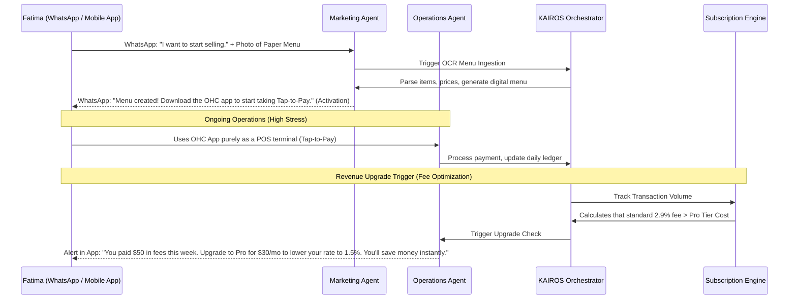

# Business Journey Architecture: Fatima (Food Cart Operator)

## Problem Statement
Micro-merchants in high-stress, fast-paced environments like Fatima (Food Cart Operator) face immense friction with traditional SaaS apps. The learning curve of navigating a new UI, combined with potential language barriers or low digital literacy, means downloading and configuring an app is often skipped entirely. Furthermore, during service hours, the app must be completely frictionless—requiring zero interaction unless an operational alert is critical. The OHC platform must provide out-of-band onboarding and focus the native app strictly on essential alerts and POS functionality.

## SaaS Landscape Research
- **Toast/Square for Restaurants:** Extremely powerful, but require dedicated hardware, complex menu building UI, and significant training. Unsuitable for a one-person mobile food cart.
- **Delivery Apps (UberEats/DoorDash):** Easy onboarding, but predatory fee structures (up to 30%) destroy micro-merchant margins. They own the customer data, preventing Fatima from building her own brand.
- **OHC's Opportunity:** Bypass traditional app onboarding entirely by using WhatsApp. Use OCR for menu ingestion, and position OHC as a low-fee, direct-to-consumer alternative that Fatima controls.

## Architectural Sequence Diagram: Out-of-Band Onboarding & ROI Upgrade

## Key Design Decisions
1.  **Out-of-Band Conversational Onboarding:** Fatima initiates the process via a familiar channel (WhatsApp). She does not need to download the OHC app to *build* her business, only to *operate* it.
2.  **OCR Menu Ingestion:** Overcoming the data entry barrier by allowing Fatima to take a picture of her physical paper menu. The KAIROS Orchestrator handles the translation into a digital catalog.
3.  **Strict Operational App UI:** The mobile app is stripped of all configuration settings. It acts solely as an alert center (new orders) and a Tap-to-Pay terminal, designed for use in the chaotic environment of a food cart.
4.  **Transaction Fee ROI Upgrades:** Monetization is pitched purely as a cost-saving measure. The system calculates when the transaction volume makes a flat monthly subscription cheaper than the standard percentage-based fee, driving the upgrade via direct financial logic.

## Implementation Prompt
**Implementer Agents:**
-   Develop the WhatsApp business API integration to support the initial conversational onboarding flow.
-   Integrate an OCR engine with the `Marketing Agent` to parse photos of physical menus into structured catalog data.
-   Design the mobile POS interface to be hyper-minimalist, focusing only on large touch targets for Tap-to-Pay and critical operational alerts.
-   Configure the `Subscription Engine` to continuously calculate the ROI of transaction fees vs. subscription costs, triggering the upgrade prompt when the math favors the merchant.
