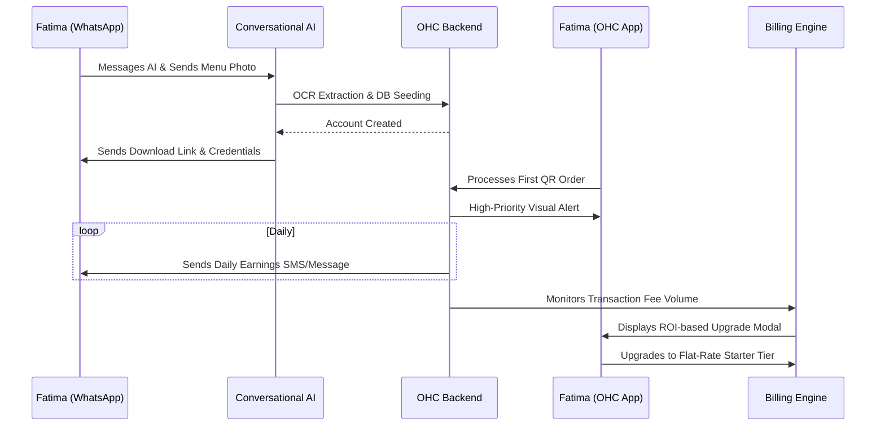

# Architecture Brief: SaaS Business Journey - Fatima the Food Cart Operator

**Title**: Architectural Mapping of the End-to-End SaaS Business Journey for Fatima (Food Cart)

**Problem Statement**:
Fatima (50) represents a challenging persona for traditional SaaS: low English literacy, operates in harsh environments, and possesses an older mobile device. Existing restaurant SaaS (like Toast or Square) requires extensive onboarding, hardware purchases, and navigating complex settings menus. The architectural challenge is designing a SaaS journey that bypasses traditional text-heavy setup entirely. How do we acquire, activate, and retain a user whose primary interaction with technology must be strictly functional and visually driven?

**Research Report**:
- **Acquisition Landscape**: Micro-merchants in cash-heavy environments are typically acquired through localized, face-to-face outreach (e.g., street teams) or simple print collateral rather than digital ads.
- **Onboarding Friction**: Any requirement to type out long menu descriptions or navigate multi-step email verification flows results in immediate drop-off.
- **Activation Metrics**: The merchant must see an immediate reduction in physical line length. Activation occurs when the first customer pre-orders via QR code and Fatima processes it successfully.
- **Retention & Revenue Drivers**: Retention relies on absolute reliability; if the system drops an order during a rush, she will uninstall it. Revenue upgrades are challenging with this persona; the model must likely rely on transaction fees or a very low, flat-rate Starter tier triggered by volume.

**Design Doc**:
- **SaaS Business Journey Flow**:
  1.  **Acquisition**: Fatima is handed a flyer with a WhatsApp number. She messages the number.
  2.  **Onboarding**:
      - The onboarding is conducted entirely via an AI agent on WhatsApp (her comfortable medium).
      - The AI asks (in Arabic): "Send me a photo of your menu board."
      - Fatima sends the photo. The AI extracts the items, pricing, and generates the initial OHC database in the background.
      - The AI replies with a link to download the extremely lightweight OHC app and her login credentials.
  3.  **Activation**:
      - OHC mails her a laminated QR code (or she prints it locally).
      - A customer scans it, orders, and Fatima's phone alerts her with a massive visual/audio cue. She taps "Ready." Activation achieved.
  4.  **Retention**:
      - The app interface remains strictly operational. There are no complex dashboards, just massive buttons for current orders and inventory toggles.
      - Retention is maintained by providing daily SMS summaries of her earnings, avoiding the need to navigate complex reporting UIs.
  5.  **Revenue (Upgrade Trigger)**:
      - Fatima operates on the Free tier, which takes a slightly higher percentage per transaction.
      - As her volume increases, the app sends a highly visual, translated prompt showing how much money she would save by upgrading to the flat-rate Starter Tier ($9/mo).
      - The calculation is done for her: "You paid $30 in fees this month. Upgrade for $9 and keep the difference."
  6.  **Referral**:
      - Word-of-mouth among the tight-knit street vendor community, driven by the visible QR codes on her cart.

- **Architecture Diagram (Mermaid.js)**:

- **Key Design Decisions**:
  - **Out-of-Band Onboarding**: Recognizing that app-based onboarding is too complex, the initial data ingestion happens via a familiar third-party channel (WhatsApp) powered by an AI agent.
  - **ROI-Driven Monetization**: Upgrades are pitched not on features (which she doesn't care about), but purely on mathematical cost savings based on transaction volume analysis.
  - **Extreme Simplification**: The mobile client she interacts with is essentially a hardened kiosk app, stripped of standard SaaS cruft.

**Implementation Prompt**:
To Implementer Agent:
Implement the localized SaaS lifecycle for "Fatima the Food Cart". Build the integration with a messaging platform (e.g., WhatsApp Business API) to handle conversational, out-of-band onboarding utilizing OCR to parse menu photos. Develop the specialized, highly constrained mobile client interface focused solely on active order management. Implement the billing logic that monitors transaction volumes against fee structures to calculate the exact ROI of upgrading tiers, and construct the localized UI prompts that present this upgrade math clearly to the user.

**Priority**: P0
**Estimated Scope**: Large
