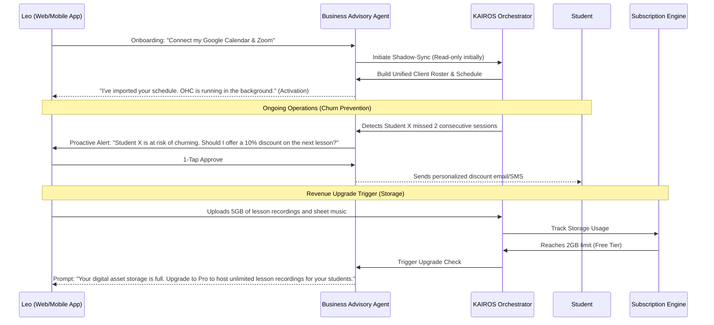

# Business Journey Architecture: Leo (Music Tutor)

## Problem Statement
Knowledge workers and creators like Leo (Music Tutor) often rely on fragmented legacy systems (e.g., Google Calendar + PayPal + Zoom). Transitioning to a unified platform involves migrating existing appointments, clients, and history, which is risky and time-consuming. Furthermore, their primary revenue loss comes from client churn or missed appointments. The OHC platform must provide a risk-free transition via shadow-syncing and deliver immediate value through proactive AI retention strategies.

## SaaS Landscape Research
- **Calendly/Acuity:** Excellent scheduling, but often require Zapier integrations for payment and video conferencing, creating points of failure.
- **Patreon/Teachable:** Good for asynchronous content, but poor for managing 1-on-1 live sessions and unified billing.
- **OHC's Opportunity:** Offer zero-risk onboarding by shadow-syncing with existing tools, then use the Business Advisory Agent to actively prevent churn, gating digital assets to drive upgrades.

## Architectural Sequence Diagram: Shadow-Sync & Churn Prevention

## Key Design Decisions
1.  **Shadow-Syncing Onboarding:** Lower the barrier to entry by not forcing an immediate hard cutover. OHC ingests data from Google Calendar/Zoom, allowing Leo to test the platform's insights without disrupting his current workflow.
2.  **Proactive Churn Prevention:** The true value is realized not just by scheduling, but by securing MRR. The Business Advisory Agent monitors attendance and payment patterns, suggesting 1-tap actions to retain clients.
3.  **Storage-Based Upgrades:** For creators, digital assets (recordings, PDFs) are crucial. Monetization is tied to storage capacity, a tangible resource that scales with the business's success.

## Implementation Prompt
**Implementer Agents:**
-   Develop OAuth integration flows for Google Calendar, Zoom, and legacy payment providers to support the "Shadow-Sync" onboarding phase.
-   Implement anomaly detection within the KAIROS Orchestrator to identify churn risk (e.g., missed appointments, lapsed payments).
-   Configure the `Business Advisory Agent` to generate 1-tap retention actions based on the anomaly detection.
-   Configure the `Subscription Engine` to track digital asset storage and trigger the upgrade flow when the specific tier limits are reached.
