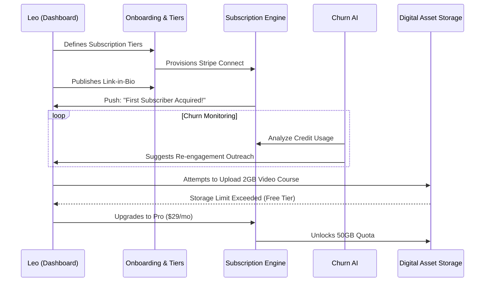

# Architecture Brief: SaaS Business Journey - Leo the Music Tutor

**Title**: Architectural Mapping of the End-to-End SaaS Business Journey for Leo (Music Tutor)

**Problem Statement**:
Leo (22) is a digital-first creator managing a fractured tech stack (Patreon, Calendly, Zoom, Venmo). The architectural goal for OHC is to consolidate this stack into a single, cohesive SaaS experience tailored for digital service providers. We must map out how a creator transitions from a fragmented workflow to the OHC platform, how they are onboarded without interrupting their existing cash flow, and how OHC proves its value by actively reducing student churn, leading to long-term SaaS retention and higher tier adoption.

**Research Report**:
- **Acquisition Landscape**: Creators discover tools through "Link-in-Bio" real estate on platforms like TikTok and Instagram. Seeing another creator use a sleek booking page is the primary driver of new signups.
- **Onboarding Friction**: Transitioning active, paying students from existing platforms (like Patreon) to a new system is high-risk. The onboarding process must allow for gradual migration or "shadow" running.
- **Activation Metrics**: Activation is achieved when a creator sets up their recurring billing tiers and successfully processes the first subscription payment via their new OHC link.
- **Retention & Revenue Drivers**: Retaining a creator means retaining their audience. The platform must actively work to prevent subscriber churn. Revenue upgrades are driven by the need to host large group sessions (webinars) or offer digital downloads alongside physical/live services.

**Design Doc**:
- **SaaS Business Journey Flow**:
  1.  **Acquisition**: Leo clicks the "Powered by OHC" link on a fellow musician's TikTok profile, impressed by the integrated booking calendar.
  2.  **Onboarding**:
      - Leo signs up. The onboarding wizard focuses on his "Offerings."
      - He defines a tier: "Masterclass - $100/mo for 4 lessons."
      - He connects his Stripe/bank account and grants access to his existing calendar to prevent double-booking during the transition.
  3.  **Activation**:
      - Leo replaces his Linktree with the OHC link.
      - A student signs up for the $100/mo tier. Leo receives his first payout notification. This is the activation moment.
  4.  **Retention**:
      - "The Advisor" AI acts as a churn-prevention engine. It notices when a student hasn't booked their allocated weekly lesson.
      - It drafts a check-in message for Leo: "Hey Sarah, noticed you haven't booked this week. Click here to grab a slot!"
      - This proactive retention ensures Leo's monthly recurring revenue (MRR) stays stable, tying his success directly to OHC.
  5.  **Revenue (Upgrade Trigger)**:
      - Leo wants to start offering recorded video lessons (Digital Products) in addition to live sessions.
      - Digital product hosting requires significant storage, triggering an upgrade prompt to the Pro Tier ($29/mo) which includes 50GB of storage.
  6.  **Referral**:
      - The high visibility of the OHC link on his viral TikToks drives organic acquisition for the platform.

- **Architecture Diagram (Mermaid.js)**:

- **Key Design Decisions**:
  - **Subscription First**: The core primitive is the recurring subscription, with scheduling acting as a secondary feature (redeeming credits), rather than treating every booking as a discrete transaction.
  - **AI as Customer Success**: Shifting the AI's focus from mere scheduling to active churn prevention (retention management), providing massive ROI for the creator.
  - **Storage-Gated Upgrades**: Utilizing digital asset storage quotas as the primary lever to drive upgrades for creator-type personas.

**Implementation Prompt**:
To Implementer Agent:
Implement the SaaS lifecycle for "Leo the Music Tutor". Build the robust subscription engine capable of defining recurring billing tiers and managing the issuance/redemption of virtual "credits." Develop the background analytics workers that monitor student engagement and power the churn-prevention AI. Implement the storage service with hard quotas, enforcing tier limits upon digital asset uploads, and seamlessly integrating the upgrade flow when limits are hit. Ensure the platform can handle the rapid provisioning of the public link-in-bio page immediately upon signup completion.

**Priority**: P1
**Estimated Scope**: Large
