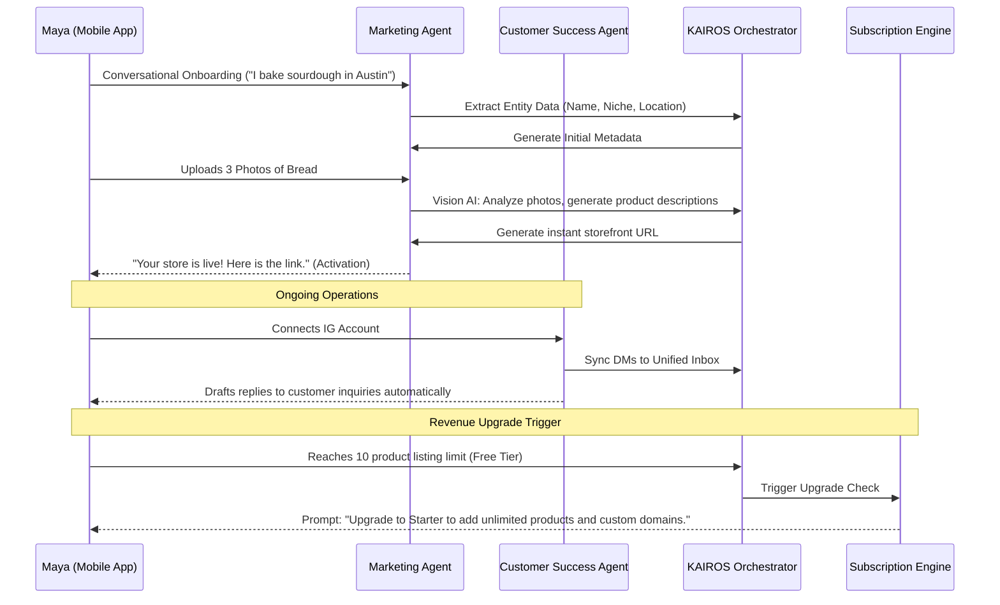

# Business Journey Architecture: Maya (Home Baker)

## Problem Statement
Home-based bakers like Maya face overwhelming friction when setting up a digital storefront. Traditional e-commerce platforms demand complex catalog configuration, payment gateway setup, and shipping rules before a single sale can be made. This high barrier to entry results in Maya abandoning the setup process and reverting to chaotic, manual order management via Instagram DMs, severely limiting her growth potential. The OHC platform must provide a frictionless onboarding experience that defers this complexity.

## SaaS Landscape Research
- **Shopify/Wix:** Require extensive upfront configuration (theme selection, product entry, payment setup) before reaching the "Activation" moment (a functional storefront). This often takes days and requires technical savvy.
- **Instagram Direct:** Extremely low friction but lacks structural order management, leading to dropped orders and manual tracking nightmares.
- **OHC's Opportunity:** Bridge the gap by offering the zero-friction entry of social media messaging with the robust backend of a full e-commerce platform.

## Architectural Sequence Diagram: Conversational Onboarding & Activation

## Key Design Decisions
1.  **Conversational Onboarding (Deferred Complexity):** The initial setup consists only of a chat interface and photo uploads. Complex settings (shipping zones, tax rules, custom domains) are hidden and configured via conversational prompts *after* the initial activation.
2.  **Instant Storefront Generation:** The core metric for Activation is the time-to-first-live-link. Vision AI and the Marketing Agent generate a complete, albeit basic, storefront instantly from minimal input.
3.  **Revenue Upgrade Triggers (Product Limits):** Monetization is driven by value realization. The free tier allows a limited number of products. Once Maya proves the value of the platform by needing more listings, the upgrade prompt to a paid tier is triggered organically.

## Implementation Prompt
**Implementer Agents:**
-   Develop the conversational UI flow in the mobile app for initial onboarding.
-   Integrate the Vision AI service with the Marketing Agent to automatically generate product titles, descriptions, and prices from uploaded images.
-   Implement the "Instant Storefront" generation logic within the KAIROS Orchestrator, ensuring a live, shareable link is produced within 60 seconds of initial data submission.
-   Configure the `Subscription Engine` to track the number of active products and trigger the upgrade flow when the free tier limit (e.g., 10 products) is reached.
