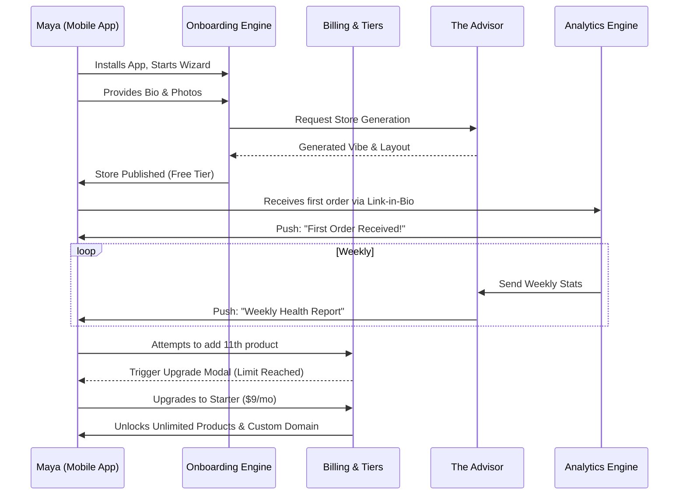

# Architecture Brief: SaaS Business Journey - Maya the Baker

**Title**: Architectural Mapping of the End-to-End SaaS Business Journey for Maya (Home Baker)

**Problem Statement**:
The OneHumanCorp (OHC) platform needs to natively support the overarching business journey of a non-technical home baker (Maya) operating exclusively from her smartphone. Previously, our architecture focused narrowly on the B2C transaction flow (how her customers buy cakes). However, for OHC to be a successful SaaS platform, we must design the complete lifecycle from how Maya discovers OHC, to her initial onboarding, activation, retention, revenue upgrades, and referral of other businesses. If Maya cannot frictionlessly progress from discovery to paying subscriber without technical assistance, OHC fails its primary objective.

**Research Report**:
- **Acquisition Landscape**: Home bakers heavily rely on Instagram and TikTok for marketing. Discovery of SaaS tools usually occurs through peer recommendations or targeted social media ads promising "link-in-bio storefronts."
- **Onboarding Friction**: Traditional platforms like Shopify require extensive desktop configuration, DNS setup, and complex taxonomy management, leading to a 70% abandonment rate during the trial period for non-technical users.
- **Activation Metrics**: "Activation" is defined as a user publishing their storefront and receiving their first customer inquiry or order. Reaching this milestone within Day 1 is critical for long-term retention.
- **Retention & Revenue Drivers**: Weekly performance summaries, actionable AI-driven insights, and hitting volume limits (e.g., product counts) drive upgrades from Free to paid tiers.

**Design Doc**:
- **SaaS Business Journey Flow**:
  1.  **Acquisition**: Maya sees an Instagram ad demonstrating a 10-minute mobile storefront setup. She clicks the CTA: "Start Your Shop for Free."
  2.  **Onboarding**:
      - Maya is guided by "The Advisor" AI in a conversational UI on her phone.
      - She inputs her business name, a short bio ("I bake vegan custom cakes in Austin"), and uploads 3 photos.
      - The system automatically generates her color palette, layout, and initial catalog. She defers custom domain setup.
  3.  **Activation**:
      - Maya taps "Publish." She is assigned an OHC subdomain (`maya-bakes.ohc.app`).
      - She adds the link to her Instagram bio. Within 24 hours, she receives her first custom order inquiry via the integrated chat. This is her "Aha!" moment.
  4.  **Retention**:
      - "The Advisor" sends a push notification every Sunday: "Maya, you had 50 profile views and 3 custom inquiries this week. Your average response time is under 1 hour!"
      - The continuous value provided by the AI managing her direct messages keeps her engaged daily.
  5.  **Revenue (Upgrade Trigger)**:
      - Maya reaches the 10-product limit on the Free tier.
      - "The Advisor" sends an in-app prompt: "You're growing fast! Upgrade to the Starter Tier ($9/mo) to add unlimited products and get a custom `.com` domain."
      - The upgrade flow is frictionless, utilizing Apple/Google Pay natively within the app.
  6.  **Referral**:
      - Maya's storefront features a subtle "Built with OHC" badge in the footer.
      - She is incentivized to refer her florist friend through an in-app referral program, earning her a free month of the Starter tier.

- **Architecture Diagram (Mermaid.js)**:

- **Key Design Decisions**:
  - **Conversational Onboarding**: Replaces complex configuration forms with an AI-driven chat to eliminate technical intimidation.
  - **Deferred Complexity**: Advanced settings (like DNS routing for custom domains) are deferred until the user upgrades to a paid tier, focusing entirely on immediate activation (getting the link in bio).
  - **Usage-Based Upgrade Triggers**: The transition from Free to Paid is triggered naturally by usage limits (product count), ensuring the user has already found value before being asked to pay.

**Implementation Prompt**:
To Implementer Agent:
Implement the end-to-end SaaS lifecycle for "Maya the Baker". Focus on building the core onboarding wizard flow that relies on "The Advisor" agent to generate the initial storefront configuration based on simple textual input and photo uploads. Implement the logic to provision the free-tier subdomain immediately upon publishing. Develop the tier-enforcement mechanism in the billing engine that intercepts attempts to exceed the 10-product limit and surfaces the upgrade modal. Finally, construct the background worker that compiles the weekly analytics data and utilizes the AI to draft and push the weekly health report to the user's device, driving retention.

**Priority**: P0
**Estimated Scope**: Large

---
*Note: This expanded architectural breakdown fundamentally shifts the focus from the consumer transaction to the merchant's SaaS lifecycle, ensuring the platform architecture supports sustainable user growth, engagement, and monetization.*
