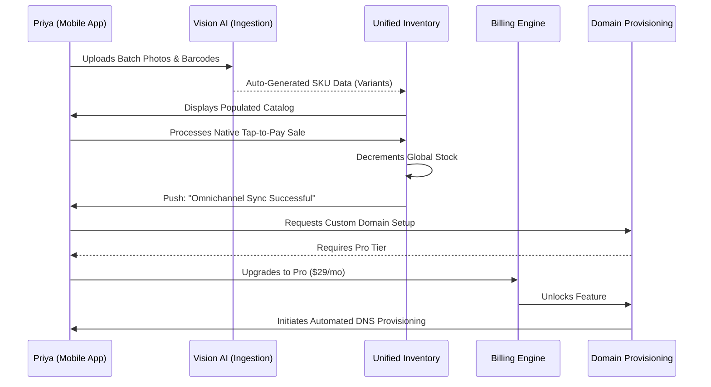

# Architecture Brief: SaaS Business Journey - Priya the Boutique Owner

**Title**: Architectural Mapping of the End-to-End SaaS Business Journey for Priya (Boutique Owner)

**Problem Statement**:
Priya (35) is an established physical retail owner looking to modernize and expand online. Her problem is not a lack of business, but a lack of systemic efficiency. She currently manages inventory manually and uses disparate tools for point-of-sale and online sales. The architectural objective is to map her journey into the OHC SaaS ecosystem, demonstrating how we acquire a "hybrid" user, onboard her complex inventory painlessly, and activate her by unifying her sales channels, eventually driving her toward high-tier enterprise features like advanced analytics and custom domains.

**Research Report**:
- **Acquisition Landscape**: Physical retailers actively search for "omnichannel POS" or "inventory sync tools." They are highly sensitive to transition costs (data migration).
- **Onboarding Friction**: Moving hundreds of SKUs from legacy systems (or spreadsheets) into a new platform is a massive barrier. If she has to manually type out every dress variant, she will abandon the setup.
- **Activation Metrics**: The "Aha!" moment for a hybrid retailer occurs when a physical tap-to-pay transaction on their phone instantly updates the stock level on their live website.
- **Retention & Revenue Drivers**: Retention is driven by the elimination of stock-outs and the automation of post-purchase marketing. Revenue upgrades are triggered by the need for multi-location support, advanced financial reporting, or custom domain SSL provisioning.

**Design Doc**:
- **SaaS Business Journey Flow**:
  1.  **Acquisition**: Priya searches for "phone POS with website." She finds an OHC landing page highlighting "Unified Inventory in 10 Minutes."
  2.  **Onboarding**:
      - Priya downloads the app. Instead of manual entry, the onboarding wizard offers "Camera Ingestion."
      - She walks around her store, taking photos of items and their barcodes.
      - "The Manager" AI auto-tags categories, extracts details, and creates variant structures (S, M, L) based on visual data and standard apparel heuristics.
  3.  **Activation**:
      - Priya uses the app to process a physical sale via Tap-to-Pay (NFC).
      - She immediately checks her automatically generated OHC storefront and sees the inventory reflect the sale in real-time. This proves the system's core value proposition.
  4.  **Retention**:
      - The unified dashboard becomes her daily command center, showing online vs. offline revenue splits.
      - "The Promoter" AI runs in the background, automatically sending review request emails to customers who purchased in-store (if they provided an email for a digital receipt).
  5.  **Revenue (Upgrade Trigger)**:
      - Priya wants to use her existing domain (`priyasboutique.com`) instead of the OHC subdomain.
      - She clicks the "Connect Domain" button in settings, which triggers the Pro Tier ($29/mo) upgrade modal.
      - The upgrade flow handles DNS configuration semi-autonomously using API integrations where possible.
  6.  **Referral**:
      - The platform generates a "Year in Review" shareable graphic showing her growth. She shares this on LinkedIn, which acts as an organic referral mechanism.

- **Architecture Diagram (Mermaid.js)**:

- **Key Design Decisions**:
  - **Vision-Driven Onboarding**: Overcoming the "empty state" problem for complex inventories by leveraging multimodal LLMs to ingest catalogs via the camera, drastically reducing time-to-value.
  - **Feature-Gated Monetization**: Unlike the volume-based limits for simpler personas, Priya's upgrade path is driven by professional features (Custom Domains, Advanced Analytics) that correlate with business maturity.
  - **Native Omnichannel**: Treating the mobile device simultaneously as the management dashboard and the physical POS terminal, ensuring the user is constantly interacting with the app.

**Implementation Prompt**:
To Implementer Agent:
Implement the SaaS lifecycle for "Priya the Boutique Owner". Develop the batch ingestion pipeline utilizing vision models to translate raw images and barcodes into structured, multi-variant product data models within the backend. Build the real-time event bus that ensures physical POS transactions instantly invalidate and update cached storefront inventory levels. Construct the feature-flagging system tied to the billing engine, specifically gating the domain provisioning and advanced analytics endpoints behind the Pro Tier subscription. Ensure the UI seamlessly prompts for upgrades when these gated routes are accessed.

**Priority**: P1
**Estimated Scope**: Large
