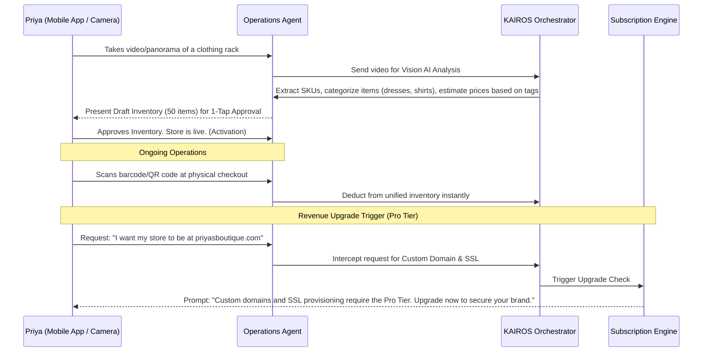

# Business Journey Architecture: Priya (Boutique Owner)

## Problem Statement
Boutique owners like Priya manage complex, ever-changing inventories. The primary friction in adopting an online platform is the initial data entry—manually inputting hundreds of SKUs, sizes, colors, and prices is a non-starter. Furthermore, managing dual inventories (physical store vs. online) leads to overselling. The OHC platform must eliminate the data entry hurdle and provide seamless physical-to-digital inventory management.

## SaaS Landscape Research
- **Shopify POS:** Excellent synchronization, but requires massive initial manual data entry or complex CSV imports. The hardware and software ecosystems can become very expensive quickly.
- **Square POS:** Good entry point, but the transition to a full online store often requires additional configuration and potential syncing issues if scaling beyond basic setups.
- **OHC's Opportunity:** Leverage Vision AI for bulk inventory ingestion and use advanced professional features (like custom domain SSL) as natural upgrade triggers once the inventory hurdle is cleared.

## Architectural Sequence Diagram: Vision-AI Batch Ingestion & Pro Upgrade

## Key Design Decisions
1.  **Vision-AI Batch Ingestion:** The onboarding process relies heavily on the camera. Priya records a video of her store, and the Operations Agent uses computer vision to identify products, read price tags, and build the initial catalog, eliminating manual data entry.
2.  **Unified Inventory by Default:** Every item ingested is immediately available for both online sale and physical tap-to-pay checkout, preventing the common desynchronization problem.
3.  **Pro Tier Upgrades via Advanced Requests:** Upgrades are triggered when Priya requests features that signify a maturing business (e.g., custom domains, advanced tax reporting, multi-location support). The system intercepts these natural language requests and presents the upgrade path.

## Implementation Prompt
**Implementer Agents:**
-   Develop the video/image ingestion pipeline within the mobile app, optimized for continuous scanning.
-   Integrate the Vision AI service with the `Operations Agent` to process batch inventory data, specifically extracting item categories, variations (if visible), and price tags.
-   Implement the 1-tap approval UI for bulk inventory confirmation.
-   Configure the `Subscription Engine` and NLP router to intercept requests for advanced features (like custom domains) and map them to the Pro Tier upgrade flow.
