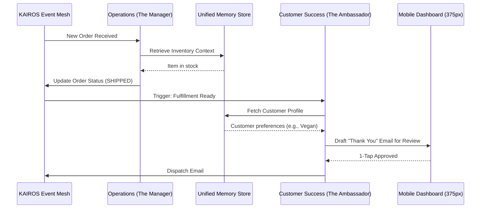

# Architecture Brief: KAIROS AI Agent Departments

## Title
Implement KAIROS AI Agent Department Orchestration and 1-Tap Approval Workflow

## Problem Statement
Small business owners like Maya the Baker and Carlos the Handyman lack the time and technical expertise to manage daily operations, marketing, and customer support. While they need automation, they do not want to interact with generic "AI Chatbots" that require complex prompting. They need a system that acts as an invisible, proactive team of employees. Furthermore, they need absolute trust that this AI team won't make catastrophic mistakes (e.g., sending the wrong quote to a customer), requiring a seamless, low-friction way to approve actions.

## Research Report
- **The Teammate Model**: Competitors treat AI as a reactive tool. OHC treats AI as proactive teammates, structured into understandable departments: Operations ("The Manager"), Marketing ("The Promoter"), Sales ("The Salesperson"), Customer Success ("The Ambassador"), Finance ("The Accountant"), Legal ("The Protector"), and Advisory ("The Advisor").
- **Trust via 1-Tap Approval**: Users will reject an autonomous system if they fear losing control. By routing high-risk actions (external communications, financial changes) into a "Draft-for-Review" state, the user retains ultimate authority through a simple mobile notification and 1-tap approval.
- **Contextual Memory**: Agents must maintain context across interactions using a centralized memory store (`autodream_memories`) isolated by tenant to prevent data leakage and provide personalized, accurate responses.

## Design Doc

### Architecture Diagram (Mermaid.js)

### Mobile UX Flow (375px First)
1. **Notification Event**: The user receives a push notification on their mobile device: "The Ambassador has drafted a reply to a new Instagram message."
2. **Action Feed**: Tapping the notification opens the OHC app to the primary "Action Feed" (Glassmorphism design, Outfit font).
3. **Review Card**: The feed displays a concise card detailing the proposed action: "Reply to John Doe: 'Yes, we do vegan cakes!'"
4. **1-Tap Resolution**: The card features a prominent, full-width "Approve & Send" button (Touch target ≥ 44x44px) and a smaller "Edit/Reject" option.
5. **Optimistic Execution**: Upon tapping "Approve," the UI immediately shows a success state (shimmer effect resolving to a checkmark), while the background agent processes the actual execution via the KAIROS orchestrator.

### Agent Department Coordination Strategy
- Departments coordinate via standard events on the Teammate Mesh (e.g., `tenant.order.fulfillment_ready`, `tenant.quote.accepted`).
- All actions are subject to the `ActionRisk` level. Low-risk actions (e.g., internal tagging) auto-execute; high-risk actions enter the `Draft-for-Review` state.
- Tier-based usage limits are enforced at the orchestrator level before agent execution begins.

## Implementation Prompt
**To Implementer Agent:**
Implement the KAIROS AI Agent Department Orchestration layer. Specifically, develop the event-driven routing mechanism that listens to the Teammate Mesh and triggers the appropriate agent department (e.g., Operations, Customer Success). Implement the "Draft-for-Review" state machine, allowing high-risk tasks to be queued for explicit user approval via the mobile dashboard. Ensure all cross-department communications utilize the established protobuf wire formats over the Teammate Mesh. Develop the 1-tap approval API endpoints to support optimistic UI updates. Integrate the unified memory retrieval (from `autodream_memories`) into the agent context generation process, enforcing strict tenant isolation. Provide unit tests covering the state transitions from `Draft` to `Approved`/`Rejected` and a complete critical user journey (CUJ) test from event trigger to user approval.

## Priority
P0

## Estimated Scope
Large