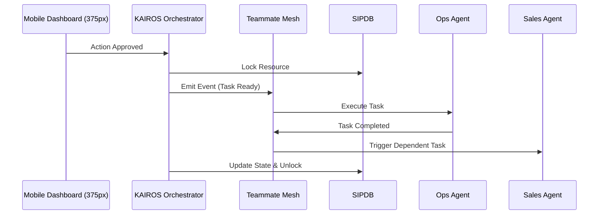

# Issue Brief: KAIROS Orchestrator

## Title
KAIROS Orchestrator: Unified Task Queuing and Coordination Engine

## Problem Statement
The OneHumanCorp (OHC) platform features autonomous AI agents functioning across various departments (Operations, Customer Success, etc.). For a non-technical small business owner like Maya or Carlos, these agents must act seamlessly and cooperatively without creating conflicting states or repeating tasks. Without a centralized orchestration engine, agents might duplicate messages or operate on stale inventory data.

## Research Report
- **Current Gaps:** Agents operate independently without a centralized locking or coordination mechanism.
- **Goal:** Implement the KAIROS Orchestrator to act as the primary brain coordinating state handoffs between specialized agents via the Teammate Mesh.
- **Personas Impacted:**
  - *Maya (Baker):* Needs Ops to finish fulfilling an order before Customer Success emails the customer.
  - *Carlos (Handyman):* Needs Sales to secure a deposit before Ops schedules the booking on his calendar.

## Design Doc
### Architecture Diagram

### UI Wireframes & Mobile UX Flow
- **375px First:** The user sees an "Activity Feed" of what KAIROS is orchestrating.
- **Optimistic UI:** When Carlos clicks "Approve", the task immediately moves to "Processing" in the UI.

### AI Agent Integration Points
- All AI Agents (The Ambassador, The Manager, etc.) connect to the Orchestrator via the Teammate Mesh and only act when KAIROS issues a task token.

### Key Design Decisions
- **Distributed State Machine:** KAIROS ensures agent transitions are rigorously tracked to prevent deadlocks.
- **Sub-Agent Queue:** Vast amounts of agent tasks are routed securely in the background.

## Implementation Prompt
**To Implementer Agent:**
Implement the KAIROS Orchestrator core engine. Create a central event mesh that securely passes task context between different agent departments. Ensure it adheres to the "1-Tap Approval" constraint, handling locks to prevent noisy-neighbor degradation. Do not prescribe specific database tables, but define the unified state-transition API contract.
- **Acceptance Criteria:** Agent actions can be queued, coordinated, and tracked securely.

## Priority
P0

## Estimated Scope
Large
