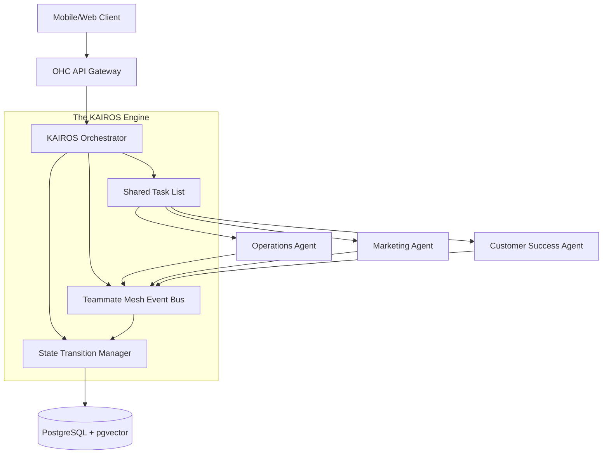

# Architecture Brief: KAIROS Orchestrator Core

## Title
KAIROS Orchestrator: Central Nervous System for the Hybrid Swarm

## Problem Statement
The OHC platform must orchestrate a complex swarm of specialized AI agents across 7 distinct departments. Without a centralized, fault-tolerant orchestration engine, agents risk duplicating work, clashing over shared resources (e.g., both the Sales Agent and Operations Agent modifying the same order), and failing to maintain context across asynchronous operations. The system needs a robust orchestration layer that ensures safe, reliable execution and seamless handoffs while maintaining strict multi-tenant isolation, ensuring that a non-technical owner (like Maya) never has to intervene in AI disputes.

## Research Report
-   **Current State:** The system utilizes a hierarchical agent architecture, but inter-agent communication and state management require formalization to support complex business workflows.
-   **The Need for "The Manager":** In a real business, a manager coordinates tasks among employees. The KAIROS Orchestrator serves this role for the AI Swarm.
-   **Concurrency Challenges:** We must handle race conditions when multiple agents are triggered simultaneously (e.g., a new order event triggering both fulfillment and marketing logic).
-   **Competitive Baseline:** Systems like Claude Code operate linearly. OHC's swarm must operate concurrently but predictably.

## Design Doc

### High-Level Architecture
The KAIROS Orchestrator is the central hub for all agent activity. It manages:
1.  **The Shared Task List:** A distributed queue of pending actions.
2.  **The Teammate Mesh:** An event bus for inter-agent communication and handoffs.
3.  **State Management:** Tracking the lifecycle of complex workflows (e.g., Order Fulfillment).

### Architecture Diagram (Mermaid.js)

### UI Wireframes or Screen Flow Description (375px first)
1. **The 'Swarm Activity' Screen:** A simple, chronological feed showing what the agents are currently doing (e.g., "Operations Agent is processing Order #123").
2. **The 'Approval Needed' Modal:** A bottom-sheet modal that slides up when the Orchestrator identifies a conflict or requires user input. It clearly states the issue (e.g., "Both Sales and Operations need your input on Quote #456") and provides 1-tap resolution options.

### Mobile UX Flow
1. **Trigger:** A complex background event occurs requiring orchestration (e.g., a massive influx of orders).
2. **Processing:** The Orchestrator throttles the agent swarm, distributing tasks. The mobile dashboard shows a subtle "Swarm Active" indicator in the header.
3. **Resolution:** Once tasks are completed or handed off, the Orchestrator updates the UI via the Teammate Mesh, providing real-time optimistic updates to the Orders list.

### AI Agent Integration Points
- **The Orchestrator as a Supervisor:** The Orchestrator acts as the "Manager," but it itself can be queried by the "Business Advisory" agent to explain *why* the swarm took certain actions.
- **Conflict Resolution Prompts:** When agents deadlock, the Orchestrator generates a plain-language summary prompt for the owner to resolve.

### Key Design Decisions
1.  **Distributed Locking:** To prevent race conditions, the Orchestrator will utilize distributed locks (e.g., via Redis or Postgres advisory locks) based on `tenant_id` and resource ID before dispatching tasks to agents.
2.  **Idempotency:** All agent actions dispatched by the Orchestrator must be idempotent. If an agent fails and a task is retried, it must not result in duplicate actions (e.g., sending the same email twice).
3.  **Tenant-Scoped Execution:** The Orchestrator strictly scopes all execution contexts (task lists, events, database queries) to the authenticated `tenant_id`.

## Implementation Prompt
**To Implementer Agent:**
Implement the core components of the KAIROS Orchestrator in the Rust backend. Create the `SharedTaskList` and `TeammateMesh` interfaces. Implement the distributed locking mechanism to ensure that only one agent can modify a specific resource (e.g., an Order) at a time within a given tenant. Update the agent execution loop to consume tasks from the `SharedTaskList` and emit lifecycle events back to the `TeammateMesh`. Develop the "Swarm Activity" feed API for the mobile dashboard to surface the orchestrator's state in plain language. Ensure comprehensive unit tests and integration tests demonstrating a successful multi-agent handoff without race conditions.

## Priority
P0

## Estimated Scope
Large
