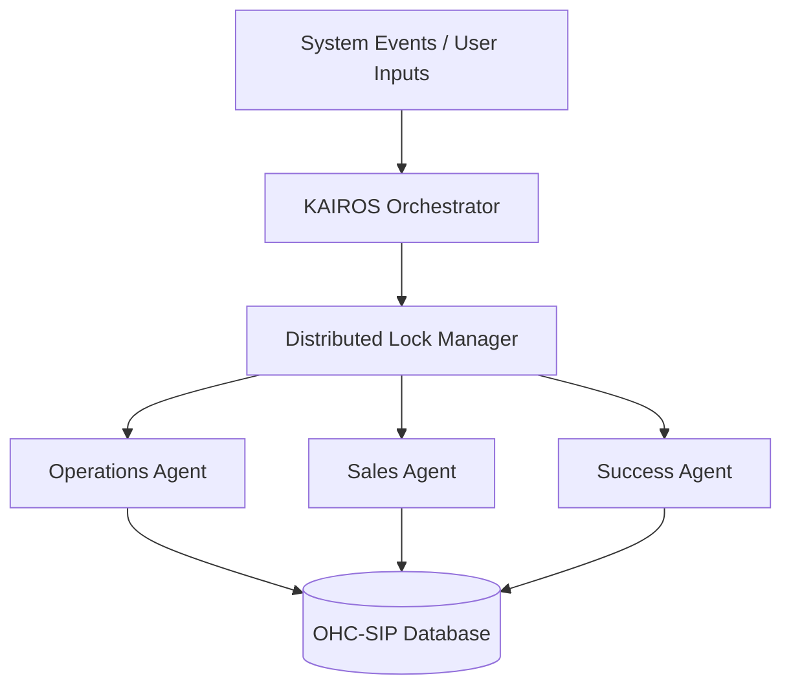

# Architecture Brief: KAIROS Orchestrator

## Title
KAIROS Orchestrator: Durable Event Routing for AI Departments

## Problem Statement
Small business owners (like Carlos and Maya) need an invisible support system that handles their daily operations without manual input. If the AI agents in the background fail to coordinate—for example, if the Operations agent fulfills an order but the Customer Success agent fails to send the email—the business owner loses trust. We need a central orchestration engine that guarantees durable, collision-free event routing between AI departments.

## Research Report
- **Competitive Analysis:** Shopify and Wix rely on synchronous API webhooks for third-party apps, which are fragile and fail silently.
- **OHC Solution:** KAIROS Orchestrator uses a Teammate Mesh (Hub) to broadcast events. It uses distributed locks (`ohc:lock:{tenant_id}:{resource_type}:{resource_id}`) to prevent race conditions.
- **Execution Modes:** Scheduled (cron), Event-Driven (system events), and On-Demand (direct user prompts).

## Design Doc
### Architecture Diagram (Mermaid.js)

### UI Wireframes & Screen Flow (375px first)
1. **Approval Modal (375px width limit):** Overlays current view with Glassmorphism blur background.
2. **Context Block:** Displays "Your Agent drafted this post:" with a preview text box.
3. **Action Bar (Sticky Bottom):** A primary large "Approve (1-Tap)" button next to a secondary "Edit" button.

### Mobile UX Flow
- When agents generate a high-risk action (e.g., publishing a social post), KAIROS halts execution and emits a push notification to the owner's mobile device (375px optimized).
- The owner sees a plain-language summary and a 1-Tap "Approve" or "Reject" button.

### AI Agent Integration Points
- **Trigger Handlers:** Each department registers handlers for specific event types (e.g., `tenant.order.fulfillment_ready`).
- **Memory Context:** Agents query the `autodream_memories` system to enrich their task context before execution.
- **Usage Throttling & Budgets:** The Orchestrator monitors token and action consumption per `tenant_id` at the mesh boundary. If the tenant's multi-tenant tier limits are exhausted, actions are paused, and a non-technical upgrade nudge is delivered by the "Business Advisory" department instead of throwing generic limits-exceeded API errors.

### Key Design Decisions
- **Event-Driven Resilience:** All inter-agent communication is asynchronous to prevent cascading failures.
- **Mandatory Tenant Scoping:** Every event payload MUST include `tenant_id` to enforce data isolation.

## Implementation Prompt
**To Implementer Agent:**
Implement the KAIROS Orchestrator core engine in the backend. Establish a durable event bus that routes typed events (e.g., `OrderPlaced`, `QuoteAccepted`) to registered AI agent departments. Implement a distributed locking mechanism to ensure tasks are processed idempotently per `tenant_id`. Create the `DraftForReview` state machine that allows high-risk tasks to pause and await a 1-tap approval payload from the mobile client. Do not define specific HTTP frameworks or database connection pools; focus on the event processing loop and state transitions. Ensure test coverage verifies successful message delivery and lock acquisition.

## Priority
P0

## Estimated Scope
Large
