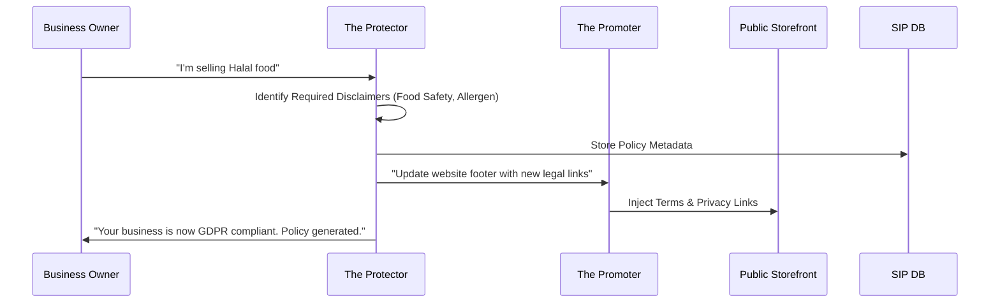

# Architecture Brief: Legal & Compliance ("The Protector")

## Title
OHC "The Protector": Autonomous Compliance, Terms & Safety Architecture

## Problem Statement
Small business owners like Fatima (Food Cart) and Priya (Boutique) live in fear of legal issues—GDPR fines, liability claims from a bad batch of food, or getting sued over website accessibility. They often "wing it" by copy-pasting Terms of Service from other sites, which offers zero real protection. They need an AI agent that ensures their business is "born legal" and stays compliant as laws change.

## Research Report
- **Competitive Landscape**: Services like Termly or Iubenda exist but require manual configuration and recurring fees. LegalZoom is too expensive for a solo baker.
- **Pain Point**: "Legal & Policies" is a Top 10 SMB pain point (#10).
- **The "Safety-by-Design" Advantage**: OHC can automatically generate Terms of Service, Privacy Policies, and Refund Policies based on the specific business type (e.g., "Allergen warnings" for Fatima, "Return window" for Priya).

## Design Doc

### High-Level Architecture (Mermaid.js)

### Mobile UX Flow (375px First)
1.  **Legal Status**: A simple "Green Shield" icon on the dashboard: "Your business is protected."
2.  **Disclaimer Review**: "We've added a peanut allergy warning to your menu. Tap to approve."
3.  **Policy Export**: "Send my Terms of Service to my email" (1-tap).

### AI Agent Integration Points
- **Protector + Accountant**: Ensure tax summaries comply with local jurisdictional requirements.
- **Protector + Promoter**: Audit social media captions for compliance (e.g., making sure "Medical claims" aren't made for supplements).
- **Protector + Operations**: Flag products that may require special licenses (e.g., selling alcohol or home-made cosmetics).

## Implementation Prompt
**To Implementer Agent:**
Implement "The Protector" department logic. Create a "Policy Generator" that takes a business profile (type, location, items sold) and outputs a human-readable and legally-defensible set of Terms, Privacy, and Refund policies. Implement the "Accessibility Audit" tool that periodically checks the "Storefront Builder" output for WCAG compliance. Build the "Disclaimer Injection" engine that allows the agent to suggest specific warnings (e.g., "Not for children under 3") for specific product categories.

## Priority
P2

## Estimated Scope
Medium
