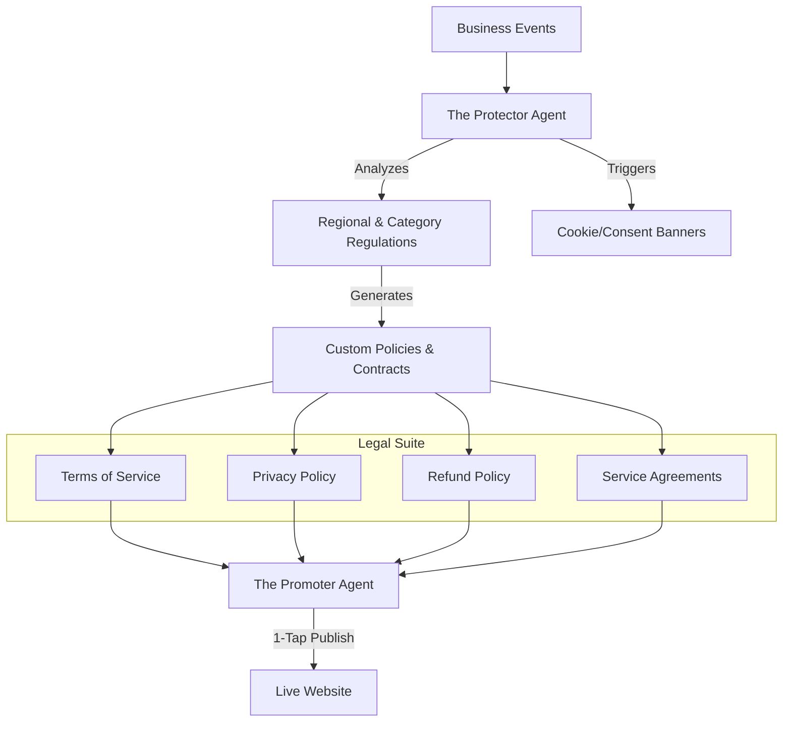

# Architecture Brief: Legal & Compliance ("The Protector")

## Title
OHC "Born Legal": Autonomous Compliance & Policy Architecture

## Problem Statement
Small business owners (Fatima, Carlos, Maya) often neglect legal compliance because it is expensive and complex. Most simply copy-paste generic terms or have no privacy policy at all, risking fines and platform bans. OHC businesses must be "Born Legal"—automatically compliant with regional laws (GDPR, CCPA) and business-specific regulations from day one.

## Research Report
- **Competitive Landscape**: Shopify and Wix offer generic templates that still require manual editing and legal knowledge to configure correctly.
- **The Gap**: No platform automatically updates policies based on business activity changes (e.g., if Maya starts shipping to the EU, she needs GDPR-compliant terms immediately).
- **Strategy**: The Protector agent doesn't just provide templates; it actively monitors business events (onboarding, location changes, new markets) and autonomously drafts/updates legal documents.

## Design Doc

### "Born Legal" Strategy
1.  **Zero-Touch Compliance**: During onboarding, The Protector analyzes the business type and location to generate custom Terms of Service, Privacy Policy, and Refund Policy.
2.  **Event-Driven Updates**:
    - `tenant.onboarding.complete` -> Generate initial legal suite.
    - `tenant.order.international` -> Update privacy policy for cross-border data transfer.
    - `tenant.inventory.food_added` -> Add liability disclaimers for food safety.
3.  **Jurisdiction Awareness**: Automatically detects and applies regional requirements like cookie consent banners for EU traffic or CCPA "Do Not Sell" links for California.

### High-Level Architecture (Mermaid.js)

### Department Coordination
- **Protector -> Promoter**: When a policy is updated, The Protector sends it to The Promoter for immediate publication on the storefront.
- **Onboarding -> Protector**: As soon as a user provides their business type, The Protector begins drafting the necessary disclaimers.

### Mobile UX Flow
- **Legal Health Check**: A simple "Shield" icon on the dashboard. Green means compliant; Yellow means "Action Required" (e.g., "1-Tap to add GDPR cookie banner").
- **1-Tap Approval**: Policies are drafted in plain language ("Here's your new refund policy based on your 'No Returns' setting"). Owner taps "Publish".

## Implementation Prompt
**To Implementer Agent:**
Implement the "Born Legal" engine for The Protector department. The system must listen for business lifecycle events (completion of onboarding, metadata updates) and autonomously generate or update the legal suite (ToS, Privacy, Refund policies) based on the business category and jurisdiction. Implement a "Legal Health" monitoring capability that identifies missing compliance artifacts or outdated consent mechanisms. All generated policies must be presented in the dashboard's "Action Feed" for 1-tap approval before being published to the storefront by The Promoter.

## Priority
P1

## Estimated Scope
Medium
