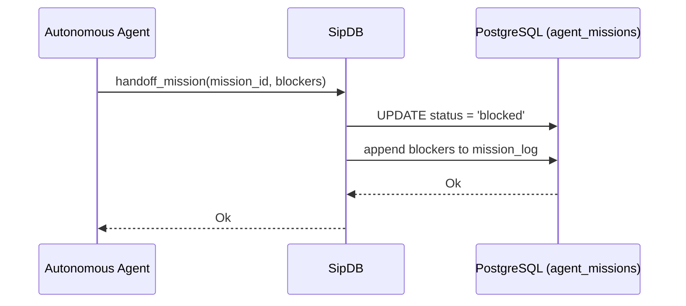

# Mission Handover Architecture

## 1. Overview
This design document defines the standard procedure for AI agent mission handoffs within the OHC platform, specifically dealing with "Mission Handover" scenarios where an agent is unable to complete a product mission.

## 2. Goals
- Define the `handoff_mission` protocol in `SipDB`.
- Specify the state changes applied to an agent mission when it is blocked.
- Ensure blocked missions leave a clear audit trail for subsequent debugging or human intervention.

## 3. Detailed Design

### 3.1 Architecture Model
The `SipDB` component in `src/server/sip.rs` implements the `handoff_mission` function. This function updates the state of an existing mission in the `agent_missions` PostgreSQL table to reflect that the agent can no longer proceed.

### 3.2 State Transitions
When an agent invokes `handoff_mission`:
1. The mission's `status` is forcefully updated to `'blocked'`.
2. The `blockers` text provided by the agent is appended to the existing `mission_log` column, preserving prior logs while clearly delineating the terminal block reason.
3. The `updated_at` timestamp is refreshed to `CURRENT_TIMESTAMP`.
4. This action is scoped correctly to the tenant using `organization_id` checking via PostgreSQL bindings to ensure tenant isolation.

### 3.3 Status
The `handoff_mission` implementation is present in `src/server/sip.rs`. Based on the "Zero WIP" policy, since the required implementation is already done, no changes are pushed to the codebase, and the task is fulfilled by providing this architecture report.
