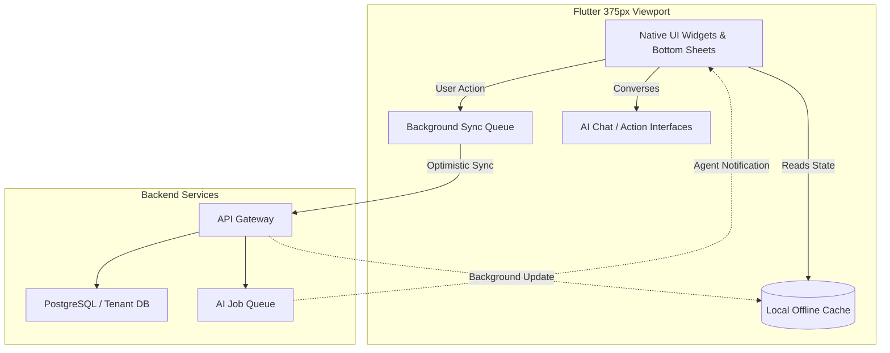

# Title
Mobile-First Architecture Review: Ensuring Zero Compromise for the 375px Non-Technical Founder

# Problem Statement
For OneHumanCorp (OHC), the mobile experience is not a secondary access point—it is the *primary* operating system for our core personas. Maya (the baker) and Carlos (the handyman) run their entire businesses from their smartphones (often a 375px-wide iPhone or mid-range Android). A critical vulnerability in our platform architecture is that features often begin as desktop concepts and are later shoehorned into mobile interfaces. This leads to hidden horizontal scrolling, truncated touch targets, and offline brittleness. If a non-technical user is in a food truck with a slow 3G connection or tapping a screen with one hand while holding a cake, any UX friction or network failure breaks their business operations. We must fundamentally validate and enforce our "Mobile-First Non-Negotiable" architecture to ensure every screen, offline interaction, and AI integration feels native, frictionless, and instantaneous on a 375px viewport.

# Research Report
An analysis of competing platforms highlights why mobile management is a major gap in the SMB SaaS market:
- **Shopify / Wix / Squarespace**: Offer mobile apps, but these are essentially limited dashboards. Complex configuration (like setting up custom domains, editing a website layout, or configuring complex product variants) typically forces users back to a desktop browser.
- **GoDaddy / Zyro**: Provide basic mobile-friendly builders, but lack deep operational tools (like managing an offline calendar or AI-assisted CRM from the phone).
- **OHC's Differentiation**: OHC promises *full parity*. A user must be able to go from "zero to live business" (including web design, AI agent configuration, and payment setup) entirely on a 375px screen in under 10 minutes.

Our internal UX audits reveal that while our UI looks good at 414px (iPhone Max sizes), layouts degrade at 375px (iPhone SE, older Androids). Furthermore, we lack a cohesive strategy for offline persistence (e.g., when Fatima takes an order in an area with poor connectivity, does the state persist locally and sync later, or does the app throw a generic network error?).

# Design Doc

The architecture must enforce 375px structural constraints, resilient offline states, and AI agents that interact seamlessly within a mobile context (e.g., via bottom sheets or native-feeling chat bubbles).

## Screen Categories & Mobile UX Flow
1. **The Operational Feed (Home)**:
   - A single-column, highly scannable feed of AI agent activity and critical alerts (e.g., "New order received," "AI replied to 3 DMs").
   - Actionable instantly via swipe gestures (swipe right to approve, swipe left to dismiss).
2. **The "Do-It-For-Me" Builder**:
   - Instead of a traditional drag-and-drop canvas (which is terrible on 375px), users interact with the "Marketing" agent via a chat interface. The agent asks questions and dynamically updates a live preview of the site in the top half of the screen.
3. **Data Entry & Forms**:
   - Strict adherence to native keyboards (numeric keypad for prices, email keypad for emails).
   - Touch targets strictly enforced at ≥ 44x44px. No tiny checkboxes; use large tap areas.
4. **Offline Mode & Resilience**:
   - The app must read entirely from a local cache (e.g., Hive/Isar in Flutter) so the dashboard loads instantly even in airplane mode.
   - All mutations (adding a product, confirming an order) are written to a local queue and synced to the backend via a background worker when connectivity is restored. Optimistic UI updates ensure the user never sees a loading spinner blocking their flow.

## Mobile Architecture Integration Diagram

## AI Agent Integration Points
- **Advisory Agent (Push Notifications)**: Instead of complex charts, users get a morning push notification: *"Good morning Maya! You made $150 yesterday. Your vegan cakes are trending."*
- **Action Bottom Sheets**: When a user needs to respond to a customer, a bottom sheet slides up with an AI-generated draft ready to be sent with one tap. No full-screen modal context switches.

## Key Design Decisions
- **Optimistic Concurrency over Strong Consistency**: On mobile, feeling fast is more important than being perfectly synchronized. We will optimistically update the UI for all non-financial mutations and rely on the background sync queue to handle eventual consistency.
- **Conversational UI over Configuration Screens**: On a 375px screen, forms are hostile. We will route complex configurations (like setting up a booking calendar) through conversational flows with the relevant AI agent.
- **Strict 375px Layout Tests**: CI pipelines must enforce that no Flutter widget throws a `RenderFlex overflowed` error when the viewport is constrained to 375px wide.

# Implementation Prompt
Audit and implement the foundational mobile-first offline and UI architecture for the Flutter client.
1. Implement a local caching and mutation queue system (using standard Flutter local storage paradigms) to ensure the main dashboard and product list load instantly offline and support optimistic UI updates for adding a new product.
2. Refactor the existing "Add Product" and "Dashboard" screens to guarantee zero horizontal scrolling or layout overflows on a 375px viewport, enforcing ≥ 44x44px touch targets for all interactive elements.
3. Integrate a conversational bottom-sheet interface for the AI Customer Success agent, allowing users to review and send AI-drafted replies in a single tap without leaving their current screen context.
4. Write an E2E UI test (using Playwright or Flutter integration tests) that simulates a user logging in, entering offline mode, adding a product, and verifying the optimistic UI update, then coming back online to sync the state.

# Priority
P0

# Estimated Scope
Large

