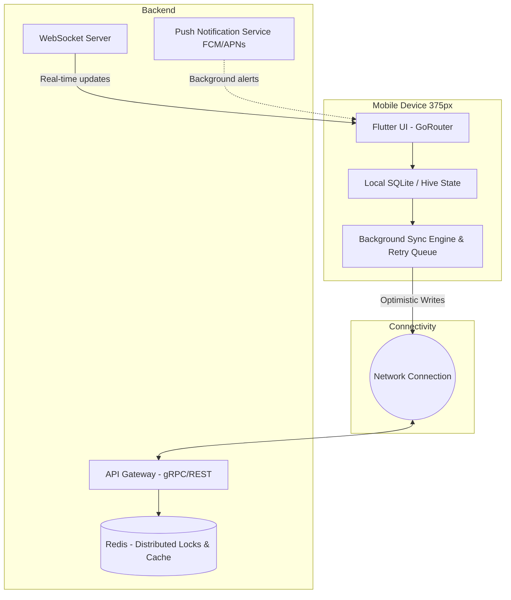

# Issue Brief: Mobile-First Architecture Review

## Problem Statement
Maya the baker and Carlos the handyman run their businesses entirely from their phones. They are constantly on the move, facing spotty network coverage, and they don't have the time to deal with desktop-only tools or slow, unresponsive mobile sites. For OHC to succeed, the platform must guarantee that all critical management tasks are seamlessly accessible on a 375px display and gracefully handle poor connectivity. If the mobile experience feels bolted-on or relies on horizontal scrolling, the design has failed. We must audit the platform against our mobile-first contract.

## Research Report
- **Mobile-Critical vs. Desktop-Only:** Our personas (Maya, Carlos, Fatima) perform 100% of their operations (accepting orders, replying to DMs, generating quotes) on mobile devices. Desktop features are strictly additive (e.g., deep analytics dives for Priya). The core CRM, POS, and order management tools are mobile-critical.
- **Offline Requirements:** Fatima operates a food cart with a slow data connection. The app must allow offline access to the current day's order list, menu item toggles (e.g., marking a product "sold out"), and the dashboard summary. Syncing these changes can wait until connectivity is restored via an optimistic UI and a background retry queue.
- **Performance Targets:** First Contentful Paint (FCP) must be under 1.5s on a 3G network. The initial app payload must be strictly limited to essential UI assets and state, utilizing aggressive image lazy-loading (WebP only) and pagination.
- **Push Notifications & Real-Time Updates:** Essential for timely order fulfillment. Uses a combination of background sync APIs, FCM/APNs for native apps, and WebSockets for real-time dashboard updates when the app is active.

## Design Doc

### Architecture Diagram

### UI Wireframes & Mobile UX Flow
- **Dashboard (375px):** Vertical feed prioritizing immediate actions (e.g., "1 New Order", "2 Messages Pending"). Offline indicator pill in the top right.
- **Offline Mode:** UI degrades gracefully; read-only for historical data, but allows queuing state changes (like "Mark Order Complete"). These changes show a pending sync icon.
- **Touch Targets:** Strictly adhered to >=44x44px. The main navigation is a bottom tab bar.
- **Forms:** Native keyboard integration (e.g., numeric pad automatically triggered for price entry).

### AI Agent Integration Points
- AI agents ("The Ambassador", "The Manager") must provide short, punchy summaries suitable for push notifications and lock-screen widgets.
- Agents operate on the cloud, but their output is proactively pushed to the device via WebSockets or Push Notifications to minimize the need for the user to "pull" updates manually.

### Key Design Decisions
- **Optimistic UI Pattern:** When Carlos taps "Accept Booking", the UI immediately reflects success, while the background Sync Engine attempts the write. If it fails, it retries up to 3 times before reverting and alerting the user.
- **On-Device Compression:** Images uploaded by the user (e.g., Maya's cakes) are compressed on-device before uploading to reduce payload and save bandwidth.

## Implementation Prompt
Implement the mobile-first, offline-capable architecture for the core business management dashboard. Ensure that critical actions, such as marking an order as complete or toggling item availability, update immediately in the UI (Optimistic UI) and queue the action in a background sync engine to handle spotty connectivity. Add comprehensive E2E tests simulating offline mode, write queued actions, and asserting the eventual consistency with the backend when the network is restored. Do not prescribe specific SQLite libraries or WebSocket handlers, but ensure the user experience matches the offline-first requirements.

## Priority
P0

## Estimated Scope
Large
