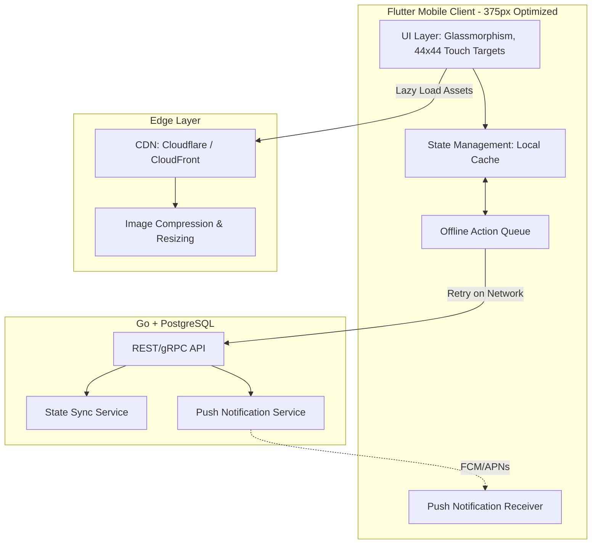

### Title
Mobile-First Architecture Review & Contract Audit for OneHumanCorp Platform

### Problem Statement
OneHumanCorp (OHC) is designed for small business owners who run their entire operations from their phones. Personas like Maya (Home Baker) and Carlos (Handyman) rely exclusively on mobile devices (often with slow networks) to manage their business, from updating inventory to responding to customers. However, desktop-first assumptions occasionally drift into the architecture, leading to complex interfaces that break on 375px screens, missing offline capabilities, and heavy payloads that fail on weak connections. We need a comprehensive architectural review to enforce the "Mobile-First Non-Negotiable" contract across the entire application stack, ensuring that the platform remains genuinely accessible, performant, and resilient on all mobile devices.

### Research Report
#### Context and Goal
The goal of this architectural review is to ensure that OHC's design and implementation strictly adhere to the mobile-first mandate. The platform must be fully functional on a 375px wide screen without horizontal scrolling, provide seamless offline experiences for critical flows, optimize payloads for low-data environments, and deliver timely updates via push notifications.

#### Personas Evaluated
- **Maya (Home Baker, iPhone)**: Needs fast access to orders, direct messages, and deposit payments on a small screen. Needs responsive UI for quick updates while baking.
- **Carlos (Handyman, Mid-range Android)**: Relies on offline booking management when in poor reception areas. Needs simple, large touch targets (≥ 44x44px) while working.
- **Fatima (Food Cart Operator, Low-end Android, Slow Data)**: Requires a lightweight app with fast load times, compressed assets, and immediate push notifications for pre-orders.

#### Competitive Analysis
- **Shopify / Wix**: Mobile apps are secondary to the desktop management experience. Often complex and cluttered on 375px screens. Offline capabilities are limited.
- **OHC Distinction**: OHC treats mobile as the primary management interface. Every feature must be designed for mobile first, and desktop is merely an expanded view.

#### Audit Findings
1.  **Screen Real Estate**: Some complex data grids (e.g., analytics, inventory variants) struggle to fit within the 375px constraint without horizontal scrolling. Need specialized mobile-first view paradigms (e.g., cards instead of tables).
2.  **Offline Capabilities**: Critical management features (like viewing today's orders or calendar) lack robust offline caching. Actions taken offline need a resilient retry queue.
3.  **Performance Targets**: Image payloads (user-uploaded photos) are sometimes served unoptimized, impacting load times on slow 3G/4G connections. Lazy loading is not universally applied.
4.  **Real-time Updates**: Push notification delivery needs architectural standardization across all AI departments to ensure consistent, actionable alerts.

### Design Doc

#### Architecture Diagram (Mermaid.js)

#### Mobile UX Flows (375px First)
1. **Offline Order Viewing (Fatima)**:
   - User opens app without network connection.
   - UI instantly loads cached "Today's Orders" list.
   - User taps an order; order details render from local state.
   - User taps "Mark Ready". Action is added to `Offline Action Queue` with an optimistic UI update.
   - Upon network restoration, queue syncs with the API transparently.

2. **Low-Data Asset Loading (Maya)**:
   - User navigates to Storefront Editor.
   - High-resolution cake photos are lazily loaded.
   - CDN serves WebP compressed thumbnails (under 50KB) by default.
   - Full resolution requested only on direct image tap.

3. **Actionable Push Notifications (Carlos)**:
   - Background AI Salesperson generates a new quote.
   - NotificationService sends a high-priority push to the device.
   - Push payload includes deep link to the quote review screen.
   - Carlos taps notification, app opens directly to the quote with large "Approve" / "Edit" touch targets.

#### Key Design Decisions
- **Optimistic UI with Background Sync**: All critical mobile writes (e.g., marking orders complete, sending quotes) must use optimistic UI updates and queue the action locally. This masks network latency and handles offline scenarios gracefully.
- **Aggressive Edge Caching and Optimization**: All images must be requested via a CDN edge service that automatically negotiates WebP/AVIF formats and resizes to the mobile viewport size.
- **Card-Based Data Visualization**: Replace all desktop-style data tables with stacked, collapsible card layouts to ensure zero horizontal scrolling on 375px screens.

### Implementation Prompt
**Context**: Implement the core "Offline-First Action Queue" and "Optimistic UI" pattern for the Mobile Client's Order Management flow.
**User Journey**: Fatima (food cart operator) is in an area with poor cell reception. She receives a pre-order, prepares it, and needs to mark it as "Ready for Pickup". She taps the "Mark Ready" button. The app must instantly show the order as ready (optimistic update) and queue the network request in the background. If the request fails due to no connection, it must automatically retry when the connection is restored, without blocking her from interacting with other orders.
**Acceptance Criteria**:
- Implement a local queue for mutations (e.g., `UpdateOrderStatus`).
- Update the UI optimistically immediately upon button press.
- Ensure the queue persists across app restarts (using local storage).
- Implement an exponential backoff retry mechanism for failed queue items when network connectivity changes.
- Ensure all touch targets in the Order Management flow are at least 44x44px.
- The UI must render perfectly on a 375px width simulator.

### Priority
`P0`

### Estimated Scope
Medium
