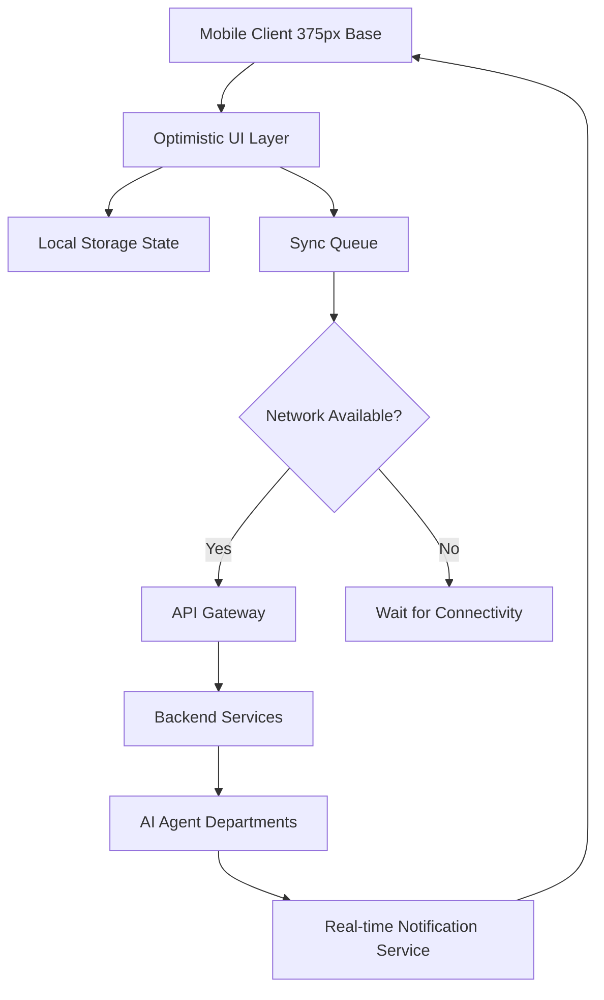

# Audit and Enhance Mobile-First Architectural Parity

**Priority:** P0
**Estimated Scope:** Large

## Problem Statement
Small business owners like Fatima, who runs a food cart and relies on a low-end Android device with intermittent connectivity, need their management dashboard to be instantly responsive and robust even when network conditions fail. Currently, platforms often prioritize desktop administrative experiences, leaving mobile users struggling with slow load times, unoptimized layouts, and failures during offline scenarios. If the app cannot function flawlessly on a 375px screen or fails to capture an order state change because the connection dropped, the business loses revenue and trust in the platform.

## Research Report
The global SMB market heavily indexes on mobile operations. Many business owners, especially those in food and beverage, manual services, or side-hustles, operate exclusively from their mobile devices.

### Competitive Analysis
| Feature | OHC Goal | Shopify | Wix | Squarespace | GoDaddy |
|---|---|---|---|---|---|
| **Mobile Management UX** | Primary platform target (100% parity) | Secondary (focus on POS & basic metrics) | Basic management | Limited / Content only | Very limited |
| **Offline Capabilities** | Optimistic UI updates; read-only dashboard offline | Spotty / requires connection | Requires connection | Requires connection | Requires connection |
| **Load Performance (3G)** | < 2 seconds | Moderate | Slow | Moderate | Fast |
| **Real-time Notifications**| Instant, deeply integrated with AI Agents | Push for sales | Email / App Push | Email / App Push | App Push |

Our research shows that a true mobile-first approach is an enormous differentiator. The OHC platform must guarantee that all core administrative actions—from viewing orders to editing a storefront—are native-feeling on mobile, resilient to network drops, and highly performant.

## Design Doc

### Architecture Diagram

### Screen Audits & Mobile-Criticality
- **Mobile-Critical (Must work flawlessly on 375px & degrade gracefully offline):**
  - **Dashboard:** Daily order lists, key metrics. Read-only access must be available offline.
  - **Order Processing:** Accepting/rejecting orders, updating status. Must use optimistic UI.
  - **Inbox/Customer Success:** Replying to DMs and emails. Drafts saved locally.
  - **Inventory/Menu Management:** Toggling "Sold Out" states. Fast, single-tap actions.
- **Desktop-Additive (Optimized for larger screens but usable on mobile):**
  - **Deep Financial Reporting:** Full P&L statements.
  - **Complex Drag-and-Drop Website Building:** Basic templates on mobile, fine-grained control on desktop.

### Offline Requirements & Performance Targets
- **Offline Operations:**
  - **Read-Only Dashboard:** The app must aggressively cache the latest state so users can view today's orders and metrics without a network.
  - **Deferred Writes:** Actions like toggling item availability or drafting a message must be queued locally and synced automatically when connectivity returns.
- **Performance Targets:**
  - **Load Time:** Core management dashboard must load and become interactive in under 2 seconds on a 3G connection.
  - **Responsiveness:** Taps and gestures must register visual feedback within 100ms.
  - **Payload Size:** Core assets must be minimal to support low-end devices, utilizing lazy-loading for heavy assets like product images.

### Real-Time Updates & Notifications
- Push notifications must be instantly delivered for critical events (new order, urgent booking).
- The application should rely on a real-time event stream to update UI elements (like order status or AI agent actions) instantly without requiring manual refreshes.

### AI Agent Integration Points
- **Operations & Customer Success Agents:** Push real-time alerts when they handle a task (e.g., "The Ambassador just replied to 3 Instagram DMs").
- **Business Advisory:** Generate a lightweight, text-first push notification for weekly summaries that can be expanded into a native mobile view.

### Key Design Decisions
1. **Optimistic UI by Default:** Every state-changing action on mobile should immediately reflect in the UI, falling back with an error state only if the synchronized retry queue permanently fails.
2. **375px Baseline:** All UI components are designed starting from 375px width constraints. Touch targets will strictly adhere to the ≥ 44x44px rule to ensure accessibility and ease of use.
3. **Graceful Degradation:** Rather than showing generic error screens, offline states will clearly indicate what is cached, what is pending, and when the last sync occurred.

## Implementation Prompt
**Task for Implementer:** Execute the Mobile-First Architecture Review enhancements.

**Critical User Journey (CUJ):** As a user with a slow or disconnected network (e.g., Fatima at her food cart), I need to open the app, immediately view my cached daily order list, toggle an item as "Sold Out", and have the app smoothly queue this action and notify me when it syncs, without any UI blocking or generic error alerts.

**Acceptance Criteria:**
1. Implement optimistic UI updates for core actions (e.g., status toggles, message drafts) that update the screen instantly.
2. Develop a read-only offline mode for the main dashboard and order list that displays the last known state when disconnected.
3. Establish a robust queueing system that automatically syncs deferred actions when the network connection is restored.
4. Ensure all newly added mobile UI components are fully responsive down to 375px width and utilize touch targets of at least 44x44px.
5. Provide a full E2E test starting from login to toggling an item offline, reconnecting, and verifying the state sync.

