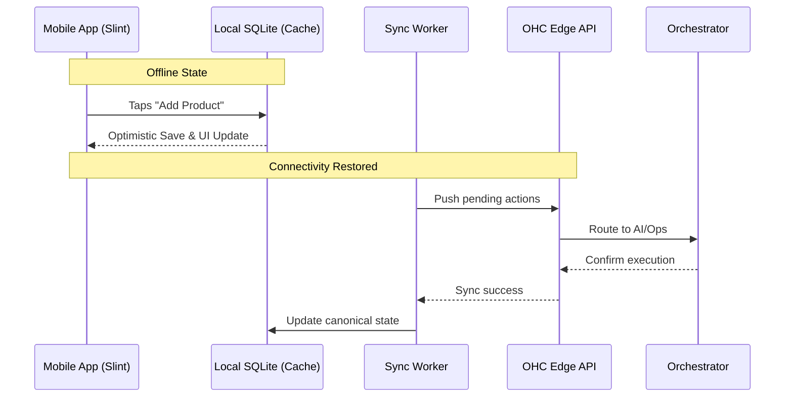

# Mobile-First Architecture Review

## Title
Mobile-First Architecture Review: Ensuring Platform Parity & Performance on Low-End Devices

## Problem Statement
The OHC platform guarantees that a user can run their entire business from a mobile device without ever touching a desktop. While the current UI (Slint) targets mobile breakpoints (375px), we lack a comprehensive architectural audit to ensure this "mobile-first" constraint holds true across all system layers. Specifically, we need to verify offline capabilities, push notification delivery, and performance targets on low-end hardware (e.g., for personas like Fatima the Food Cart Operator), ensuring no critical functionality is accidentally restricted to desktop or high-bandwidth environments.

## Research Report
- **Goal:** Audit the OHC platform architecture against the mobile-first contract.
- **Findings:**
  - **Screen Parity:** All critical screens (Onboarding, Dashboard, Order Management, Website Builder) must be primarily designed and tested for 375px width. Desktop views are strictly additive.
  - **Offline Requirements:**
    - Read operations (viewing active orders, checking the calendar) must work offline via local SQLite caching.
    - Write operations (drafting a product, saving a website layout) should be optimistically updated locally and synced in the background via the KAIROS Orchestrator when connectivity returns.
  - **Performance Targets:**
    - Initial load payload must be under 1MB to support low-end Android devices on 3G networks.
    - AI responses should be streamed to prevent perceived latency.
  - **Notifications:** Real-time updates (new orders) must use robust push notification channels (APNs/FCM) linked to the background task queue, ensuring reliable delivery even when the app is suspended.
- **Competitive Analysis:** Many competitors (Shopify, Wix) treat mobile apps as companions to a primary desktop dashboard. OHC's architecture must treat the mobile device as the *primary* and often *only* interface, requiring a completely different approach to caching and background sync.

## Design Doc

### Architecture Diagram

### Key Design Decisions
1. **Local-First Architecture:** The mobile app heavily utilizes a local SQLite database for fast read access and offline operation. The UI binds directly to the local database state.
2. **Optimistic Updates:** User actions are immediately reflected in the UI and saved locally. A background sync worker manages the queue of pending actions to be pushed to the server.
3. **Payload Optimization:** API responses must be aggressively paginated and minimized. Images should be dynamically resized and delivered via a CDN based on the device's screen density.
4. **Resilient Notifications:** Critical alerts (e.g., new order for the Food Cart) use silent push notifications to trigger a local data fetch and ring a loud alarm, bypassing OS-level notification throttles where possible.

### Mobile UX Flow
- User opens app without internet. Dashboard loads instantly from the local cache.
- User drafts a reply to a customer. The UI shows a subtle "Pending Sync" icon.
- Network restores. The icon spins and turns to a green checkmark.
- A new order arrives while the phone is locked. The screen wakes up with a high-priority notification displaying key details (Order #, Items, Total).

## Implementation Prompt
**To Implementer Agent:**
Implement the "Local-First" caching and sync architecture within the mobile application layer. Establish the local SQLite schema to mirror the critical server entities (Orders, Products, Customers). Implement the sync worker that handles pushing offline actions to the Edge API and pulling updates when connectivity changes. Ensure the UI components bind to the local SQLite state to provide instant, optimistic feedback. Include E2E tests simulating offline mode (e.g., disconnecting network in Playwright), performing an action, and verifying the background sync upon reconnection. Do not prescribe the specific conflict resolution strategy on the server; focus on the client-side caching and sync loop.

## Priority
P1

## Estimated Scope
Large
