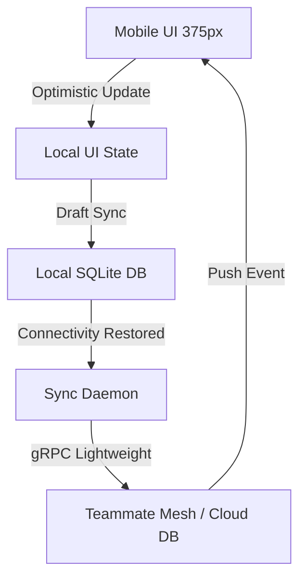

# Title
OHC Mobile-First Contract: Performance, Resilience, and "Grandmother Test" Audit

## Problem Statement
Small business owners (Carlos, Fatima, Maya) are mobile-only or mobile-primary. They operate in high-distraction environments (bakeries, repair sites, food carts) and often on low-end Android devices or poor 4G/5G connections. If the OHC dashboard is slow to load or fails when offline, Carlos can't send a quote, and Fatima loses a sale. OHC must be as fast and reliable as a native calculator app, otherwise users will abandon the platform.

## Research Report
- **The "Grandmother Test"**: If a user has to wait more than 2 seconds for a screen to load, or more than 1 second for a button to respond, they assume the app is "broken."
- **Payload Bloat**: Traditional SaaS dashboards (Shopify, Wix, GoDaddy) often fetch megabytes of JS and JSON, leading to LCP > 3s on 4G networks.
- **Offline Gaps**: Most web-based builders (Squarespace) require a constant internet connection. OHC's hybrid nature (Local SQLite/SIPDB) allows "Offline Drafting."

## Design Doc

### Architecture Diagram

### UI Wireframes or Screen Flow Description (375px first)
1. **Dashboard Skeleton**: Shimmer effect on `StatCard` and `AgentFeed` components during initial load.
2. **Offline Draft Banner**: A subtle banner indicating the app is offline but changes are saved locally.
3. **Optimistic Task Item**: An agent draft card that instantly turns green/approved when tapped, with a tiny spinning sync icon.

### Mobile UX Flow
- Primary actions are reachable with one thumb (bottom navigation).
- All touch targets are at least 44x44px.
- Use native mobile keyboards (numeric for prices).
- Replace jargon ("API Config", "CNAME") with plain language ("Helper Settings", "Website Address").

### AI Agent Integration Points
- Agents must queue results locally if offline, allowing users to interact with previously cached agent states.
- Adaptive asset loading serves smaller, progressive WebP images generated by the Marketing Agent for mobile connections.

### Key Design Decisions and Why
- **Lightweight Dashboard Service**: Return ONLY critical counts (Orders, Agents, Messages) for initial paint, meeting the < 1.5s LCP target.
- **Optimistic UI with "Mesh Sync"**: Actions update local state immediately; KAIROS handles background sync, meeting the < 100ms FID target.
- **Offline-First Drafting**: Allows uninterrupted work on subways or low-signal areas.

## Implementation Prompt
Audit the current Slint/Rust frontend against Mobile-First Performance targets. Implement "Skeleton Loading" (shimmer effect) for the `StatCard` and `AgentFeed` components. Update the `DashboardService` to support a `mobile_optimized: true` flag that returns a lightweight payload for the initial mobile paint. Implement "Optimistic Updates" in the Task List: when a user approves an agent draft, the UI should immediately reflect the "Approved" status and show a non-blocking background sync indicator. Ensure all touch targets in the `WebsiteBuilder` are at least 44x44px. Write E2E tests validating the offline drafting and optimistic update flows.

## Priority
P0

## Estimated Scope
Medium
