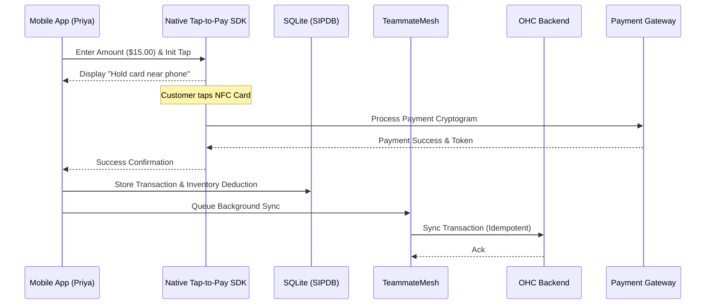

# Architecture Brief: Omnichannel Mobile Tap-to-Pay & POS Architecture

## Title
Omnichannel Mobile Tap-to-Pay & Point of Sale (mPOS) Architecture

## Problem Statement
Small business owners like Priya (boutique owner) and Fatima (food cart operator) conduct a significant portion of their business in person. Traditional Point of Sale (POS) systems require bulky, expensive hardware, and even modern mobile card readers create a friction point (bluetooth pairing, charging, $50 upfront cost). Priya and Fatima need their existing mobile phones to act as standalone payment terminals, allowing customers to tap their credit card or phone directly on the merchant's device to pay. This offline-to-online bridge must perfectly sync with their cloud inventory without any manual data entry, enabling a "zero-hardware" launch.

## Research Report
- **Competitor Analysis**: Square built a $50B business on hardware dongles, but is shifting to software-only "Tap to Pay". Shopify offers "Tap to Pay on iPhone" for its merchants, reducing hardware reliance. Stripe Terminal provides robust native SDKs (iOS/Android) to enable NFC-based payments without external card readers.
- **SMB Pain Points**: Purchasing hardware delays the "Time to First Dollar" (Activation). Bluetooth card readers frequently disconnect or run out of battery during a rush (Fatima's food cart).
- **Offline Reliability Constraints**: In-person sales often happen in environments with poor connectivity (festivals, thick-walled boutiques). The system must securely handle network drops, caching the intent and confirming the transaction swiftly.
- **Design Conclusion**: OHC must adopt a zero-hardware approach, integrating device-native NFC Tap-to-Pay directly into the OHC mobile app.

## Design Doc

### Architecture Diagram

### UI Wireframes & Screen Flow (375px First)
1. **Quick Charge Screen**: A highly legible, large numeric keypad (44x44px minimum touch targets). "Charge $15.00" button in high-contrast primary color.
2. **Tap-to-Pay Waiting Screen**: A distraction-free screen utilizing the platform's native Glassmorphism design system. A subtle, pulsing NFC icon indicating where to tap the card, with clear plain-language text: "Hold card to top of phone".
3. **Success & Receipt Screen**: A large checkmark with options to "Send SMS Receipt" or "Email Receipt".

### Mobile UX Flow
- **Frictionless Entry**: The POS keypad is directly accessible from the bottom navigation bar (e.g., a floating action button in the center).
- **Haptic Feedback**: The phone provides distinct vibration patterns for a successful read vs. a read error, so Fatima doesn't have to look at the screen while handing over food.
- **Jargon Eradication**: No terms like "Initialize SDK" or "Gateway Timeout". Errors are translated to actionable plain language, e.g., "Card didn't read clearly. Try tapping again."

### AI Agent Integration Points
- **Operations Agent**: Monitors the continuous sync of physical sales. If Priya sells the last red dress in-person, the agent instantly updates the online storefront to "Sold Out" and queues an inventory restock task for 1-Tap approval.
- **Finance Agent**: Automatically reconciles daily in-person sales batches with online sales, generating a simple end-of-day brief ("You made $450 today! $300 in person, $150 online.").

### Key Design Decisions & Why
- **Idempotent Mutations**: All payment requests use strict idempotency keys generated locally on the device. This prevents double-charging if Fatima's network connection drops exactly as the tap occurs.
- **Local SQLite (SIPDB) Caching**: In-person transactions are written to the local database immediately upon success from the SDK, providing an optimistic update to the dashboard while the TeammateMesh handles the backend sync asynchronously.
- **No Application-Level Multi-Tenancy Mixing**: Multi-tenant data persistence must enforce strict isolation at the storage level (e.g., via PostgreSQL Row Level Security). Each transaction record strictly enforces tenant boundaries.

## Implementation Prompt
**To Implementer Agent:**
Implement the "Tap-to-Pay" Mobile POS flow within the mobile interface.
1. Create the `PosKeypad` UI component ensuring 375px viewport optimization and minimum 44x44px touch targets.
2. Integrate the native Tap-to-Pay intent flow, displaying the visual and haptic prompts for card reading.
3. Wire the successful transaction result to update the local SQLite (SIPDB) database for optimistic UI updates.
4. Queue the transaction in the background TeammateMesh worker for idempotent synchronization with the Rust backend.
Do not prescribe specific PostgreSQL DDL or Rust backend API routes—focus on the client-side module, local data caching, and the sync event payload. Ensure all language passes the "Grandmother Test".

## Priority
P0

## Estimated Scope
Large
