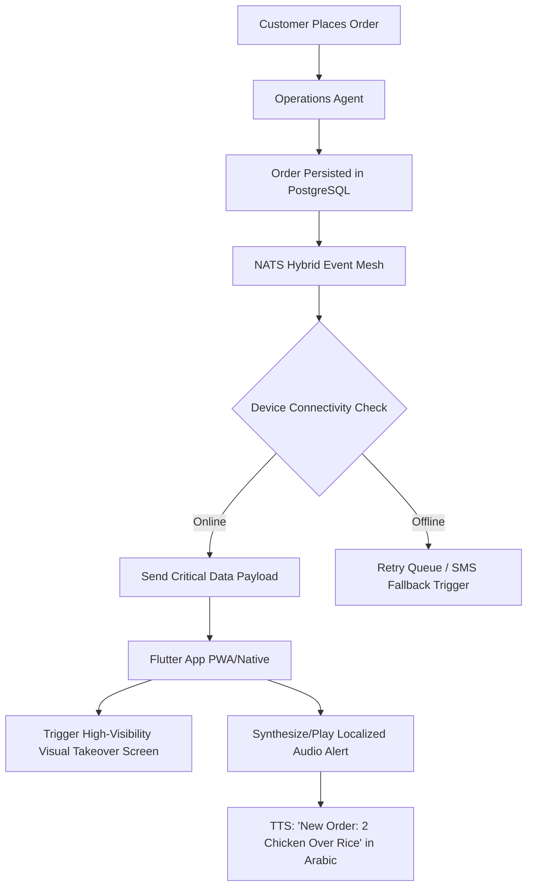

# Multi-Lingual Audio & Visual Order Notification Mesh for Harsh Environments

## Problem Statement
Small business owners operating in harsh environments (e.g., food carts, busy kitchens, noisy workshops) face a critical friction point: missing incoming online orders due to low-end devices, slow network connectivity, language barriers, and high ambient noise.
Persona Fatima (50, non-technical, limited English, runs a halal food cart) is highly vulnerable to this. She operates a low-end Android phone with poor data connection, amidst street noise, while multitasking. A standard push notification or email is frequently missed or misunderstood, leading to dropped orders, frustrated customers, and lost revenue.

## Research Report
Current SMB platforms (Shopify, Wix, Squarespace) rely on standard push notifications or email for order alerts, which are ineffective in high-stress, noisy environments. Dedicated restaurant point-of-sale systems offer specialized hardware (like loud receipt printers or buzzers), but they are prohibitively expensive and complex for a solo food cart operator.
**Competitive Gap:**
- **Shopify/Wix:** Rely on standard OS push notifications. Easily missed in a pocket or noisy setting.
- **Dedicated POS (Square/Toast):** Requires expensive hardware or complex app usage.
- **OHC Opportunity:** Utilize the existing mobile device to create an "unmissable," offline-resilient, multi-lingual auditory and visual alert system driven by a lightweight event mesh, requiring zero configuration.

## Design Doc
We propose the **Multi-Lingual Audio & Visual Order Notification Mesh**. This system guarantees order delivery to the device, bypasses standard notification silencing (where legally/technically permissible and user-approved for critical alerts), and provides high-visibility, localized auditory and visual cues.

### Architecture Diagram

### UX & Mobile Flow (375px)
1.  **Idle State:** The app is running or in the background.
2.  **Order Received:** A critical event triggers a full-screen, high-contrast modal ("Glassmorphism" but with bright, unmissable colors like neon green/orange).
3.  **Auditory Alert:** A loud, distinct chime sounds, immediately followed by a synthesized voice (via device TTS or pre-rendered lightweight audio payload) announcing the order details in the user's preferred language (e.g., Arabic for Fatima).
4.  **Action:** The user taps a massive 88x88px (double standard) "Accept" button. The screen returns to the standard queue view, now showing the new order.
5.  **Offline Resilience:** If data fails, the system falls back to a critical SMS via Twilio/Messagebird, formatted to trigger a loud custom text tone.

### Key Design Decisions
-   **Audio First:** Relying on sound to break through physical barriers (noise, phone in pocket).
-   **Multi-Lingual TTS:** Utilizing local device Text-To-Speech APIs to announce orders in the user's native language, reducing cognitive load.
-   **Full-Screen Takeover:** Bypassing the standard notification tray for critical business events to ensure visibility.

## Implementation Prompt
**For Implementer Agent:**
Implement the "Multi-Lingual Audio & Visual Order Notification Mesh" for the Operations Department.
1.  Extend the current order processing pipeline to publish a `critical_order_alert` event to the NATS Hybrid Event Mesh.
2.  In the Flutter client, listen for this event. When received, trigger a full-screen, high-contrast modal displaying the order details.
3.  Integrate device-native Text-To-Speech (TTS) to announce the order summary ("New Order: [Item] for [Customer Name]") in the tenant's configured language.
4.  Ensure the visual modal utilizes massive touch targets (min 88x88px) for the "Accept" action, designed for the 375px viewport.
5.  Include a robust retry mechanism and SMS fallback if the push payload fails to acknowledge within 30 seconds.

## Priority
**P0** (Critical for Food & Beverage, Services & Bookings)

## Estimated Scope
Medium
