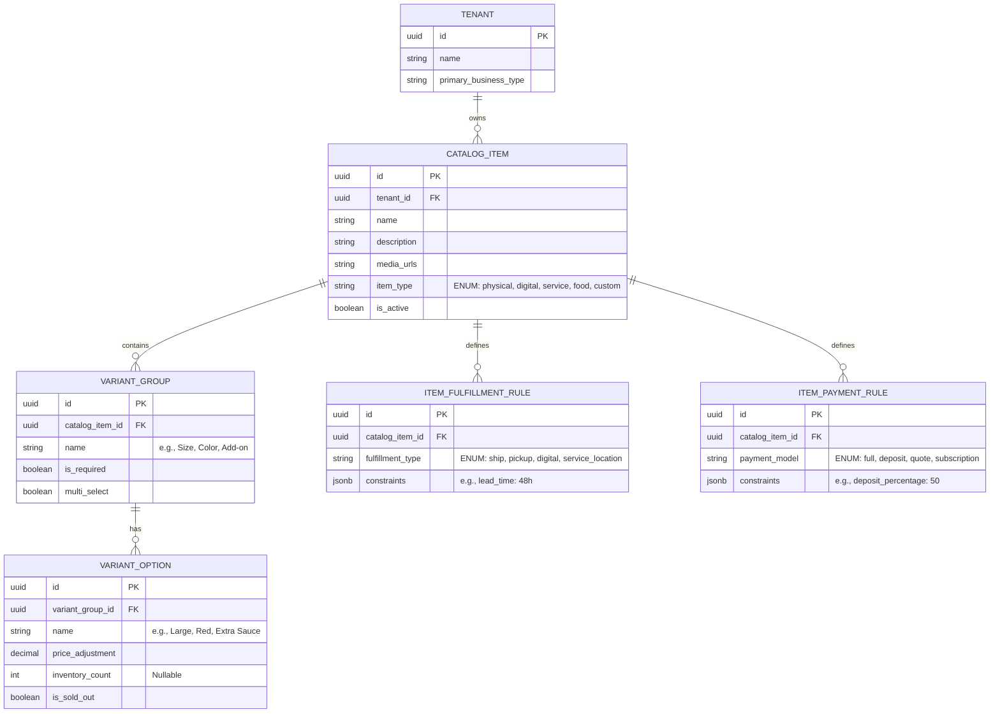

# [architecture] Universal Multi-Tenant Dynamic Catalog & Variant Rules Engine

## Title
Universal Multi-Tenant Dynamic Catalog & Variant Rules Engine

## Problem Statement
Small business owners offer extremely diverse products and services, yet most platforms force them into rigid "E-commerce Product" or "Service Booking" data models.
- **Priya (boutique owner)** needs physical products with size/color variants, tracked inventory, and shipping rules.
- **Fatima (food cart)** needs food items with simple "sold out" toggles, add-ons (extra sauce), and no shipping.
- **Carlos (handyman)** needs service listings with variable pricing (e.g., hourly vs. flat rate) and deposit requirements.
- **Maya (baker)** needs custom photo catalogs where items require custom quote requests and percentage-based deposits rather than instant checkout.

Currently, OneHumanCorp (OHC) lacks a unified, multi-tenant catalog architecture that can instantly adapt to these fundamentally different business models from a single, simple, mobile-first interface without forcing the user to understand complex configuration options.

## Research Report
### Competitive Analysis
*   **Shopify:** Excellent for Priya (variants, physical inventory), but terrible for Carlos (services require complex workarounds or apps). Rigid data model focused purely on physical/digital retail.
*   **Wix/Squarespace:** Offers different "apps" for Stores vs. Bookings vs. Restaurants, creating fragmented silos. A user can't easily sell a physical t-shirt, a digital tutorial, and an in-person workshop from the same unified catalog manager.
*   **Square:** Good offline/online parity, but variants can become messy, and quote/deposit flows for custom orders are clunky.

### OHC Opportunity
OHC must provide a **Polymorphic Catalog Entity** that fluidly changes its behavior (and AI operational handling) based on the business type. The business owner simply says, "I want to sell Vegan Chocolate Cake," and the AI dynamically attaches the correct variant structure (size, custom writing), fulfillment type (pickup/delivery), and payment rules (deposit vs. full payment) without exposing a complex database schema to the user.

## Design Doc

### Business Journey Mapping
1.  **Creation (Mobile UI):** Maya taps "+ Add Item". She uploads a photo of a cake. The AI agent detects it's a custom cake.
2.  **AI Auto-Configuration:** The AI automatically suggests: "Requires 50% deposit, customizable text (variant), 48-hour lead time." Maya taps "Looks good" (Activation).
3.  **Customer Experience (Web/Mobile Storefront):** A customer views the item, selects variants, enters custom text, and pays the deposit.
4.  **Fulfillment/Operations:** The order flows into the Unified Inbox with the variant data clearly extracted for Maya to fulfill.

### Architecture Diagram

### Mobile UX Flow (375px Viewport)
The design prioritizes macOS-style translucent glass and UniFi modular cards.

*   **Catalog List Screen:** A vertically scrolling list of cards. Each card shows a thumbnail, title, base price, and a large, accessible "Active/Sold Out" toggle switch.
*   **Item Detail/Edit Screen (The "Grandmother Test"):**
    *   Top: Large image dropzone/carousel.
    *   Middle: Title and Base Price input fields.
    *   Bottom: A section called "How you sell this" (hiding the complexity of fulfillment/payment rules).
    *   *AI Interaction:* Instead of manual variant setup, a text box says, "Describe variations (e.g., comes in Red and Blue, $5 extra for Large)." The AI generates the `VARIANT_GROUP` and `VARIANT_OPTION` entities instantly.
    *   Advanced Settings are hidden behind an accordion labeled "Advanced Rules".

### AI Agent Integration Points
*   **Catalog Architect Agent (Operations Dept):** Intercepts natural language descriptions or uploaded photos from the user and translates them into the structured polymorphic JSON required by the API.
*   **Inventory Watcher Agent:** Monitors `inventory_count` across all active `VARIANT_OPTION`s. If an item hits zero, it autonomously flips `is_sold_out` to true and updates the Edge Caching Storefront to prevent over-ordering, notifying the owner in the Unified Inbox.

### Technical Integrity & Mobile-First Review
*   **Performance:** Catalog reads must be heavily cached at the edge (CDN) since storefronts are read-heavy. The backend must invalidate specific item caches efficiently upon update.
*   **Offline-First:** On the mobile POS side (for Priya doing in-person tap-to-pay), the catalog must sync to a local SQLite/Realm database on the device.
*   **Zero Trust:** All read/write operations must enforce tenant isolation at the database level using Row-Level Security (RLS) keyed by the authenticated tenant's `organization_id` (via SPIFFE identity injected into the context).

## Implementation Prompt
**To the Implementer:**
Implement the backend APIs and database schema for the Universal Dynamic Catalog Engine. Your implementation must allow a single Tenant to create items of fundamentally different types (e.g., a physical product with size variants and tracked inventory, alongside a custom service requiring a 50% deposit and no inventory) within the same catalog structure.

The API must support creating an item, its variant groups, options, fulfillment rules, and payment rules in a single transactional request to support AI-driven generation. Ensure strict multi-tenant isolation (RLS or equivalent) so tenants can only access their own catalog. Do not prescribe the specific UI framework, but ensure the payload structure is clean enough to map directly to mobile-first UI components.

## Priority
P0

## Estimated Scope
Large
