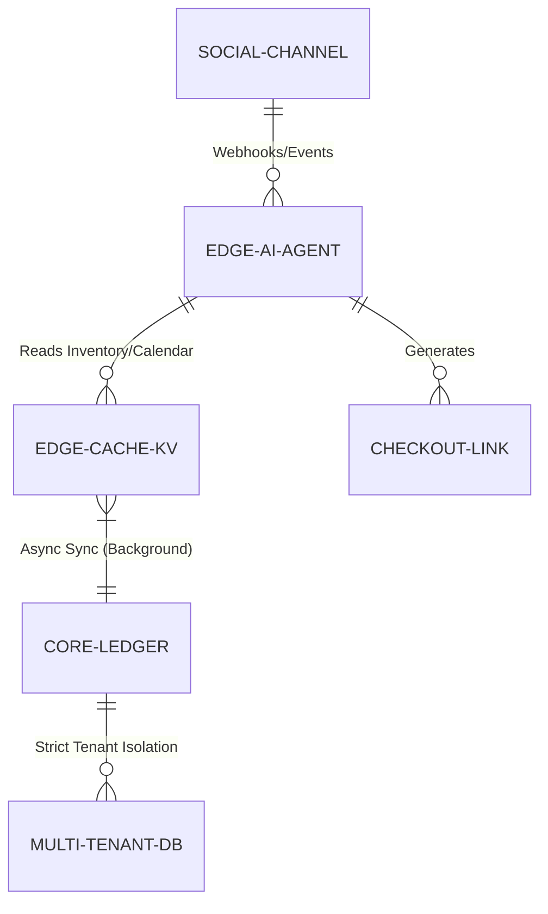

# Title: Multi-Tenant Edge-Caching Conversational Commerce Engine

## Problem Statement
Small business owners like Maya (baker) and Fatima (food cart) rely heavily on social media platforms (Instagram, WhatsApp) for customer acquisition and conversational orders. However, managing these orders, updating inventory in real-time, and taking deposits across disconnected channels causes massive friction. High-latency APIs or centralized databases cause delayed AI agent responses, losing impulsive buyers. A multi-tenant, edge-cached conversational commerce engine is needed to allow AI agents to instantly verify inventory, quote prices, and generate localized checkout links natively within social channels with zero perceptible latency.

## Research Report
*   **Current Architecture Limits:** OHC's current architecture relies on centralized cloud databases which introduce significant latency when AI agents need to check live inventory for Instagram DMs.
*   **Competitor Analysis:**
    *   *Shopify:* Uses global edge networks for storefronts but lacks native multi-tenant AI conversational agents at the edge.
    *   *ManyChat:* Great for conversational flows but lacks deep, real-time inventory and deposit ledger integration.
    *   *Wix:* Centralized, leading to slow conversational commerce responses.
*   **Discovery:** We need to push read-heavy data (catalog, availability calendar) to edge nodes for ultra-fast, single-digit millisecond reads by the AI agent. The AI agent must run at the edge to provide instant conversational responses.

## Design Doc

### Architecture Diagram

### UI Wireframes & Mobile UX Flow (375px)
*   **Customer View (Instagram/WhatsApp):** Customer messages "Do you have vegan cakes for tomorrow?" -> AI agent replies instantly (<500ms) with a beautifully formatted card/message containing an embedded checkout link using macOS-style Translucent Glass aesthetics and Ubiquiti UniFi modular layout.
*   **Merchant View (OHC Mobile App - 375px):**
    *   **Unified Inbox Card:** Clean dashboard card showing "Conversational Orders" with an auto-updating counter.
    *   **Agent Approval Feed:** If the AI is unsure, it pushes an approval request to the merchant's 375px screen. The screen uses a Translucent Glass overlay with a clear "Approve Quote" or "Edit" button. Grandmother test passed: Clear, large tap targets, intuitive swipe-to-approve.

### Key Design Decisions
*   **Edge-First AI Execution:** To guarantee sub-second conversational responses, the NLP routing and inventory checking happens at the edge using cached data.
*   **Strict Multi-Tenant Isolation:** Edge caches are segmented by Tenant ID using Zero-Trust policies (SPIFFE/SPIRE). Cross-tenant data leakage is structurally impossible.
*   **Optimistic UI/Async Ledger:** Transactions are queued locally or at the edge and synced to the core ledger asynchronously, ensuring high availability even during backend traffic spikes.

### AI Agent Integration Points
*   **Customer Service (CS) Agent:** Deployed at the edge. Context-aware of the current customer's history.
*   **Operations Agent:** Syncs edge cache with the core ledger. Informs the CS agent of inventory limits.

## Implementation Prompt
Implement a multi-tenant edge-caching layer for the conversational commerce AI agents using `src/server/utils/cache.rs` `HybridCache`. Ensure the `src/server/api/agents/webhook.rs` handles webhooks instantly using the edge cache for inventory checking and generates a checkout link in under 500ms using a provider from `src/server/integrations/registry.rs`. Use the Stripe integration for checkout preference.

## Priority
P0

## Estimated Scope
Large
