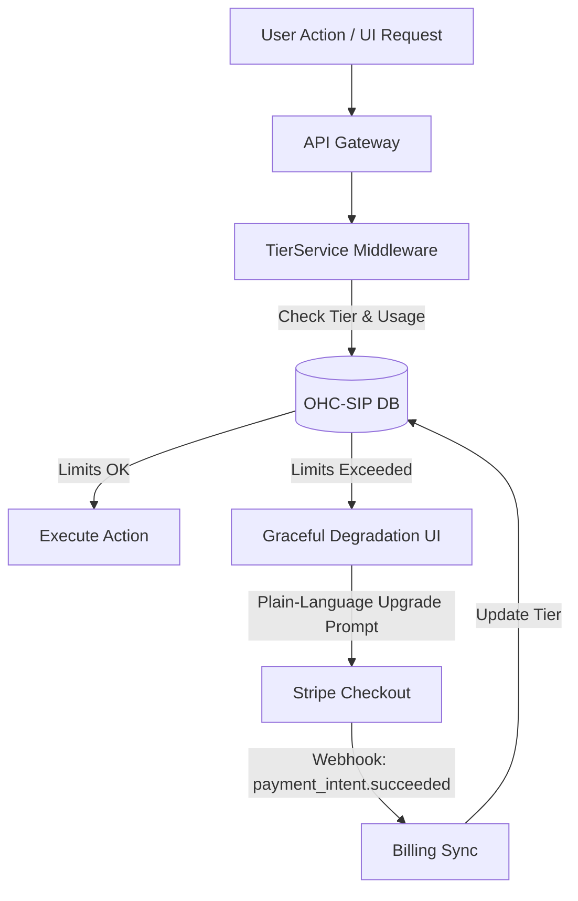

# Architecture Brief: Multi-Tenant SaaS Tier Architecture

## Title
OHC Multi-Tenant SaaS Tiers: Tier Enforcement and Upsell Logic

## Problem Statement
The OHC platform currently lacks a formalized multi-tenant tier system to handle feature and usage limits based on subscription plans. Without this, we cannot effectively monetize the platform while providing a robust free tier for non-technical small business owner personas (e.g., Maya, Carlos, Priya). The system needs a transparent, fair, and scalable pricing model. Maya needs a free tier to test the waters with her first cake order. As her business expands, she will hit limits (storage, AI actions, custom domains) that necessitate an upgrade to a paid tier (Starter, Pro, Business). The platform requires a clear architectural definition of these tiers, how limits are enforced, and how the user experience gracefully handles upgrades without technical friction.

## Research Report
- **Competitor Landscape**: Wix and Shopify use aggressive feature-gating. OHC's differentiation is "AI as the upgrade driver."
- **User Psychology**: Non-technical users upgrade when they see direct value (e.g., "The Sales Agent just secured a $500 booking, but your AI limit is reached. Upgrade to keep it running.") rather than abstract metrics like "Storage."
- **Tier Structure**:
  - **Free:** $0/mo. 10 Products, 1 AI Department (Ops), 100 AI actions/mo, 500MB Storage, OHC Subdomain.
  - **Starter:** $9/mo. 100 Products, 3 AI Departments, 1,000 AI actions/mo, 5GB Storage, Custom Domain.
  - **Pro:** $29/mo. Unlimited Products, 10 AI Departments, Unlimited AI actions, 50GB Storage, Custom Domain + SSL.
  - **Business:** $79/mo. Unlimited everything, 500GB Storage, Multi-domain.
- **Enforcement Mechanisms**: Limits must be enforced at the orchestration layer, not just the UI, to prevent abuse.

## Design Doc

### Key Design Decisions
1.  **Usage Metering**: All AI agent actions (invocations, drafted emails, generated quotes) must emit a telemetry event to a central metering service.
2.  **Soft Limits & Grace Periods**: When a user hits 90% of their limit, the Business Advisory Agent sends a proactive, friendly notification. Hitting 100% does not break the site; it queues actions and prompts for an upgrade.
3.  **Tier Information API**: The frontend must have a lightweight way to query the current tier and usage stats (e.g., `GET /api/v1/tenant/tier-status`) to render progress bars and upgrade CTAs natively.
4.  **No Technical Jargon**: Upgrade prompts must focus on business value. Instead of "Upgrade for more database storage," use "Upgrade to add more products to your catalog."
5.  **Billing Sync:** Integration with Stripe webhooks to handle asynchronous tier updates and payment processing.

### Architecture Diagram (Mermaid.js)

### AI Agent Integration Points
- AI Agents are strictly subject to tier limits.
- The **"Business Advisory"** agent proactively surfaces tier upgrade recommendations in the dashboard based on usage patterns (e.g., nearing product limit or action limits).

### Mobile UX Flow (375px First)
- **Settings View**: A dedicated "My Plan" section using clean Glassmorphism cards.
- **Progress Bars**: Visual indicators showing "AI Tasks This Month" (e.g., 85/100).
- **The Upgrade Trigger**: When an action is blocked (e.g., trying to add an 11th product on the Free tier), a bottom sheet modal appears with a 1-tap Apple Pay/Google Pay upgrade button.
- **Plain Language:** Instead of a technical error, the UI shows a plain-language prompt (e.g., "You've reached your free product limit. Upgrade to add more!").

## Implementation Prompt
Implement the Multi-Tenant SaaS Tier Architecture. Create the `TierService` middleware, define the tier structures in the database, integrate with Stripe webhooks for billing sync, and update frontend components to handle graceful degradation and upgrade prompts. On the frontend, implement the mobile-first "My Plan" view using the visual excellence tokens (Glassmorphism, Outfit font) to display usage progress. Ensure that when a limit is reached, the UI elegantly presents a friendly upgrade prompt rather than a technical error. Do NOT prescribe specific database schemas.

## Priority
P0

## Estimated Scope
Large
