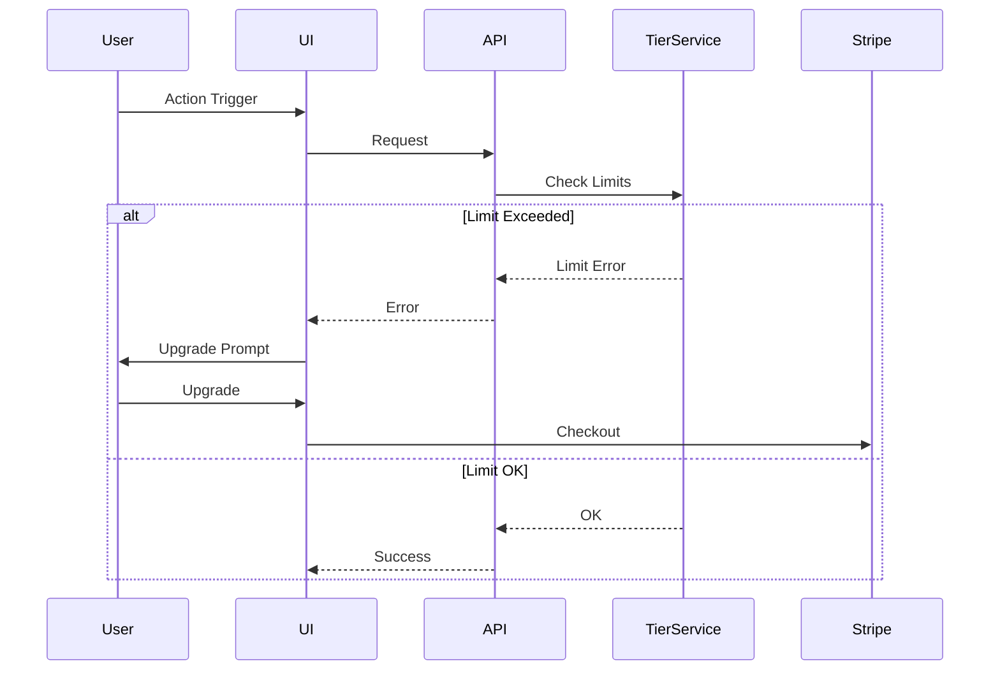

# Architecture Brief: Multi-Tenant SaaS Tiers

## Title
OHC Multi-Tenant SaaS Tiers Architecture

## Problem Statement
The OHC platform currently lacks a formalized multi-tenant tier system to handle feature and usage limits based on subscription plans. Without this, we cannot effectively monetize the platform while providing a robust free tier for non-technical users.

## Research Report
- **Competitive Analysis**:
  - **Shopify:** Complex and lacks a free tier.
  - **Wix/Squarespace:** Confusing upgrade paths and ad-supported free tiers.
  - **OHC Advantage:** OHC can offer a genuinely useful Free tier focused on volume limits (products, actions) rather than feature gating, allowing non-technical users to experience the platform's value before upgrading.

- **Tier Structure**:
  1.  **Free:** $0/mo. 10 Products, 1 AI Department, 100 AI actions/mo, 500MB Storage, OHC Subdomain.
  2.  **Starter:** $9/mo. 100 Products, 3 AI Departments, 1,000 AI actions/mo, 5GB Storage, Custom Domain.
  3.  **Pro:** $29/mo. Unlimited Products, 10 AI Departments, Unlimited AI actions, 50GB Storage, Custom Domain + SSL.
  4.  **Business:** $79/mo. Unlimited everything, 500GB Storage, Multi-domain.

## Design Doc

### High-Level Architecture (Mermaid.js)

### Mobile UX Flow (375px First)
- **Graceful Degradation:** When limits are reached, the system will pause actions and present clear, plain-language upgrade prompts rather than technical errors.
- **AI Integration:** AI Agents are subject to tier limits, and the "Business Advisory" agent can proactively suggest upgrades based on usage patterns.

## Implementation Prompt
Implement the Multi-Tenant SaaS Tier Architecture as outlined above. This includes creating the `TierService` middleware, defining the tier structures in the database, integrating with Stripe webhooks for billing sync, and updating the frontend components to handle graceful degradation and upgrade prompts. Ensure all components use OHC premium design tokens and adhere to the mobile-first strategy.

## Priority
P0

## Estimated Scope
Medium
