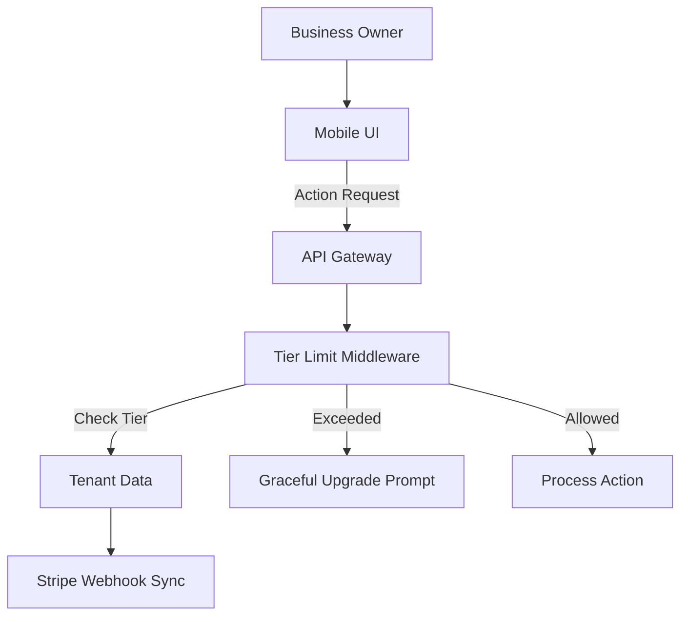

# Title
Multi-Tenant SaaS Tier Architecture

## Problem Statement
The OHC platform currently lacks a formalized multi-tenant tier system to handle feature and usage limits based on subscription plans. Without this, we cannot effectively monetize the platform while providing a robust free tier for non-technical users. The pricing model needs to be transparent, fair, and perfectly aligned with the non-technical small business owner personas.

## Research Report
- **Competitive Analysis**: Shopify is complex and lacks a true free tier. Wix and Squarespace have confusing upgrade paths and ad-supported free tiers that look unprofessional. GoDaddy pushes domain upselling heavily.
- **OHC Advantage**: OHC offers a genuinely useful Free tier focused on volume limits (products, actions) rather than feature gating, allowing non-technical users to experience the platform's value before upgrading.

## Design Doc

### Architecture Diagram

### UI Wireframes or Screen Flow Description (375px first)
1. **Tier Limit Modal**: A plain-language prompt explaining the limitation (e.g., "You've reached your free product limit").
2. **Upgrade Screen**: A simple, one-click upgrade path using Stripe Checkout, clearly showing the new benefits without technical jargon.
3. **Usage Dashboard**: Visual progress bars showing current usage vs. limits.

### Mobile UX Flow
When a user attempts an action that exceeds their tier limit, the UI intercepts the request gracefully instead of failing. A bottom-sheet or modal appears with the plain-language upgrade path. The entire checkout flow is mobile-optimized via Stripe.

### AI Agent Integration Points
- **Business Advisory Agent**: Proactively analyzes usage and suggests upgrades (e.g., "You're getting lots of traffic. Upgrading to Starter will give you a custom domain to boost trust.").
- **Agent Action Limits**: AI actions are tracked against the tenant's tier quota (e.g., 100 actions/mo for Free).

### Key Design Decisions and Why
- **Volume-Based Gating**: Limit by product count and AI actions rather than core features, to prove value early.
- **Graceful Degradation**: Never block the user with a hard technical error; always offer a seamless path forward.
- **Tier Service Middleware**: Enforce limits at the API/Orchestration layer reliably across all endpoints.

## Implementation Prompt
Implement the Multi-Tenant SaaS Tier Architecture. Create the `TierService` middleware to intercept requests, verify the tenant's current tier, and enforce configured limits (product count, AI actions). Integrate Stripe webhooks for asynchronous billing and tier updates. Update frontend components to handle graceful degradation, displaying plain-language upgrade prompts when limits are reached instead of technical errors. Ensure the Business Advisory Agent can surface proactive upgrade recommendations in the dashboard. Include end-to-end tests for a user attempting to exceed a limit and successfully going through the upgrade flow.

## Priority
P1

## Estimated Scope
Medium
