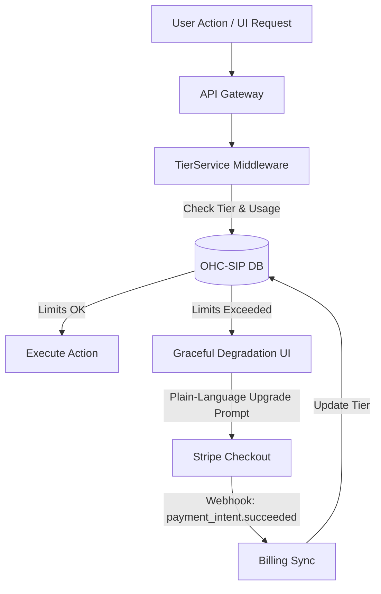

# Architecture Brief: Multi-Tenant SaaS Tiers

## Title
Multi-Tenant SaaS Tier Architecture

## Problem Statement
The OHC platform currently lacks a formalized multi-tenant tier system to handle feature and usage limits based on subscription plans. Without this, we cannot effectively monetize the platform while providing a robust free tier for non-technical small business owner personas (e.g., Maya, Carlos, Priya). The system needs a transparent, fair, and scalable pricing model.

## Research Report
- **Competitive Analysis:**
  - **Shopify:** Complex and lacks a free tier.
  - **Wix/Squarespace:** Confusing upgrade paths and ad-supported free tiers.
  - **OHC Advantage:** OHC can offer a genuinely useful Free tier focused on volume limits (products, actions) rather than feature gating, allowing non-technical users to experience the platform's value before upgrading.
- **Tier Structure:**
  - **Free:** $0/mo. 10 Products, 1 AI Department, 100 AI actions/mo, 500MB Storage, OHC Subdomain.
  - **Starter:** $9/mo. 100 Products, 3 AI Departments, 1,000 AI actions/mo, 5GB Storage, Custom Domain.
  - **Pro:** $29/mo. Unlimited Products, 10 AI Departments, Unlimited AI actions, 50GB Storage, Custom Domain + SSL.
  - **Business:** $79/mo. Unlimited everything, 500GB Storage, Multi-domain.

## Design Doc

### Key Design Decisions
1.  **Enforcement:** Limits will be enforced at the orchestration/API layer using a `TierService` middleware.
2.  **Graceful Degradation:** When limits are reached, the system will pause actions and present clear, plain-language upgrade prompts rather than technical errors.
3.  **Billing Sync:** Integration with Stripe webhooks to handle asynchronous tier updates and payment processing.

### Architecture Diagram (Mermaid.js)

### AI Agent Integration Points
- AI Agents are strictly subject to tier limits.
- The **"Business Advisory"** agent proactively surfaces tier upgrade recommendations in the dashboard based on usage patterns (e.g., nearing product limit or action limits).

### Mobile UX Flow (375px First)
- **Graceful Interception:** When a user attempts an action that exceeds their current tier's limits, a bottom-sheet modal (375px optimized) slides up.
- **Plain Language:** Instead of a technical error, the UI shows a plain-language prompt (e.g., "You've reached your free product limit. Upgrade to add more!").
- **1-Click Upgrade:** Offers a simple, one-click upgrade path using Stripe Checkout, integrated directly into the mobile view.

## Implementation Prompt
Implement the Multi-Tenant SaaS Tier Architecture. Create the `TierService` middleware, define the tier structures in the database, integrate with Stripe webhooks for billing sync, and update frontend components to handle graceful degradation and upgrade prompts. Ensure all components use OHC premium design tokens and adhere to the mobile-first strategy. Do NOT prescribe specific database schemas.

## Priority
P0

## Estimated Scope
Large
