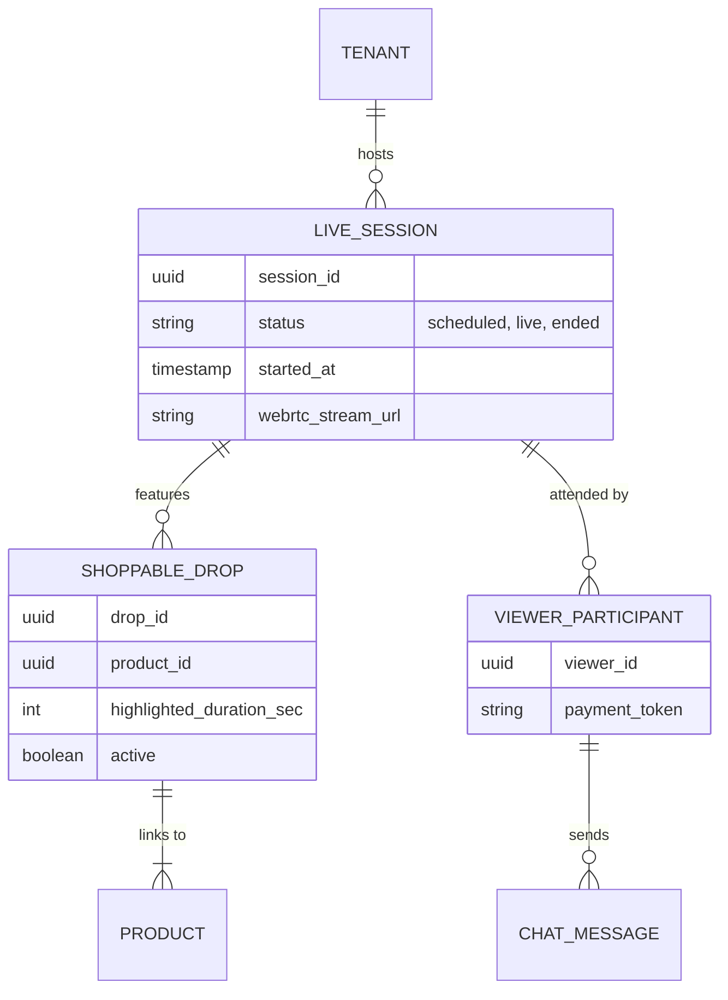

# [Architecture] Native Live Commerce & Shoppable Streaming

## Title
Native Live Commerce & Shoppable Streaming Engine

## Problem Statement
Small business owners like Priya (Boutique Owner) and Maya (Baker) increasingly rely on live video (Instagram Live, TikTok Live) to showcase new collections or custom creations. However, these platforms force users to constantly hop between apps—customers must leave the stream, navigate a link-in-bio, find the product, and check out, leading to massive drop-off rates and lost sales. Furthermore, real-time inventory synchronization fails during high-traffic drops, resulting in overselling. Small businesses need a fully integrated, "zero-config" live shopping experience directly on their OHC storefront that merges low-latency streaming with instant, 1-tap checkout, keeping the entire transaction within their owned channels.

## Research Report
**Market Gap Analysis:**
- **Competitors (Shopify, Wix, Squarespace):** Currently, they rely on complex third-party integrations (like Bambuser or Firework) to embed live shopping, which are expensive, developer-heavy, and fail the "grandmother test."
- **Social Giants (TikTok Shop, Instagram):** High fees and algorithms control the audience. Small businesses do not own their customer data.

**The OHC Differentiator:**
By embedding WebRTC-based low-latency streaming directly into the OHC platform, we can offer native, zero-friction live commerce. When Priya goes live, the OHC Operations Agent handles real-time inventory deduplication, the Customer Success Agent auto-moderates the chat, and the Marketing Agent sends push notifications. Customers can tap and buy without leaving the video player.

## Design Doc

### Architecture Diagram

### Mobile-First UX Flow (375px)
1. **Broadcaster View (Priya):** A massive "Go Live" button on the OHC Merchant App dashboard. Upon tapping, her camera activates. Below the video preview, she has a carousel of her products. Tapping a product instantly "pins" it to the live stream for all viewers.
2. **Viewer View:** The customer opens Priya's OHC link. The live video plays full screen (TikTok style). When Priya pins a product, a sleek, glassmorphic card slides up from the bottom with a 1-tap "Buy Now with Apple/Google Pay" button.
3. **Frictionless Checkout:** The transaction processes instantly in a bottom-sheet overlay without interrupting the live video or chat feed.

### Key Architectural Invariants & Targets
- **Performance:** Stream latency must remain < 2 seconds (WebRTC). Inventory claims must resolve in < 50ms using edge-cached optimistic locking to prevent overselling during flash drops.
- **Zero Trust & Security:** Broadcaster streams are authenticated via SPIFFE/SPIRE. Tenant isolation guarantees that Priya's stream data and viewer payment tokens are cryptographically separated from other merchants.
- **Offline Resilience:** If the merchant's connection drops, the stream gracefully degrades to a "Reconnecting" slate while the chat and previously pinned products remain active.

### AI Department Coordination
- **The Operations Agent:** Listens to the high-throughput event mesh during a live drop. If 50 people try to buy 10 dresses, the agent manages the queue, allocating inventory fairly and gracefully rejecting the rest with a "Waitlist" option.
- **The Customer Success Agent:** Ingests the real-time WebSocket chat. If viewers repeatedly ask "What size is she wearing?", the agent automatically replies or overlays a pre-approved FAQ card on the stream.
- **The Marketing Agent:** Before the stream starts, it autonomously dispatches SMS and email blasts to Priya's VIP customers.

## Implementation Prompt
**To Implementer Agent:**
Implement the Native Live Commerce engine for OHC Storefronts. Establish the WebRTC streaming infrastructure and WebSocket connections necessary for low-latency live video and real-time chat. Build the `LiveSession` and `ShoppableDrop` data models with strict multi-tenant isolation. Create a seamless, mobile-optimized (375px) viewer UI where pinned products trigger a bottom-sheet checkout overlay. Integrate the AI Agent swarm hooks so that the Operations Agent can manage burst inventory claims during flash drops, and the Customer Success Agent can monitor and moderate the live chat stream.

## Priority
P1

## Estimated Scope
Large
