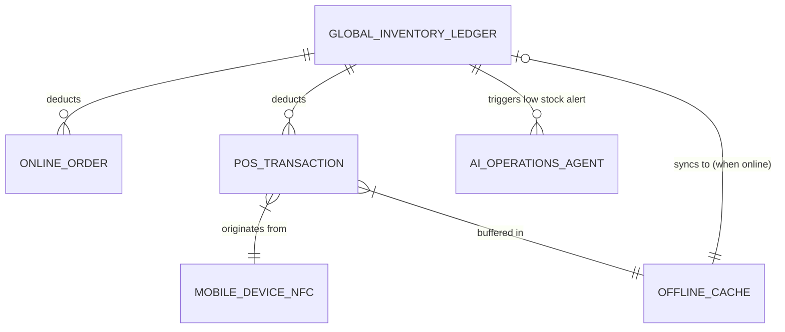

# Native POS & Unified Inventory Integration

## Title
Native POS Integration and Unified Inventory Sync Engine

## Problem Statement
For merchants with both physical and online presences (like Priya the boutique owner), managing separate inventory pools is a critical pain point. Existing solutions either require manual synchronization (leading to overselling and unhappy customers) or complex, expensive third-party integrations. Non-technical users need a seamless, invisible system where a sale in-store (via a native Point of Sale terminal or tap-to-pay on their phone) instantly deducts from the global inventory pool, updating the online storefront in real-time without any manual intervention.

## Research Report
**Findings:**
1.  **Shopify:** Offers strong native POS but charges significant hardware fees and requires a complex setup process for beginners. The POS app is separate from the main admin app, creating friction.
2.  **Wix:** Provides POS through partnerships, but it feels bolted on rather than native. Inventory sync can sometimes lag.
3.  **OHC Gap:** Our platform currently lacks a deeply integrated native POS system that allows owners to use their own mobile devices as tap-to-pay terminals with instantaneous, invisible inventory synchronization.

**Data & References:**
*   Gap Analysis Report (`ohc_small_business_platform_gap_analysis.md`) identifies "Native POS Integration" as a major gap where competitors currently have an advantage.
*   Market Dominance Report (`ohc_market_dominance_smb_platform_research_report.md`) highlights the "Priya" persona whose primary pain point is inventory sync and lack of POS integration.

## Design Doc

### Key Design Decisions
1.  **Mobile-First Tap-to-Pay:** Utilize the user's existing mobile device (NFC enabled) as the primary POS terminal, eliminating the need for expensive proprietary hardware.
2.  **Single Global Inventory Ledger:** A unified data model where both online carts and physical POS transactions hit the same atomic inventory ledger.
3.  **Offline Tolerance:** The POS must be able to cache transactions offline and sync the ledger once connectivity is restored, prioritizing the physical checkout speed.
4.  **AI Operations Agent Integration:** When inventory drops below a threshold due to a POS sale, the Operations Agent automatically drafts a reorder email to the supplier.

### Architecture Diagram

### UI Wireframes / Screen Flow (375px first)
*   **Main Dashboard:** Prominent "Tap to Pay" floating action button (FAB) accessible from anywhere.
*   **POS Checkout Flow:**
    1.  Grid of product photo cards with large tap targets.
    2.  User taps products to add to a slide-up cart summary.
    3.  Tap "Charge [Amount]".
    4.  Screen transitions to an NFC ready state: "Hold customer card to back of phone." using translucent glass materials.
    5.  Success haptic feedback and instantaneous inventory update notification toast.
*   **Inventory Tab:** Shows unified stock levels with "In-store" and "Online" reserved allocations clearly visible but managed under one total number.

## Implementation Prompt
**Objective:** Build the Native POS and Unified Inventory Sync Engine.
**User Journey (CUJ):** Priya opens the OHC app on her iPhone. A customer wants to buy a dress in-store. Priya taps the dress in her catalog, taps "Charge", and the customer taps their credit card to her phone. The payment is processed, and the dress's inventory count is instantly reduced by one. If that dress is now sold out, the online storefront automatically updates to "Sold Out" before another customer can add it to their online cart.
**Acceptance Criteria:**
*   Implement a unified inventory data model that acts as the single source of truth for both online and physical channels.
*   Create a mobile-first POS interface that allows adding items to a cart and triggering an NFC payment flow.
*   Ensure that a completed POS transaction atomically updates the inventory ledger.
*   Implement an offline queueing mechanism so POS sales can occur without internet and sync automatically upon reconnection.
*   Do NOT prescribe the specific payment gateway SDK or database schema—focus on the abstraction and synchronization logic.

## Priority
P0

## Estimated Scope
Large
