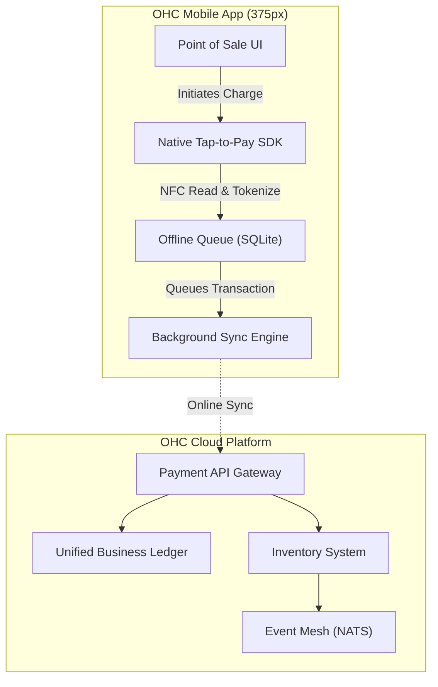

# 📱 Architecture: Native Offline-First Tap-to-Pay POS

## Title
Implement Native Mobile Tap-to-Pay POS Architecture with Offline-First Queuing

## Problem Statement
Small business owners like Fatima (Food Cart) and Priya (Boutique Owner) operate in fast-paced physical environments, sometimes with spotty internet connectivity (like food truck festivals or basement shops). Traditional POS hardware is expensive, clunky, and requires confusing third-party integrations that fragment their data. They need to accept in-person payments securely and instantly using just their own smartphone, with the peace of mind that transactions will process even if the Wi-Fi drops, and that everything syncs perfectly with their unified OHC ledger and inventory without any manual work.

## Research Report
- **Competitor Analysis**:
  - *Shopify POS*: Requires downloading a separate app and often buying additional card reader hardware. This violates our Radical Simplicity ethos.
  - *Square*: Easy to use, but takes a significant cut of revenue and silos customer data away from the main business operating system.
  - *Stripe Terminal*: Offers Tap-to-Pay on iPhone/Android SDKs, but is heavily developer-focused.
- **Strategy**: Leverage the native iOS/Android Tap-to-Pay capabilities (via Stripe Terminal SDK or similar underlying provider) embedded directly into the primary OHC app. Wrap it in a robust offline-first synchronization engine.
- **Target Persona**: Priya (Boutique Owner), Fatima (Food Cart, 50, limited English).
- **Advantages**: Zero extra hardware costs. True unified data model (sales instantly update inventory and trigger AI agents). Radical simplicity—no switching apps.
- **Risks**: Security and compliance for offline authorizations. Managing user expectations if a deferred offline transaction declines when back online.
- **Pricing Impact**: Increases platform stickiness; standard payment processing fees apply.

## Design Doc

### Architecture Diagram

### UI Wireframes or screen flow description (375px first)
- **Screen 1 (Checkout)**: A clean, modular dashboard card layout showing the cart summary. A prominent Primary Blue (`#0071E3`) "Charge $XX.XX" button at the bottom.
- **Screen 2 (Payment Overlay)**: Triggering native OS Tap-to-Pay. The UI behind the native overlay adopts a macOS-style Light Translucent Glass (`background: rgba(255, 255, 255, 0.65)`) to maintain focus on the hardware interaction. Technical terms are entirely hidden; it simply says "Hold card or phone near top".
- **Screen 3 (Success & Receipt)**: Success Green (`#34C759`) checkmark. Options to "Text Receipt" or "Email Receipt" as large, tappable cards.

### Mobile UX Flow
1. User adds items to the cart from the physical product catalog or enters a custom amount.
2. User taps "Charge".
3. The native OS NFC reader activates. Customer taps their physical card or digital wallet.
4. If online, the transaction is processed instantly. If offline, a reassuring "Payment Saved Offline" notification appears, and the transaction is queued.
5. Inventory is immediately decremented locally so the user knows what's in stock.
6. User can immediately start the next order (Crucial for high-volume scenarios like Fatima's food cart).

### AI Agent Integration Points
- **The Vigilant Manager (Operations)**: Listens to the inventory decrement events globally. If a product hits the low-stock threshold, it queues a 1-tap restock task in the dashboard.
- **The Silent Ambassador (Customer Success)**: If a digital receipt is sent, the agent automatically associates the payment method with a customer profile and can follow up for feedback or offer a loyalty discount on their next visit.
- **The Business Advisor (Advisory)**: Factors in-person sales velocity into the daily human-language briefing (e.g., "In-person sales were up 20% today at the festival!").

### Key Design Decisions and Why
- **Offline-First SQLite Queue**: Chosen because food carts (Fatima) and pop-up shops (Priya) frequently operate in areas with congested or dead cellular networks. We cannot block a sale due to a dropped packet.
- **Unified App Shell**: We chose not to build a standalone "OHC POS" app. Requiring a separate download adds friction and violates the "zero to live in 10 minutes" vision.
- **Grandmother Test Compliance**: All payment routing, tokenization, and sync logic are abstracted. The user never sees the words "Syncing", "API", or "Token". They only see "Payment Received" or "Payment Saved Offline".

## Implementation Prompt
Implement the native mobile Tap-to-Pay POS integration and offline queuing system.
- Create a UI for the Point of Sale cart and the checkout button following the translucent glass design system.
- Integrate the necessary native bridges to trigger the OS-level NFC Tap-to-Pay overlay.
- Build the local database queue to store transaction tokens when the device lacks internet connectivity.
- Develop the background sync engine that safely flushes queued transactions to the OHC backend once connectivity is restored.
- **Acceptance Criteria**:
  - A user can open the POS tab on their phone and tap "Charge".
  - The native Tap-to-Pay interface appears.
  - Upon a successful dummy NFC read (without internet), the transaction is saved locally and inventory is decremented.
  - When the internet connection is restored, the transaction automatically syncs to the central ledger.
  - The UI remains completely free of developer jargon.

## Priority
P0

## Estimated Scope
Large