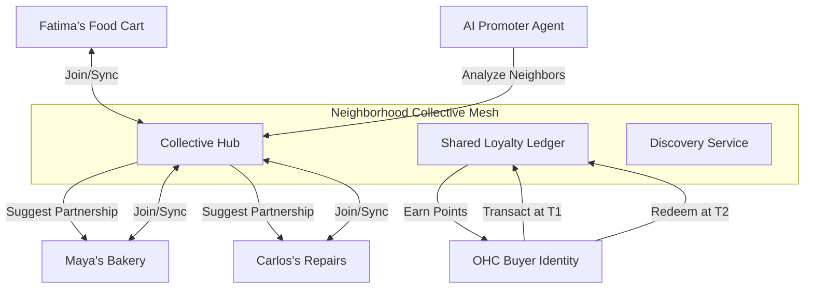
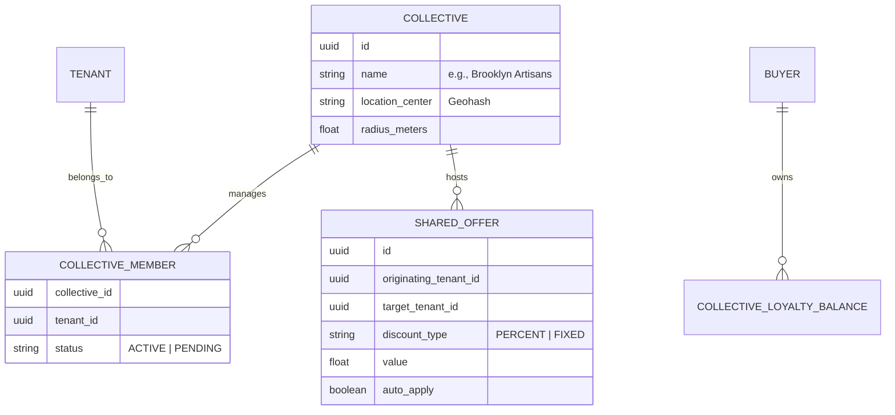

# [Architecture] Neighborhood Collective Discovery & Shared Loyalty Mesh

## 1. Title
**Neighborhood Collective Discovery & Shared Loyalty Mesh (The OHC "Main Street" Engine)**

## 2. Problem Statement
Small business owners like **Maya (baker)**, **Carlos (handyman)**, and **Fatima (food cart operator)** operate as isolated islands. While they may physically be located in the same neighborhood or serve the same local customer base, they lack the technical infrastructure to leverage each other's success.

Large retail chains dominate because of massive, unified loyalty networks and cross-promotional power. Currently, if a customer buys a cake from Maya, there is no automated way for Maya to recommend Carlos for the customer's upcoming party, or for them to offer a "Neighborhood Bundle." Managing these partnerships manually via paper flyers or verbal mentions is high-friction and untrackable. They need an autonomous "Collective Mesh" that enables discovery, shared loyalty points, and cross-merchant rewards without any manual accounting or technical setup.

## 3. Research Report
### Market Gap & Competitor Analysis
*   **Shopify Collective**: Allows merchants to sell other merchants' products, but it is focused on e-commerce drop-shipping, not local, physical neighborhood synergy. It requires complex desktop configuration.
*   **Wix/Squarespace**: Completely isolated. No cross-tenant discovery or loyalty integration exists natively.
*   **Nextdoor / Yelp**: Provide discovery but are disconnected from the transaction. You can't earn a "Main Street Point" at the bakery and spend it at the hardware store.

### The OHC Opportunity
OHC can create a "Network Effect for the Little Guy." By utilizing the **Universal Buyer Identity (OHC Pay)**, we can allow separate tenants to form a "Collective." Within this mesh, AI agents proactively identify complementary businesses (e.g., a baker and a florist) and suggest shared loyalty programs. This turns every OHC merchant into a discovery node for every other local OHC merchant, creating a "Virtual Mall" experience on a 375px phone screen.

## 4. Design Doc

### Architecture Diagram (Mermaid.js)

### Data Model & Invariants

**Key Invariants:**
*   **Multi-Tenant Isolation**: Loyalty balances are scoped to the `CollectiveID`. Maya cannot see Carlos's private sales data, only the shared loyalty events.
*   **Zero-Jargon Transparency**: The UI never uses "Reciprocal API" or "Geofencing." It uses "Neighborhood Group" and "Local Partner."
*   **Opt-in Only**: No tenant is added to a collective without a 1-tap mobile approval.

### Mobile-First UX Flow (375px First)
1. **The Neighborhood Pulse (Dashboard Card)**: A translucent glass card appears on Maya's dashboard: *"There are 4 OHC businesses in your area. Form a 'Main Street Collective' to share customers?"*
2. **The "Partner Match" Sheet**: Maya taps the card and sees high-contrast cards for Carlos and Fatima with their "Vibe" matches.
3. **Shared Loyalty Setup**: Maya selects "Shared Points." The AI suggests: *"Give 5 'Main Street' points for every $10 spent. Points valid at all 3 shops."*
4. **Buyer Experience (The OHC Wallet)**: A customer pays Maya using OHC Pay. Their receipt (glassmorphic modal) shows: *"You earned 15 Main Street Points! Spend them at Carlos's Repairs or Fatima's Cart nearby."*
5. **Discovery Widget**: On Maya's live storefront, a subtle "Neighbors" footer displays partner businesses with a 1-tap navigation/booking link.

### AI Agent Integration Points
- **The Promoter (Marketing AI)**: Periodically scans for OHC tenants within a 5-mile radius. Evaluates business categories to find non-competing, complementary pairs (e.g., Handyman + Cleaning Service).
- **The Accountant (Finance AI)**: Handles the "Loyalty Clearinghouse" logic, ensuring that if a customer earns points at Maya's but spends them at Carlos's, the ledger records the value transfer correctly for tax purposes.

## 5. Implementation Prompt
**Task for Implementer Agent:**
Build the backend services and mobile UI for the "Neighborhood Collective Discovery & Shared Loyalty Mesh."

**User Journey (CUJ):**
1. Maya (Merchant A) receives a dashboard suggestion to partner with Carlos (Merchant B).
2. Maya taps "Invite Carlos" to form a collective.
3. Carlos receives a push notification, reviews the partnership terms (Shared Loyalty), and taps "Join."
4. A customer (Sarah) buys a cake from Maya. Her OHC Pay profile is credited with "Neighborhood Points."
5. Sarah later visits Carlos's booking page. The OHC checkout UI automatically detects her points and offers a translucent glass toggle: `[ Use 50 Neighborhood Points for $5 off ]`.
6. Upon redemption, the Finance AI updates the shared ledger to record the cross-merchant value transfer.

**Acceptance Criteria:**
*   **Collective Membership**: Implement the `Collective` and `CollectiveMember` entities with strict RLS.
*   **Shared Ledger**: Create a service that manages shared loyalty point accumulation and redemption across different `tenant_id`s, validated by the `Universal Buyer Identity`.
*   **Mobile Discovery**: Build a 375px-optimized "Neighborhood Widget" for the storefront that dynamically lists collective partners.
*   **Visual Excellence**: All partnership cards and loyalty toggles must use the macOS Translucent Glass styling (`backdrop-filter: blur(20px)`).
*   **Grandmother Test**: The entire setup must require < 3 taps for the merchant. No complex rule builders.

## 6. Priority
**P1** (High - This is OHC's primary "Unfair Advantage" to create a network effect).

## 7. Estimated Scope
**Large** (Requires integration with OHC Pay, cross-tenant ledger logic, and location-based discovery).
