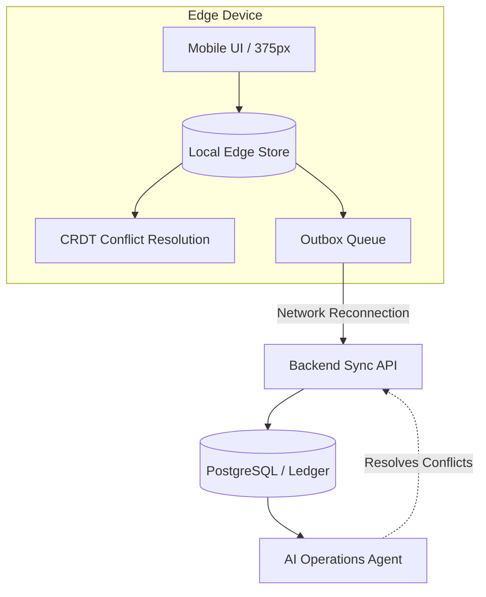

# Implement High-Performance Offline-First Edge Inventory Sync Architecture

## Problem Statement
For mobile-first businesses operating in dynamic or constrained environments (e.g., Fatima the food cart owner at a crowded festival, Maya at a pop-up market, or Carlos out of cellular range in a client's basement), network reliability is a primary bottleneck. Currently, OHC requires a continuous connection to process inventory decrements, validate stock, and accept orders. When connection drops or slows, OHC becomes unresponsive. We need a robust architecture that allows point-of-sale actions, pre-orders, and critical catalog state updates to execute instantly on the edge (device/browser), optimistically reconciling with the backend when connection is restored, without losing data or overselling limited stock.

## Research Report
### Target Capabilities
- Zero-latency perceived interactions for catalog browsing, cart addition, and POS order creation.
- Complete operation of critical business features even with zero network connectivity.
- Guaranteed eventual consistency using CRDTs (Conflict-free Replicated Data Types) and vector clocks for concurrent order resolution.
- Intelligent background sync engine (ServiceWorker/Flutter Isolate) managing a robust outbox queue.
- Edge caching of dynamic catalog states, localized strings, and multi-currency exchange rates.

### Competitive Landscape
- **Square/Stripe Terminal**: Excellent offline mode for in-person payments, but often decoupled from full inventory sync.
- **Shopify POS**: Supports offline cash transactions and syncs later, but lacks deep autonomous reconciliation for complex variants without manual review.
- **OHC Opportunity**: Deeply integrated edge-caching where AI agents handle the conflict resolution (e.g., automatically issuing apologies/store credit if a true oversell occurs due to prolonged offline state, rather than blocking the sale entirely).

## Design Doc
### Architecture Diagram

### Mobile UX Flow (375px first)
- Unobtrusive "Offline Mode" indicator using subtle frosted glass pill in the header.
- Cart and POS checkout flows show no blocking spinners; instant local confirmation.
- Toast notifications when the outbox syncs successfully in the background.

### AI Agent Integration Points
- **Operations Agent (The Manager)**: Actively monitors the reconciliation queue. If an oversell is detected upon re-sync, it automatically triggers a workflow: notify owner, draft apology to customer, and offer refund/store credit via Finance Agent.
- **Customer Success (The Ambassador)**: Informs online customers of potential delays if the system detects the merchant device has been offline for an extended period.

### Key Design Decisions
- CRDT-based ledger for offline modifications instead of integer decrement to ensure consistency.
- SQLite/IndexedDB for local edge storage.
- Optimistic UI updates with event-sourcing pattern for queued changes.

## Implementation Prompt
Implement the edge-sync architecture for inventory and ordering.
1. Create the backend sync endpoints and conflict resolution logic (CRDT or event-sourcing based) for inventory items.
2. Define the PostgreSQL schema for the sync outbox and conflict ledger.
3. Implement the local edge storage (SQLite/IndexedDB abstraction) on the Flutter client, ensuring offline-first reads for catalog data.
4. Add comprehensive automated E2E tests validating the offline-to-online transition and conflict resolution.
5. Ensure all UI updates are instant (optimistic) and properly reflect network state.

## Priority
P1

## Estimated Scope
Large
