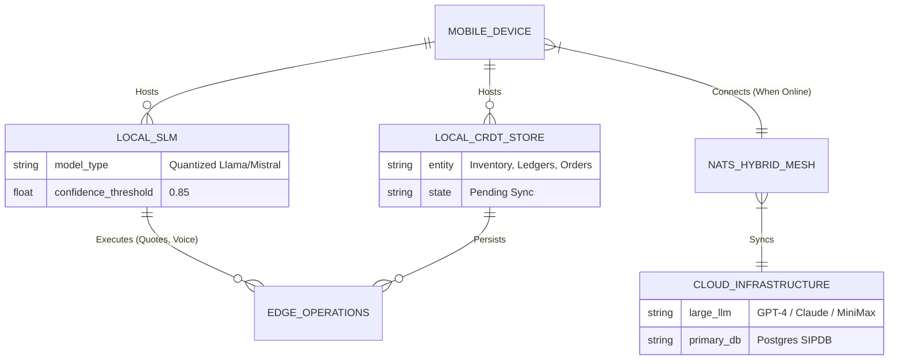

# [architecture] Offline-First Edge AI Inference Mesh

## Title

Offline-First Edge AI Inference Mesh

## Problem Statement

Small business owners operating in low-connectivity environments—like Carlos (a handyman in a concrete basement) or Fatima (a food cart vendor in a congested, signal-starved event space)—cannot rely on cloud-dependent AI. When connectivity drops, critical business functions such as generating automated quotes, recording sales, checking inventory, or processing local AI-driven voice commands fail. If the AI "Ambassador" and autonomous operations go offline, the Zero-Drop autonomous promise of OneHumanCorp (OHC) breaks, leading to lost revenue and severe operational friction. They need an invisible mesh that continues to provide core AI capabilities and business logic directly on the device, seamlessly syncing when connectivity is restored.

## Research Report

- **Shopify POS / Inbox:** Highly dependent on constant cloud connectivity. The "Sidekick" AI and even basic checkout features degrade severely or fail completely in dead zones.
- **Wix / Squarespace / GoDaddy:** Inherently cloud-bound web applications. They offer no real offline capabilities, let alone on-device AI inference.
- **OHC Differentiation - "Zero-Drop Autonomy":** Instead of failing gracefully, OHC continues to operate proactively. By leveraging an **Offline-First Edge AI Inference Mesh**, OHC utilizes local Small Language Models (SLMs) (e.g., Llama 3 8B or similar quantized models optimized for mobile) running directly on the merchant's hardware. Combined with local CRDT (Conflict-free Replicated Data Type) datastores, the platform can negotiate prices, manage inventory, and process transactions fully offline.

## Design Doc

### Architecture Diagram

### UI Wireframes (375px) & Mobile UX Flow

1.  **State - Offline Indicator:** A subtle, translucent glass pill at the top of the UI reads "Edge Mode Active" (no scary red error banners).
2.  **Voice Command:** Carlos taps the microphone icon (ubiquiti modular card design). He says, "Generate a quote for the basement pipe repair, $250."
3.  **Local Inference:** The Local SLM processes the intent in <200ms. A quote card is instantly generated on-screen using cached catalog/pricing data.
4.  **Local Save & Queue:** The action is saved to the `LOCAL_CRDT_STORE` with a visual checkmark indicating "Saved to Device."
5.  **Connectivity Restored:** Once Carlos drives out of the dead zone, the NATS mesh connects. A subtle green checkmark animates, indicating "Cloud Synced." The Heavy AI (in the cloud) may review the action for deep analytics in the background.

### AI Agent Integration Points

- **Edge Operations Agent (Local SLM):** Handles immediate, high-priority, low-complexity tasks: parsing local voice commands, generating standard quotes, and processing offline payments (store-and-forward).
- **Handoff to Cloud (Heavy AI):** When online, the local agent securely hands off complex tasks (e.g., "Analyze my entire month's sales and suggest new pricing") to the Cloud AI, which returns the results via the event mesh.
- **Memory Synchronization:** The Episodic Memory generated by the local SLM is queued and later processed by the AutoDream Pipeline once synced to the cloud.

### Key Design Decisions

- **Quantized SLMs:** Strictly utilize aggressively quantized (e.g., 4-bit) Small Language Models that can run within the memory constraints of mid-tier Android and iOS devices without draining the battery.
- **CRDTs for State:** All local state modifications must use CRDTs to guarantee mathematical eventual consistency upon reconnection, completely eliminating merge conflicts for the user.
- **Zero-Trust Identity on Edge:** Even offline, the local agent must sign its actions using a locally cached short-lived SPIFFE certificate, ensuring that when data is synced to the cloud, it is cryptographically verified as originating from the authorized tenant device.
- **Invisible Fallback:** The transition between Edge SLM and Cloud LLM must be entirely invisible to the user. No developer terms (e.g., "Model Switch", "Sync Failed") should ever be displayed.

## Implementation Prompt

**Task:** Implement the foundational scaffold for the Offline-First Edge AI Inference Mesh.
**Outcome:** The mobile client (Tauri v2) must be able to load a minimal quantized SLM and a local CRDT datastore. When the network is disconnected, a user should be able to submit a text command (e.g., "Add 5 vanilla cakes to inventory"), have the local SLM parse the intent, and update the local CRDT state. Upon simulated reconnection, the state must sync via the existing NATS event mesh to the cloud backend.
**Acceptance Criteria:**

1. A local mock or real SLM inference engine is instantiated on the Tauri client.
2. An offline action updates the local CRDT store successfully.
3. Network toggling triggers a background sync to the cloud backend without user intervention.
4. The UI reflects the state smoothly using the established design system tokens (no jarring error messages).

## Priority

`P1`

## Estimated Scope

Large
