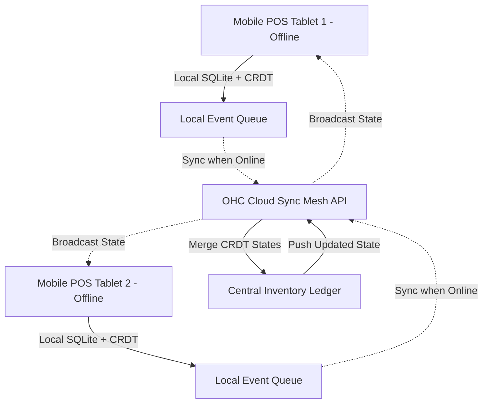

# Offline-First Inventory Sync Mesh

## Problem Statement
Small business owners, especially those operating in temporary or mobile environments (like Fatima’s food cart or farmers' market vendors), frequently experience intermittent or zero internet connectivity. When a POS device loses connection, the merchant must still be able to complete transactions and update inventory locally. However, when the connection is restored, naive sync strategies cause conflicting inventory updates, overselling of limited stock, and corrupted ledger states. These merchants need an invisible, mathematically sound mesh that guarantees inventory consistency across multiple offline nodes once they reconnect, without requiring the merchant to manually resolve conflicts.

## Research Report
**Findings & Competitive Analysis:**
- **Shopify/Wix:** Rely heavily on constant internet connections. Their POS solutions often fail or block transactions when offline, or they simply queue orders without performing local inventory deduction, leading to massive overselling when the connection returns.
- **Square:** Offers "Offline Mode" for payments but explicitly warns users that inventory is not guaranteed to be accurate and that they are responsible for manually reconciling oversold items.
- **Industry Trend:** CRDTs (Conflict-Free Replicated Data Types) and Event Sourcing are becoming the gold standard for offline-first local-first applications (e.g., Linear, Figma).
- **Opportunity:** OHC can implement a unified Inventory Sync Mesh using CRDTs (specifically, state-based PN-Counters for inventory levels) embedded directly into the OHC Mobile App's local SQLite store. This guarantees that Fatima can have two offline tablets taking orders simultaneously, and when they reconnect, the inventory mathematically converges to the correct state without human intervention.

## Design Doc

### Architecture Diagram

### AI Agent Integration Points
- **Operations Department:** The Operations AI agent monitors the sync mesh. If an irreconcilable anomaly occurs (e.g., a hardware failure corrupted local state), the agent proactively drafts an adjustment proposal and notifies the merchant in plain language.
- **Customer Service (CS) Department:** If the mathematically correct merge results in an oversold state (e.g., only 1 item existed, but both offline tablets sold it), the CS Agent automatically identifies the second buyer, cancels the order, issues a refund, and sends a personalized apology text/email to the customer.

### UI Wireframes & Screen Flow (375px Mobile First)
- **Status Indicator:** A subtle, non-intrusive indicator in the top right of the POS screen: a green dot for "Synced," a gray cloud for "Offline (Working Locally)," and a pulsing blue icon for "Syncing..."
- **Conflict Resolution Card (Inbox):** If the CS Agent had to cancel an oversold order, a card appears in the Translucent Glass inbox: "Oversell Prevented: 1 extra Vegan Cake was sold offline. The CS Agent refunded Jane Doe and sent an apology text. [View Details]"

### Mobile UX Flow
1. **Offline State:** Fatima’s tablet loses Wi-Fi. She continues tapping items and checking out customers. The UI remains blazing fast.
2. **Reconnection:** The tablet reconnects. A tiny blue sync icon pulses for 1 second.
3. **Resolution:** The local CRDT states merge with the cloud. The inventory numbers update smoothly. If an oversell occurred, the Operations Agent handles it invisibly and drops a summary in the inbox.

### Key Design Decisions and Why
- **CRDTs for Inventory (PN-Counters):** Instead of naive "last-write-wins" which destroys data, we use Positive-Negative Counters. Tablet 1 records "Added 5, Sold 2". Tablet 2 records "Added 0, Sold 3". The cloud merges these operations mathematically to find the true current stock, guaranteeing data integrity.
- **Local-First SQLite:** The mobile app must treat its local database as the primary source of truth, reading and writing instantly. The cloud is treated merely as a background synchronization peer.
- **Invisible Error Handling:** Small business owners don't know what a "merge conflict" is. The AI agents must handle all edge cases (like overselling) automatically, treating the owner as an executive who just needs a summary of the actions taken.

## Implementation Prompt
**Objective:** Implement the Offline-First Inventory Sync Mesh utilizing CRDTs within the OHC Core System and Mobile Client.

**User Journey (CUJ):**
1. As a business owner, I use the OHC Mobile POS on two different devices.
2. Both devices lose internet connection.
3. I sell items on both devices simultaneously.
4. When connectivity returns, both devices sync with the OHC Cloud.
5. The system mathematically merges the sales, accurately deducting the inventory without losing any data or requiring me to manually fix "conflicts."

**Acceptance Criteria:**
- **Local Datastore:** The mobile client must utilize a local datastore (e.g., SQLite) for instant read/write operations when offline.
- **CRDT Implementation:** Inventory counters must be implemented using CRDTs (PN-Counters) to ensure eventual consistency without data loss.
- **Sync Mesh API:** Create a bidirectional synchronization endpoint in the OHC API to accept local CRDT states and return the merged global state.
- **Agent Orchestration:** Trigger the Customer Service Agent automatically if the converged state results in a negative inventory balance (oversell), enabling it to perform automated refunds.
- **Mobile UI:** The POS UI must function without any latency when offline and visually indicate sync status unobtrusively.

## Priority
P0

## Estimated Scope
Large