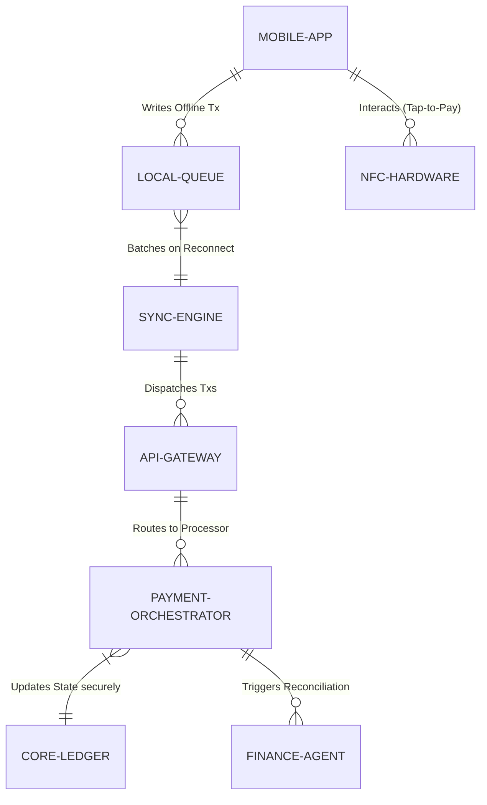

# Title: Offline-First Mobile POS & Tap-to-Pay Engine

## Problem Statement
Small business owners like Fatima (Food Cart operator) and Priya (Boutique owner) operate in environments with intermittent cellular service or high-density areas where networks get congested. Fatima frequently takes orders and payments at street festivals where her low-end Android phone loses connection. When this happens, she can't process transactions, resulting in lost sales and frustrated customers. Priya needs to quickly accept payments in her shop without investing in expensive, dedicated POS hardware. They both need an invisible, highly resilient mobile POS that works seamlessly on their smartphones, capable of processing "Tap-to-Pay" transactions completely offline, queuing them locally, and syncing securely once connectivity is restored.

## Research Report
*   **Current Architecture Limits:** OHC's current checkout flow assumes a constant internet connection. If the connection drops during payment authorization, the UI hangs or fails, forcing the user to retry, which ruins the customer experience.
*   **Competitor Analysis:**
    *   *Square:* Requires proprietary hardware (dongles, terminals). Their offline mode is decent but locks the merchant into their expensive hardware ecosystem.
    *   *Shopify POS:* Highly reliant on continuous connectivity for inventory checks and full payment processing. It is also an expensive add-on to their core platform.
    *   *Stripe Terminal:* Excellent APIs, but requires the developer to build the offline queuing and synchronization logic.
*   **Discovery:** OHC needs a native, offline-first mobile POS that leverages the smartphone's built-in NFC for Tap-to-Pay (Apple Tap to Pay / Android Tap to Pay). It must implement a robust local queuing system (CRDTs or local write-ahead log) to safely store transactions offline and sync them immediately upon reconnection, without any manual intervention from the user.

## Design Doc

### Architecture Diagram

### UI Wireframes & Mobile UX Flow (375px)
*   **Customer/Merchant View (OHC Mobile App - 375px):**
    *   **Action:** Fatima is at a festival, offline. A customer taps their card on her phone.
    *   **Feedback:** An immediate, satisfying haptic vibration and a large green checkmark appear.
    *   **Offline Indicator:** A subtle, non-alarming indicator (e.g., a small grey sync icon) shows that the transaction is queued locally. No technical errors are shown.
    *   **Reconnect:** Once service returns, the sync icon disappears, and the Finance Agent sends a silent push notification confirming the batch sync.

### AI Agent Integration Points
*   **Finance & Payments Agent:** Reconciles offline transactions with the central ledger once synced. If an offline payment is later declined (a known risk of offline POS), the Finance Agent proactively messages the merchant with a clear, jargon-free explanation and automatically initiates the retry/recovery flow.

## Implementation Prompt
**To Implementer Agent:**
Implement the offline-first Tap-to-Pay engine for the OHC mobile app. Integrate with Apple/Android native NFC payment APIs. Build a robust local SQLite/IndexedDB queue to securely store encrypted transaction data when offline. Develop the background synchronization worker that automatically flushes the queue to the OHC API Gateway upon network reconnection. Implement idempotent processing on the backend to prevent duplicate charges. Ensure the UI provides immediate optimistic feedback (haptics, visual success) regardless of network state.

## Priority
P0

## Estimated Scope
Large
