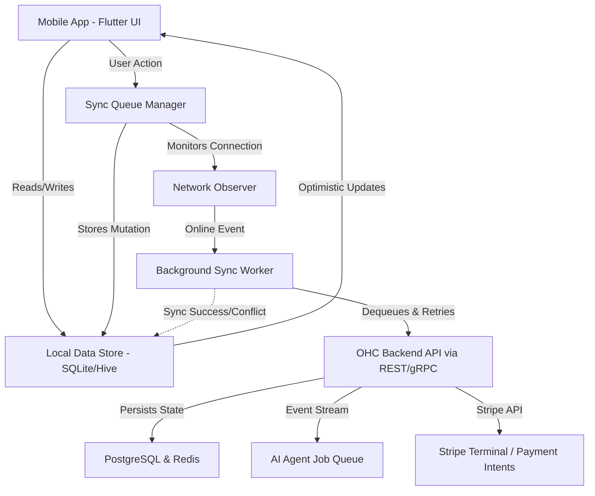

# Architecture: Offline-First Mobile POS & Tap-to-Pay

## Title
Build an Offline-First, Resilient Mobile POS & Tap-to-Pay Architecture

## Problem Statement
Fatima runs a busy halal food cart in a location where the cellular connection is spotty. During the lunch rush, she can't afford to have her app freeze, fail to load the menu, or drop an order just because she lost 5G for a few minutes. She needs her OHC app to be lightning fast, always available, and capable of queuing orders and payments locally so she can keep serving customers without interruption. She expects the system to "just work" and sync automatically in the background when the connection is restored, without her having to tap a "refresh" or "retry" button.

## Research Report
### Market Findings & Competitive Analysis
- **Shopify POS**: Offers an offline mode but is often clunky. Payments are typically cached, but inventory syncing can cause conflicts if multiple devices are used offline simultaneously. Requires an expensive plan for full POS capabilities.
- **Square POS**: The industry leader in offline capabilities. Square handles offline card processing seamlessly (with the merchant assuming some risk) and syncs the ledger perfectly once reconnected. This is the gold standard we must match.
- **Wix/Squarespace**: Extremely limited or non-existent offline POS functionality. Primarily built for web, their mobile POS extensions require a stable internet connection.
- **GoDaddy**: Basic POS features; lacks robust offline store state management.
- **The Gap**: Most platforms treat offline capability as a fallback exception. OHC must treat offline as the default state (Local-First). By leveraging local state management combined with optimistic UI updates and robust background syncing, we can provide an uninterrupted, premium experience on any device, even in deep network shadows.

## Design Doc

### Architecture Diagram

### UI Wireframes / Screen Flow Description (375px)
1. **Menu/Catalog View**:
   - A grid of product cards (e.g., Falafel Platter, Chicken Gyro) with cached WebP images.
   - Top right shows a subtle network indicator: a translucent glass pill stating "Offline mode" if disconnected.
2. **Order Cart**:
   - Floating action button at the bottom right indicating cart size.
   - Tapping it opens a bottom sheet with the current order summary and a prominent "Pay / Tap-to-Pay" button.
3. **Payment Flow**:
   - If online: Standard Stripe Terminal flow.
   - If offline: A prompt appears stating "You are offline. Queue this payment for later processing? (Note: Offline card processing carries slightly higher risk)".
   - If accepted, the UI immediately shows a checkmark "Order Saved!" and returns to the empty cart state, keeping the line moving.

### Mobile UX Flow
- The user launches the app. The local data store immediately hydrates the UI, leading to a <1s perceived load time.
- All actions (adding to cart, toggling "sold out") are instantly reflected in the UI via optimistic state updates.
- If the device is offline, a background queue captures these actions as discrete events (e.g., `OrderPlaced`, `ItemSoldOut`).
- A discreet background worker monitors connectivity. Upon reconnection, it plays back the queue to the backend with idempotency keys.

### AI Agent Integration Points
- **Operations ("The Manager")**: Monitors the sync queue. If an offline queue creates an inventory conflict upon syncing (e.g., an item sold offline was already marked sold out by an online pre-order), The Manager resolves it by adjusting the ledger and, if needed, queuing an alert for the owner.
- **Customer Success ("The Ambassador")**: If an offline payment is queued and later declined upon syncing, the Ambassador automatically drafts a gentle SMS to the customer requesting an alternative payment method.
- **Finance & Payments ("The Accountant")**: Reconciles delayed offline transactions in the daily financial reports, explicitly flagging them to ensure the business owner understands the timing discrepancy.

### Key Design Decisions
- **Local-First Paradigm**: The source of truth for the UI is always the local database. The network is treated as an asynchronous replication channel.
- **Optimistic UI**: Never block the user waiting for a network request, except for critical high-value transactions where offline processing is disabled by the merchant.
- **Idempotent Syncing**: Every queued action must have a unique UUID. The backend must deduplicate requests to prevent double-charging or double-counting inventory if a sync retry occurs.
- **Conflict Resolution**: Last-write-wins is sufficient for most operations, supplemented by the Operations AI Agent for complex edge cases (like inventory overselling).

## Implementation Prompt
**Task**: Implement the Offline-First Sync Architecture for the Mobile POS.

**Context**: You are building the core local-state and sync mechanism for the Flutter mobile app.

**User Journey**:
1. Fatima opens the app with airplane mode turned on.
2. She sees her full catalog instantly.
3. She adds two items to the cart and marks a third item as "Sold Out".
4. She completes a cash transaction for the cart. The app instantly clears the cart and shows a success screen.
5. She turns off airplane mode.
6. The app detects the connection, silently syncs the "Sold Out" status and the cash transaction to the backend, and updates the central database.

**Acceptance Criteria**:
- The Flutter application must boot and render the catalog entirely from local storage without a network request blocking the critical rendering path.
- State mutations (like adding to cart or toggling inventory) must update the UI immediately and persist to a local queue.
- A background sync mechanism must automatically push the queued changes to the backend API when the device comes back online.
- All network requests related to sync must include idempotency keys to ensure safety during retries.
- The UI must handle network transitions gracefully without locking up or losing data.

## Priority
P0

## Estimated Scope
Large
