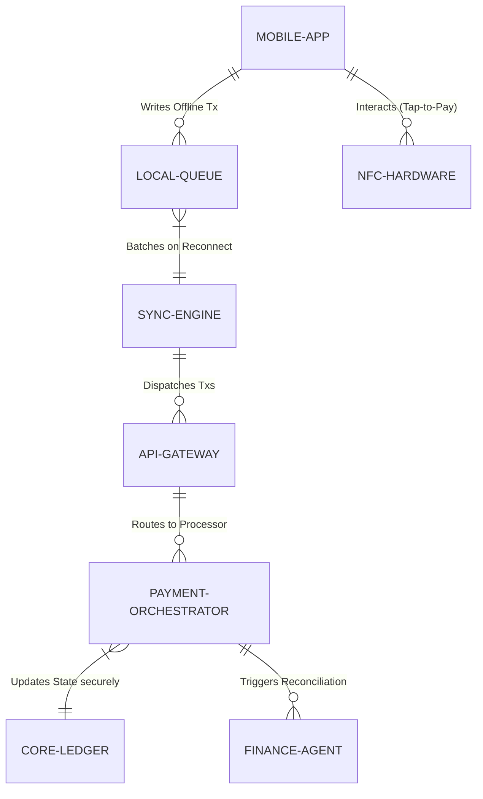

# Title: Offline-First Mobile POS & Tap-to-Pay Engine

## Problem Statement
Small business owners like Fatima (Food Cart operator) and Priya (Boutique owner) operate in environments with intermittent cellular service or high-density areas where networks get congested. Fatima frequently takes orders and payments at street festivals where her low-end Android phone loses connection. When this happens, she can't process transactions, resulting in lost sales and frustrated customers. Priya needs to quickly accept payments in her shop without investing in expensive, dedicated POS hardware. They both need an invisible, highly resilient mobile POS that works seamlessly on their smartphones, capable of processing "Tap-to-Pay" transactions completely offline, queuing them locally, and syncing securely once connectivity is restored.

## Research Report
*   **Current Architecture Limits:** OHC's current checkout flow assumes a constant internet connection. If the connection drops during payment authorization, the UI hangs or fails, forcing the user to retry, which ruins the customer experience.
*   **Competitor Analysis:**
    *   *Square:* Requires proprietary hardware (dongles, terminals). Their offline mode is decent but locks the merchant into their expensive hardware ecosystem.
    *   *Shopify POS:* Highly reliant on continuous connectivity for inventory checks and full payment processing. It is also an expensive add-on to their core platform.
    *   *Stripe Terminal:* Excellent APIs, but requires the developer to build the offline queuing and synchronization logic.
*   **Discovery:** OHC needs a native, offline-first mobile POS that leverages the smartphone's built-in NFC for Tap-to-Pay (Apple Tap to Pay / Android Tap to Pay). It must implement a robust local queuing system (CRDTs or local write-ahead log) to safely store transactions offline and sync them immediately upon reconnection, without any manual intervention from the user.

## Design Doc

### Architecture Diagram

### UI Wireframes & Mobile UX Flow (375px)
*   **Customer/Merchant View (OHC Mobile App - 375px):**
    *   **Action:** Fatima is at a festival, offline. A customer taps their card on her phone.
    *   **Payment Screen:** A clean, Unifi-style screen showing the amount. Upon tap, a large, satisfying green checkmark appears instantly. No loading spinners.
    *   **Offline Indicator:** A subtle Translucent Glass pill at the top: "Saved offline. Will sync when connected." (Passes the Grandmother Test - completely reassuring).
    *   **Background Sync:** When she gets home, the app silently syncs the transactions in the background.

### Key Design Decisions
*   **Offline-First Paradigm:** The UI must always assume success for reads and writes. Network requests are an asynchronous side-effect, not a blocker for the UI.
*   **Secure Local Storage:** Offline transactions must be encrypted locally using hardware-backed keystores on the device before being placed in the local queue.
*   **Idempotent Sync:** The sync engine must ensure transactions are idempotent to prevent double-charging if a network drop occurs during sync.
*   **Zero Trust & Multi-Tenancy:** The sync engine authenticates via SPIFFE/SPIRE identity, ensuring the offline transactions are strictly bound to the specific merchant's tenant ID and cannot cross boundaries.

### AI Agent Integration Points
*   **Finance Agent:** Monitors synced batches, reconciles offline transactions with the payment processor, and sends a daily summary ("You processed 45 offline payments yesterday successfully").
*   **Operations Agent:** If an offline transaction fails to authorize upon syncing (e.g., card declined later), the Operations Agent attempts to recover funds or notifies the merchant cleanly without technical jargon.

## Implementation Prompt
Implement the Offline-First Mobile POS & Tap-to-Pay Engine for OneHumanCorp. The system must allow merchants to seamlessly accept NFC Tap-to-Pay transactions directly on their mobile devices (iOS/Android) even without an active internet connection. Focus on building a highly resilient local queuing mechanism that encrypts and stores transactions securely on the device, and an intelligent sync engine that automatically batches and transmits these transactions to the core ledger once connectivity is restored. Ensure strict multi-tenant isolation and idempotent processing to guarantee zero double-charges. The user experience must be instantaneous and completely mask network latency or drops from the merchant. Acceptance criteria include zero lost offline transactions across device reboots and successful background sync upon network recovery.

## Priority
P0

## Estimated Scope
Large
