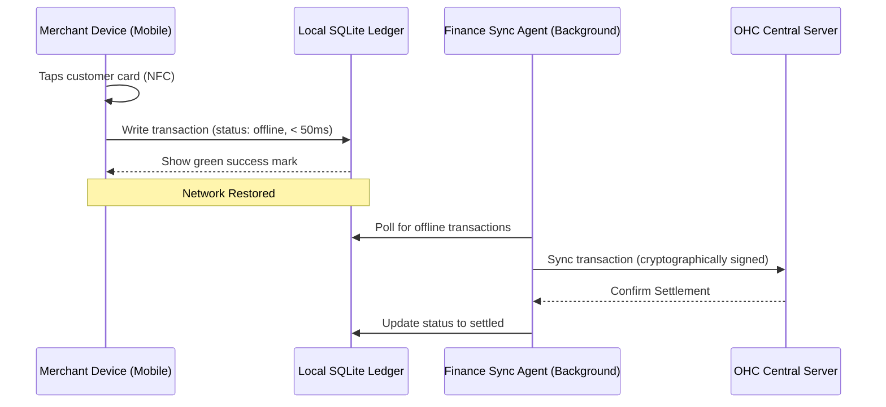

# [Architecture] Offline-First Mobile Tap-to-Pay Engine

## Problem Statement
Small business owners—like Fatima (Food Cart Operator) and Maya (Baker)—often operate in environments with unreliable or non-existent internet connections, such as crowded farmers' markets or festivals. Existing point-of-sale solutions either require clunky additional hardware (like Square readers) or fail entirely when the network drops, resulting in lost sales and frustrated customers. We need a system that passes the "grandmother test": a single button to accept payments instantly using native device NFC, saving transactions locally, and seamlessly synchronizing in the background when connectivity is restored, all without any technical jargon or setup.

## Research Report
- **Market Context**: Durable provides quick websites but weak POS operations. Shopify offers offline POS but requires extra hardware and complex setup. Wix is hybrid but desktop-focused.
- **Pain Points**:
  - Missing sales due to connectivity drops.
  - Bluetooth pairing failures with external card readers.
  - Inventory desynchronization during offline sales.
- **Goal**: OHC must provide an instant, 0-hardware, offline-first tap-to-pay capability directly on the merchant's mobile device (iOS/Android), setting a new standard for "Radical Simplicity" and "Mobile-Only Optimized" operations.

## Design Doc

### Architecture Diagram

### Mobile UX Flow (375px First)
1. **Home Screen**: A massive, beautifully styled "Tap to Pay" button using OHC's Translucent Glass aesthetic (Dark Mode: `rgba(22, 22, 26, 0.7)`, 8px/16px curve radius) centered on the screen.
2. **Action**: The merchant taps the button and holds the customer's contactless card or phone to the back of their device.
3. **Feedback**: Instant haptic feedback and a prominent green checkmark, even with zero network bars.
4. **Advanced Settings**: All sync queue logs, retry statuses, and server connections are hidden behind a sticky "Advanced Settings" toggle.

### AI Agent Integration Points
- **Finance Department**: A background worker on the mobile device that monitors network state and processes the sync queue asynchronously, ensuring idempotency.
- **Operations Department**: Listens for ledger updates to decrement local inventory and syncs changes to the main server to avoid overselling.
- **Customer Success Department**: Triggered post-settlement on the server to dispatch digital receipts automatically.

### Key Design Decisions
- **Local SQLite Storage**: Chosen for its robust, transactional support on mobile devices, ensuring data integrity before sync.
- **Zero-Trust Sync**: Tenant IDs must be derived strictly from the active session on the server during sync, rather than trusting the client payload, ensuring multi-tenant isolation.
- **Hardware Independence**: We rely exclusively on Apple Tap to Pay and Android native NFC APIs to eliminate third-party hardware friction.

## Implementation Prompt
**For the Implementer Agent:**
Implement the "Offline-First Mobile Tap-to-Pay Engine". Your task is to build the local transaction queueing mechanism and the background sync worker.
- The user must be able to tap a single button to initiate an NFC payment.
- The transaction must save instantly (< 50ms) to a local datastore, displaying success immediately regardless of network status.
- A background process must automatically sync offline transactions to the backend when connectivity is restored.
- The backend must securely process these synced transactions, verifying cryptographic signatures and enforcing multi-tenant isolation by deriving the tenant ID from the session, not the payload.
- Ensure the UI adheres to the 375px mobile-first constraints and the OHC Visual Excellence Mandate (Translucent Glass styling). All developer/sync logs must be hidden behind an "Advanced Settings" switch.

## Priority
P0 (Critical)

## Estimated Scope
Large