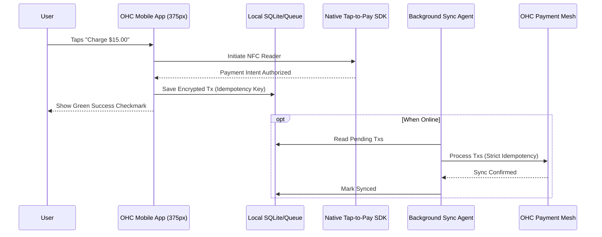

# OHC Offline-First Tap-to-Pay & POS Architecture

## Title
Offline-First Tap-to-Pay & POS Architecture

## Problem Statement
Small business owners like Priya (boutique owner) and Fatima (food cart) frequently operate in fast-paced environments with unreliable internet access (e.g., crowded markets, thick-walled boutiques). They need a Point of Sale (POS) system that allows them to instantly accept in-person tap-to-pay directly on their smartphones, without needing extra hardware. When the internet drops, the system must continue to accept payments, queue them securely, and sync them seamlessly in the background once connectivity returns. They should never see a "Network Error" during a checkout.

## Research Report
- **Market Baseline**: Competitors like Square and Shopify POS rely heavily on offline mode for their hardware terminals, but software-only tap-to-pay on smartphones often requires an active connection. Enabling true offline-first software POS gives OHC a significant edge.
- **Offline Reliability**: Best-in-class offline POS systems aggressively cache product catalogs and queue encrypted payment authorization intents locally using SQLite or IndexedDB.
- **Hardware Abstraction**: iOS (Tap to Pay on iPhone) and Android have differing native SDKs for NFC payments. OHC must abstract this into a single, unified "Checkout" capability.
- **Idempotency**: All offline-queued transactions must be strictly idempotent to prevent double-charging when the device regains connectivity and replays the queue.

## Design Doc

### Architecture Diagram

### UI Wireframes (375px first)
**Screen 1: Checkout Cart**
- **Top Bar**: Translucent Glass, "Cart" title, total amount ($15.00).
- **Body**: List of items (e.g., 2x Espresso, 1x Vegan Cake).
- **Bottom Fixed Action Bar**: Big, pill-shaped Primary Blue button: "Tap to Pay $15.00". No technical jargon.

**Screen 2: Tap to Pay Modal**
- **Overlay**: Dark Translucent Glass background.
- **Center Card**: Clean UniFi modular card. NFC icon pulsing gently. Text: "Hold card or phone near top of screen."
- **Cancel Button**: Subtle text link below.

**Screen 3: Success Screen**
- **Center**: Giant Success Green checkmark, haptic feedback.
- **Text**: "Payment Successful" (If offline: "Saved safely! We'll sync it when you're online.").
- **Bottom**: "New Sale" button.

### Mobile UX Flow
1. User taps "Charge".
2. App invokes native Tap-to-Pay UI.
3. Customer taps credit card to merchant's phone.
4. Cryptogram is securely captured and locally queued.
5. Immediate success screen to unblock the line.
6. Background agent syncs the cryptogram to Stripe/MercadoPago when network is available.

### AI Agent Integration Points
- **Finance Operations Agent**: Continuously monitors the local sync queue. If a transaction fails to clear asynchronously (e.g., insufficient funds on a delayed capture), the agent proactively drafts an SMS to the customer with a secure payment link to recover the funds, queueing it for 1-Tap approval by the business owner.
- **Support Agent**: If the device's NFC capability is restricted, the AI instantly surfaces a conversational prompt: "Tap-to-pay needs permission to run. Should I open settings for you?"

### Key Design Decisions
- **Asynchronous Capture**: To provide instant feedback, we rely on asynchronous payment capture. The risk of delayed declines for small amounts is outweighed by the friction of blocking the checkout line.
- **Strict Local Encryption**: Offline payment cryptograms are immediately encrypted locally and stored in a secure SQLite vault, never exposed to the UI layer.
- **Unified UX**: No separate "Offline Mode" toggle. The app seamlessly transitions between online and offline states using the same UI.

## Implementation Prompt
Implement the offline-first Tap-to-Pay module for the OHC mobile client. Create a unified checkout flow that invokes native Tap-to-Pay functionality. Build a local secure queue for transaction authorization payloads using an Idempotent Last-Write-Wins strategy. Ensure the UI adopts the macOS-style Translucent Glass materials and passes the grandmother test (no mentions of "syncing", "queues", or "APIs"). Add robust E2E Playwright tests simulating offline network conditions and successful background sync recovery.

## Priority
P0

## Estimated Scope
Large
