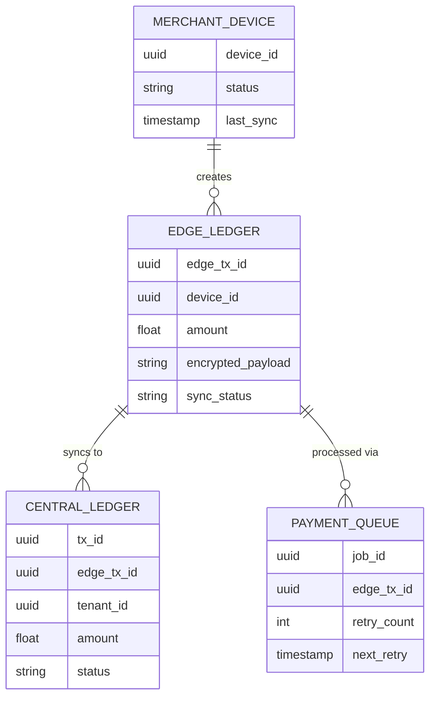

# [Architecture] Offline-First Tap-to-Pay & Edge Ledger Synchronization

## Title
Offline-First Tap-to-Pay & Edge Ledger Synchronization

## Problem Statement
Fatima (Food Cart Operator) operates her business in areas with spotty or no internet connection (like festivals or dense urban markets). She needs to process payments quickly using Tap-to-Pay on her Android device without worrying about dropped connections. When a connection is re-established, the platform needs to silently and securely sync all payments to the central ledger without requiring her to perform manual reconciliations or read complex technical jargon.

## Research Report
- **Strategy**: Implement an offline-first POS architecture leveraging Edge Databases (e.g., local SQLite/CRDTs) to queue and validate payments securely on the device, syncing asynchronously when connectivity is restored via a distributed background queue.
- **Target Persona**: Fatima (Food Cart Operator), Priya (Boutique Owner at pop-up shops), Carlos (Handyman in remote areas).
- **Advantages**: Guarantees zero downtime during sales, matching the speed of physical cash. Eliminates the anxiety of "network error" popups during critical customer interactions. Empowers businesses to operate absolutely anywhere.
- **Risks**: Security constraints around offline payment tokenization. Handling conflicts or delayed reconciliations if an offline transaction is later declined by the gateway.
- **Pricing**: Included in core platform processing fees.
- **Compatibility**: Mobile-first edge computing. Standalone (Local CRDT store). Cloud (Asynchronous sync to central OHC ledger).
- **Competitor Analysis**:
  - **Square**: Has robust offline payment processing, setting the industry benchmark.
  - **Shopify POS**: Supports offline cash transactions and limited card offline modes, but is often brittle.
  - **Wix**: Primarily online-first, struggling with seamless edge synchronization.
  - **OHC (Target)**: Invisible background CRDT sync with zero user intervention and AI-driven reconciliation for declined edge transactions.

## Design Doc

### Architecture Diagram

### UI Wireframes & Mobile UX Flow (375px first)
- **Screen 1 (Checkout - 375px)**: Large, high-contrast numeric keypad. A clean "Charge $XX.XX" button at the bottom.
- **Screen 2 (Tap to Pay - Offline Mode)**: A smooth glassmorphism card appears: "Tap to Pay". If offline, a subtle, friendly text below says "Offline Mode Active - Processing locally". The UI remains fast and responsive.
- **Screen 3 (Success)**: Big green checkmark. "Payment Complete". No technical details about sync queues.
- **Screen 4 (Advanced Settings - Hidden)**: Under an "Advanced Developer Settings" toggle, a list of "Pending Offline Syncs" is visible for debugging, but kept completely out of the main operational flow.

### Key Design Decisions
- **Offline-First Default**: The edge ledger is always the primary write target for the POS UI, ensuring sub-100ms response times regardless of network quality.
- **CRDT Synchronization**: Use Conflict-free Replicated Data Types (CRDTs) to merge offline transactions back into the central ledger safely without complex locking mechanisms.
- **Multi-Tenant Isolation**: The Edge Ledger is scoped strictly to the authenticated `tenant_id` on the device. Sync queues validate the token upon reconnection to ensure data boundaries are maintained.
- **Progressive Disclosure**: Zero mention of "syncing", "queues", or "CRDTs" in the main flow. To the user, a payment just works.

### AI Agent Integration Points
- **Finance & Payments Agent**: Monitors the asynchronous sync queue. If an offline payment is ultimately declined by the processor after syncing, the agent automatically drafts a friendly SMS/Email to the customer (via the Operations agent) with a new payment link, and alerts the merchant natively without halting their current sales flow.
- **Operations Agent**: Tracks network health. If the device has been offline for >24 hours with pending transactions, it proactively prompts the user with a simple notification: "Connect to Wi-Fi to finalize your recent sales."

## Implementation Prompt
Build the Edge Ledger Synchronization engine and Offline-First POS flow. Implement a local storage mechanism (e.g., SQLite) to capture transaction intents securely when offline. Create the background worker that monitors network connectivity and flushes the edge queue to the central OHC ledger using a robust retry mechanism. Ensure the UI handles offline states gracefully without showing errors during checkout.
- **Acceptance Criteria**: A merchant can complete a tap-to-pay transaction with Wi-Fi/Cellular disabled. The transaction appears as successful instantly in the UI. When connectivity is restored, the transaction syncs to the central database without user intervention.
- **Priority**: P0
- **Estimated Scope**: Large
