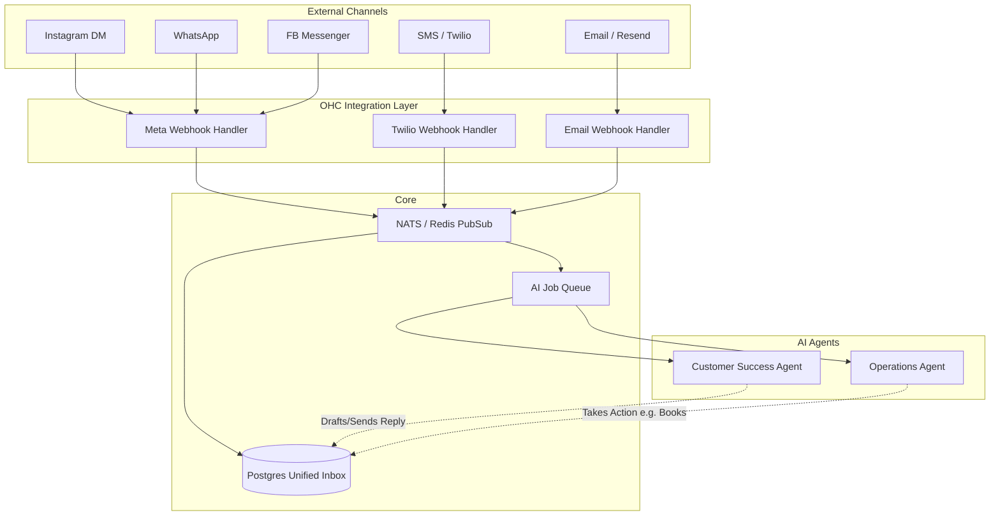

# Omni-Channel AI Inbox Architecture

## Title
Omni-Channel AI Inbox Architecture

## Problem Statement
Small business owners (e.g., Maya the Home Baker) receive customer inquiries across multiple platforms—Instagram DMs, WhatsApp, SMS, Email, and Facebook Messenger. Keeping track of these messages, responding promptly, and ensuring consistency across channels is overwhelming. The current disconnected communication silos prevent AI agents (like the Customer Success and Operations agents) from providing unified, context-aware support. If a customer asks "Do you do vegan cakes?" on Instagram, the AI needs to reply seamlessly without the business owner having to manually switch contexts.

## Research Report
The current market (Shopify, Wix) either lacks a unified inbox entirely or provides limited, chat-only integrations (like Shopify Inbox) that don't deeply integrate with a full suite of business operations (inventory, bookings). Tools like Zendesk or Intercom are too complex and expensive for micro-businesses.
Integrating Meta Graph API (Instagram/Messenger), WhatsApp Business API, Twilio (SMS), and Resend/IMAP (Email) into a single Event Mesh within OHC will allow our AI agents to consume, analyze, and respond to all messages centrally.

*Competitor Comparison:*
- **Shopify Inbox:** Good for web chat and basic Instagram, but not deeply autonomous.
- **Wix Inbox:** Basic consolidation, limited AI.
- **OHC:** True autonomous agentic inbox where AI drafts, approves, or auto-sends replies based on business context (inventory, calendar, policies) across *all* channels.

## Design Doc

### Architecture Diagram

### UI Wireframes & Mobile UX Flow
- **Home Screen (375px):** An "Inbox" tab with a notification badge.
- **Inbox View:** A consolidated list of conversations. Each item shows the customer's name, the latest message snippet, and an icon indicating the channel (Instagram, WhatsApp, etc.).
- **Conversation View:** A chat interface (Translucent Glassmorphism style).
    - Messages from the customer appear on the left.
    - AI-drafted replies appear at the bottom with a prominent "Approve & Send" button or a "Edit" button.
    - If the AI auto-replied (based on confidence threshold), it shows "Sent by AI" below the message bubble.
- **Context Panel (Drawer/Swipe):** Swiping left reveals customer context: previous orders, upcoming bookings, and notes.

### AI Agent Integration Points
- **Customer Success Agent:** Listens to incoming messages. If the intent is a general inquiry (e.g., "What are your hours?", "Do you do vegan cakes?"), it queries the RAG knowledge base and drafts a reply.
- **Operations Agent:** If the message intent is transactional (e.g., "I need to change my booking to 3 PM", "Where is my order?"), this agent handles the state change and drafts the confirmation reply.

### Key Design Decisions
- **Event-Driven:** Webhooks normalize incoming payloads into a standard `OmniMessage` format before hitting the message bus. This decouples the core logic from specific API quirks (Meta vs Twilio).
- **Asynchronous AI Processing:** AI generation must happen in the background queue (`SKIP LOCKED` Postgres queue or Redis) so webhooks can return 200 OK immediately.
- **Human-in-the-Loop by Default:** Initially, the AI *drafts* replies. The business owner must approve them. Owners can toggle specific intents to "Auto-Reply" as they build trust.

## Implementation Prompt
Implement the foundational data models and webhook handlers for the Omni-Channel AI Inbox.
1. Create the `OmniMessage` and `Conversation` models in PostgreSQL with proper `tenant_id` isolation.
2. Implement a unified webhook endpoint that can accept incoming messages (start with Meta Graph API for Instagram/WhatsApp as the MVP).
3. Normalize the incoming Meta payload into an `OmniMessage` and save it to the database.
4. Publish an event to the internal message bus so the AI agents (implemented in a future task) can begin drafting a reply.
5. Create a basic API endpoint to fetch conversations and messages for a specific tenant, to be used by the mobile frontend.

## Priority
P0

## Estimated Scope
Large
