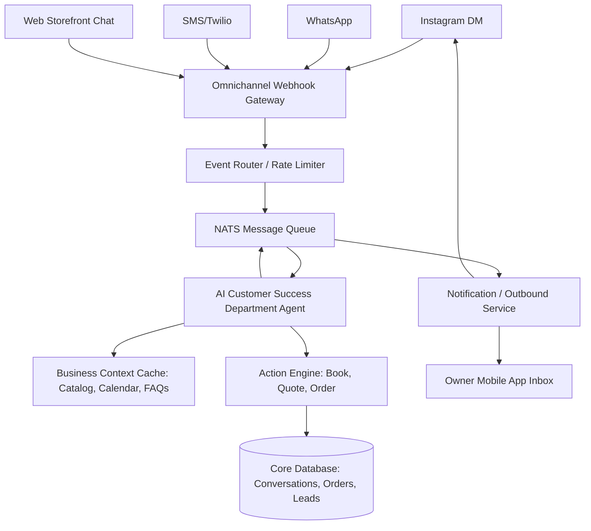

# Title: Omnichannel AI Conversational Commerce & Shared Inbox Architecture

## Problem Statement
Small business owners (like Maya the baker and Carlos the handyman) lose out on revenue because they cannot monitor or respond to inquiries across multiple channels (Instagram DMs, WhatsApp, SMS, Web Chat) 24/7. When they are working or sleeping, potential customers expect immediate responses for quotes, availability, and simple FAQs. They need a single, unified inbox where an AI agent acts as their first-line respondent—answering questions, booking appointments, and capturing leads seamlessly while they sleep or work.

## Research Report
- **Competitor Analysis**: Shopify Inbox provides basic chat features, but it relies on pre-programmed answers rather than dynamic, context-aware AI. Wix offers Wix Chat but lacks deep cross-channel integrations without expensive third-party apps like Gorgias. Gorgias and Intercom offer unified inboxes with AI, but they are expensive, complex, and built for larger support teams, not solopreneurs.
- **Industry Trend**: "Conversational commerce" is booming. Customers increasingly prefer buying or booking directly within the social app they are using (e.g., replying to an Instagram story to order a cake).
- **The Gap**: No platform currently provides a zero-setup, omnichannel shared inbox with a native AI agent that automatically reads business context (inventory, calendar, pricing) and handles interactions autonomously on behalf of the owner across SMS, IG, WhatsApp, and Web.

## Design Doc

### Architecture Diagram

### UI Wireframes / Screen Flow (375px first)
1.  **Unified Inbox List (Mobile View)**:
    - Clean, Ubiquiti UniFi modular dashboard card style.
    - List of conversations. Each item shows user avatar, name, snippet of last message, and a channel icon (IG, WhatsApp, Web, SMS).
    - Status badges: `[AI Handling]`, `[Needs Owner]`, `[Resolved]`.
2.  **Conversation Detail View**:
    - Standard chat UI, translucent glass header.
    - Bubbles show customer messages and AI responses (distinguished with a subtle "AI ✨" tag).
    - "Takeover" button prominently displayed for the owner to pause the AI and reply manually.
    - Inline action cards injected by AI (e.g., "AI sent a payment link for $50").
3.  **AI Settings (Advanced)**:
    - Simple toggles: "Allow AI to book appointments", "Allow AI to send quotes", "Allow AI to offer discounts (up to X%)".
    - "Grandmother test" passed: By default, the AI just works using existing business data.

### Mobile UX Flow
- Maya wakes up, opens the OHC app.
- She sees a push notification: "✨ AI booked 2 new cake consultations from Instagram overnight."
- She taps the notification, opening the Unified Inbox.
- She reviews the conversation where the AI correctly identified the requested date was open, offered the standard consultation fee, and securely sent a booking link.
- Maya taps a "Thumbs Up" to reinforce the AI's behavior, or taps "Takeover" if she needs to add a personal touch.

### AI Agent Integration Points
- **Customer Success Department (CS Agent)**: Triggered by incoming messages from any channel. It queries the `BusinessContextCache` (which holds real-time inventory, pricing, and availability).
- **Operations Department (Ops Agent)**: If the CS Agent identifies a confirmed order or booking, it hands off to the Ops Agent to update the ledger and calendar.
- **Handoff Protocol**: If a question is highly complex, emotionally charged, or outside defined guardrails, the AI Agent tags the thread as `[Needs Owner]` and sends an immediate push notification to the owner's device.

### Key Design Decisions
- **Unified Event Normalization**: All incoming messages (regardless of channel) are normalized into a standard `OmnichannelEvent` payload before hitting the queue, simplifying the AI Agent's context handling.
- **Human-in-the-Loop Override**: The "Takeover" mechanism is an absolute requirement for trust. Once an owner replies manually, the AI is paused for that thread until the owner re-enables it.
- **Zero Trust / Multi-Tenancy**: The AI Agent's context must be strictly scoped to the specific `tenant_id` associated with the incoming channel connection (e.g., the specific Instagram account linked to Maya's bakery).

## Implementation Prompt
**Task**: Implement the core backend infrastructure and mobile UI components for the "Omnichannel AI Conversational Commerce & Shared Inbox".

**User-Facing Outcome**: The small business owner can connect their Instagram, WhatsApp, or use our web chat widget, and view all messages in a single mobile inbox. An AI agent should be able to automatically respond to basic inquiries based on their catalog and calendar, with the ability for the owner to take over the conversation instantly.

**Acceptance Criteria**:
1.  **Backend**: Create a unified webhook receiver that can normalize incoming events from at least two sources (e.g., simulated Web Chat and a mock external API like IG/WhatsApp).
2.  **AI Integration**: Wire the incoming messages to the `builtin` AI agent, allowing it to generate responses based on the tenant's data context.
3.  **UI**: Build a mobile-first (375px) Unified Inbox view showing aggregated messages with channel icons and AI vs. Human sender differentiation.
4.  **Control**: Implement the "Takeover" toggle that pauses AI responses for a specific conversation thread.
5.  **Multi-Tenancy**: Ensure strict RLS/tenant isolation so the AI never leaks data from one business to another.

**Note to Implementer**: Design the specific database tables (e.g., `conversations`, `messages`), API routes, and state management as you see fit. Adhere strictly to the Visual Excellence Mandate (Translucent Glass, Ubiquiti modular cards).

## Priority
P0

## Estimated Scope
Large
