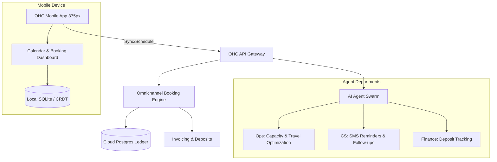
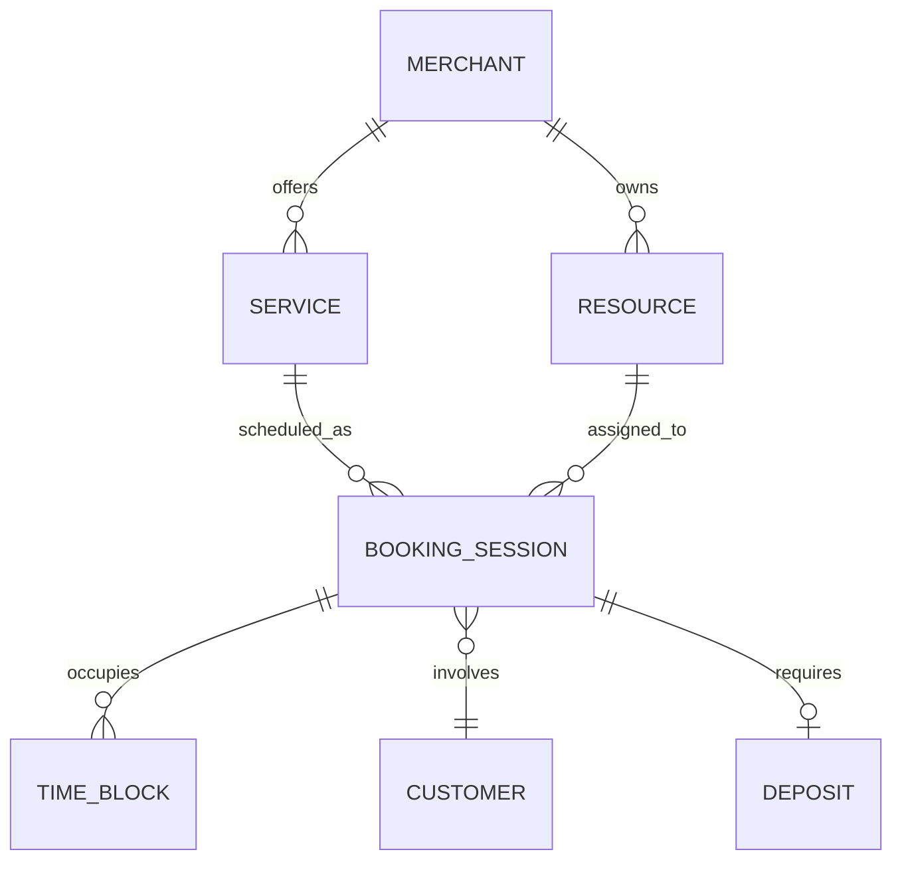

# [Architecture] Omnichannel Booking & Resource Scheduling Engine

## Problem Statement
Small business owners like Leo (a music tutor managing online and in-person lessons) and Carlos (a handyman scheduling service calls) rely heavily on their calendar, but existing tools disjoint scheduling from payments, customer management, and communications. Currently, Leo has to use a separate app for bookings, manually generate meeting links, and chase students for payments. Carlos needs to block out time based on physical travel distance between jobs and require deposits before locking a time. They need a native, intelligent booking engine within OneHumanCorp that unifies resource availability, automated scheduling, localized payments, and omnichannel AI agent communications—all from their mobile device.

## Research Report
**Competitor Systems Audit:**
- **Calendly:** The gold standard for simple scheduling, but it operates externally. Users are redirected away from the business's storefront, and it lacks deep multi-resource (e.g., specific rooms, travel time) management natively tied to a unified ledger.
- **Wix Bookings / Squarespace Scheduling (Acuity):** Good integrations, but heavily reliant on the desktop web interface for complex setups (like recurring classes, variant pricing). They are not truly offline-first for mobile.
- **Shopify:** Primarily designed for physical products; service scheduling requires clunky third-party apps with inconsistent UX and separate data silos.

**Gaps Identified:**
OHC lacks a native scheduling capability where "Time" and "Service Capacity" are treated as first-class, transactable inventory. There is no unified system allowing AI agents to intelligently negotiate time slots via SMS/Instagram DMs on behalf of the merchant, while ensuring offline-capable mobile calendar management and secure deposit processing.

## Design Doc

### Architecture Diagram

### Entity-Relationship Diagram

### Mobile UX Flow (375px First)
1. **Service Setup:** Leo opens the OHC app. He taps the "+" icon on the bottom navigation bar and selects "New Service". He inputs "1-on-1 Piano Lesson", sets a price, and toggles "Requires $20 Deposit". The UI uses macOS-style Translucent Glass materials on top of a clean UniFi-style card layout.
2. **Calendar View:** The main dashboard displays a unified daily timeline. Swipe left/right to change days. Offline capability ensures Leo can check his schedule even in a basement studio with no cell reception.
3. **AI Booking Interaction:** A student messages Leo on Instagram: "Do you have time next Tuesday?" The OHC Operations Agent reads the unified calendar, verifies availability, and replies automatically with a deep link: "Yes! Here's a link to book 4 PM on Tuesday."
4. **Checkout & Scheduling:** The student clicks the link, views a 375px-optimized booking page, selects the time, and pays the deposit via local payment methods (e.g., Apple Pay).
5. **Confirmation:** Leo receives an instant push notification of the booking. The CS Agent automatically sends the student a calendar invite and a Zoom link.

### AI Agent Integration Points
- **Operations Agent:** Monitors travel distances for mobile service providers (like Carlos). If Carlos has a job in North Seattle at 10 AM, the agent blocks out appropriate travel time before his next available slot.
- **Customer Success Agent:** Proactively sends 24-hour reminder SMS messages. If a student is inactive for 30 days, it automatically emails a "miss you" discount code.
- **Finance Agent:** Tracks the deposit. Once the service is completed (Leo swipes "Done" on the booking card), it auto-generates and sends the final invoice for the remaining balance.

### Key Design Decisions & Security
- **Time as Inventory:** Time slots and physical/digital resources are modeled just like physical products in the ledger, allowing unified cart checkouts (e.g., booking a lesson AND buying a sheet music PDF simultaneously).
- **Zero-Trust Multi-Tenancy:** Strict tenant isolation using SPIFFE SVIDs. A query for available time slots automatically appends the merchant's tenant ID, ensuring complete data boundary enforcement and preventing booking overlap leaks across merchants.
- **Offline-First Resilience:** The calendar dashboard reads from a local CRDT store. Modifications sync aggressively in the background when connectivity returns, with conflict resolution favoring the earliest booked timestamp.
- **Performance:** 99th percentile API latency target for availability queries is < 50ms, with payloads aggressively minimized via cursor-based pagination to support low-bandwidth environments.

## Implementation Prompt
Implement the Omnichannel Booking & Resource Scheduling Engine.
- **User-Facing Outcome:** Merchants can define services, set availability, and manage their calendar directly from their phone. Customers can book slots and pay deposits seamlessly. AI agents can negotiate and schedule appointments on the merchant's behalf via social channels.
- **CUJ (Critical User Journey):**
  1. Merchant creates a bookable service requiring a deposit.
  2. Customer interacts with AI agent via chat to find a time slot.
  3. Customer clicks checkout link, books the time, and pays the deposit.
  4. Merchant receives a push notification and views the booking in their offline-capable mobile calendar.
  5. AI automatically follows up with reminders and zoom links.
- **Acceptance Criteria:**
  - Complete parity on 375px mobile viewports using the glassmorphism design system.
  - Offline-first read capabilities for the merchant's calendar.
  - Zero-trust multitenant boundaries enforced on all scheduling queries.
  - Do not expose complex scheduling jargon to the user.
  - Integrate Operations, CS, and Finance agent triggers for booking lifecycles.

## Priority
P0

## Estimated Scope
Large