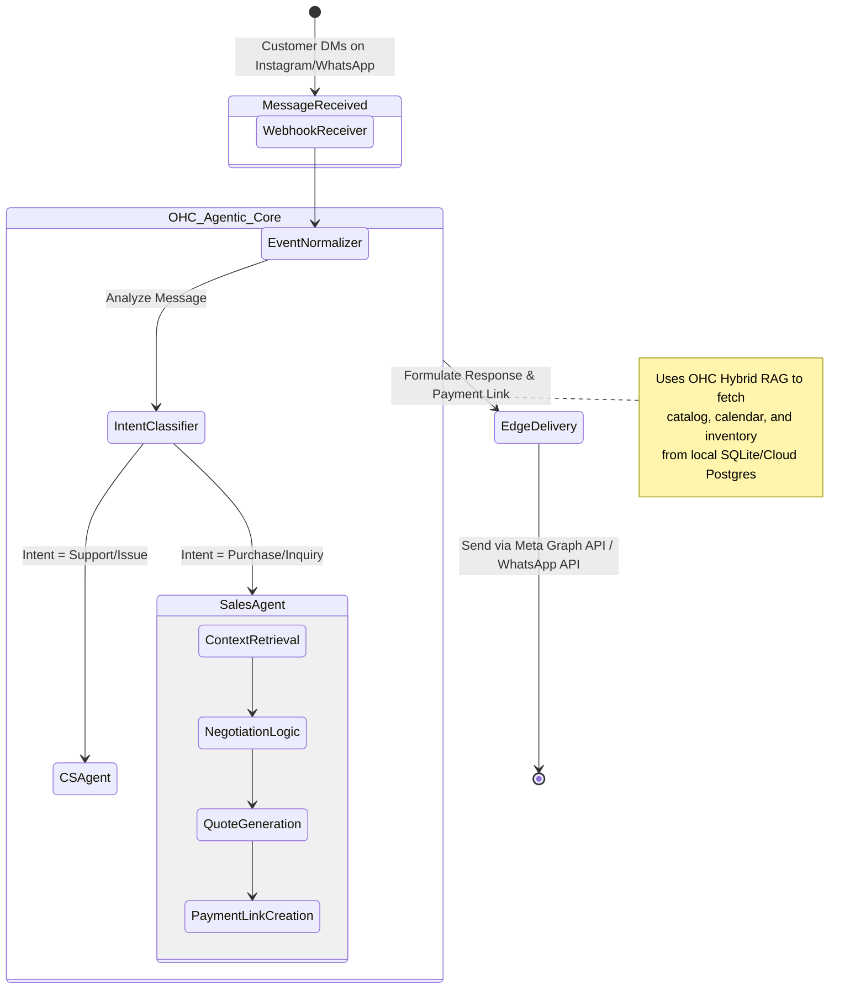

# Title: [Architecture] Omnichannel Conversational Commerce Engine

## Problem Statement

Small business owners like Maya (Baker) and Leo (Music Tutor) run their businesses primarily via social media and messaging platforms. They receive inquiries via Instagram DMs, Facebook Messenger, and WhatsApp (e.g., "Do you make vegan cakes for this Saturday?" or "Are you available for lessons next week?").

Currently, these founders have to manually monitor multiple inboxes, answer repetitive questions, negotiate orders, send payment links, and track who paid what. This limits their growth, causes them to lose sales while they are working or sleeping, and leads to severe burnout.

They need an autonomous, omnichannel conversational commerce engine. They need OHC's AI agents to transparently integrate with social media platforms, intercept messages, understand the context of the user's business (catalog, calendar, inventory, pricing rules), negotiate orders directly with customers in natural language, and securely collect deposits—all while the business owner sleeps.

## Research Report

- **Current Architecture Limits:** OHC currently lacks native integration into external messaging platforms. The internal agentic mesh is primarily focused on operations and UI orchestration within the OHC platform itself.
- **Competitor Analysis:**
  - _Shopify Inbox / ManyChat:_ These rely heavily on static, rules-based chatbot logic ("press 1 for pricing"). They are fragile, difficult for non-technical users to set up, and lack true contextual understanding of complex business constraints like custom order quoting.
  - _Zendesk / Intercom:_ Enterprise-focused and too complex/expensive for our micro-business personas. Not natively built for transactional commerce (capturing deposits natively in chat).
- **Discovery:** We must extend the OHC Hybrid Agentic OS to the edge of the customer journey. We need an "Omnichannel Conversational Commerce Engine" that connects OHC to Meta's Graph API (Instagram/WhatsApp) and Google Business Messages. This engine will route incoming messages through our local-first/cloud-escalation sync engine directly to the designated OHC AI Sales Agent, securely handling state, context, and secure checkout link generation.

## Design Doc

### Architecture Diagram

### Mobile UX Flow (375px First)

1.  **Dashboard Hub:** A simple "Inbox" card on the main dashboard showing "3 AI-negotiated orders pending review."
2.  **Conversational Review:** Tapping the card opens a unified inbox. The merchant sees the AI's conversation with the customer, styled cleanly like iMessage.
3.  **Takeover / Hand-off:** A prominent "Take Over" button allows the merchant to pause the AI and reply manually at any time.
4.  **Transaction Status:** A floating pill at the top of the chat shows the state of the deal (e.g., "Negotiating", "Quote Sent - $150", "Deposit Paid").

### AI Agent Integration Points

- **Customer Service (CS) Agent:** Handles FAQs ("What are your hours?", "Do you use peanuts?").
- **Sales / Quoting Agent:** Accesses the product catalog and calendar via Hybrid RAG to negotiate custom orders and generate SPIFFE-secured payment links.
- **Operations Agent:** Monitors completed payments from the chat and automatically updates inventory/calendar and notifies the fulfillment queue.

### Key Design Decisions

- **Event Normalization:** All incoming messages (regardless of source: IG, WA, FB) are normalized into a standard `OmnichannelEvent` struct before hitting the agents, simplifying agent logic.
- **Zero-Trust Payment Links:** Agents never handle raw credit card data. They generate one-time, cryptographically signed OHC checkout links that open in an embedded webview or browser for secure, PCI-compliant payment.
- **"Human in the Loop" by Default:** The merchant can set thresholds (e.g., "Auto-approve orders under $100, require my review for anything over").

## Implementation Prompt

Implement the Omnichannel Conversational Commerce Engine. Create the foundational webhook receivers for Meta Graph API (Instagram/WhatsApp) that normalize incoming messages into a standard `OmnichannelEvent`. Implement the routing logic to dispatch these events to the existing AI Agent mesh. Ensure the Sales Agent can read the normalized event, query the merchant's catalog/availability using our Hybrid RAG protocol, and respond with a generated checkout link. Build a unified mobile-first React component (`UnifiedInboxView`) that displays these agent-customer interactions and provides a "Take Over" button for the merchant.

## Priority

P0

## Estimated Scope

Large
