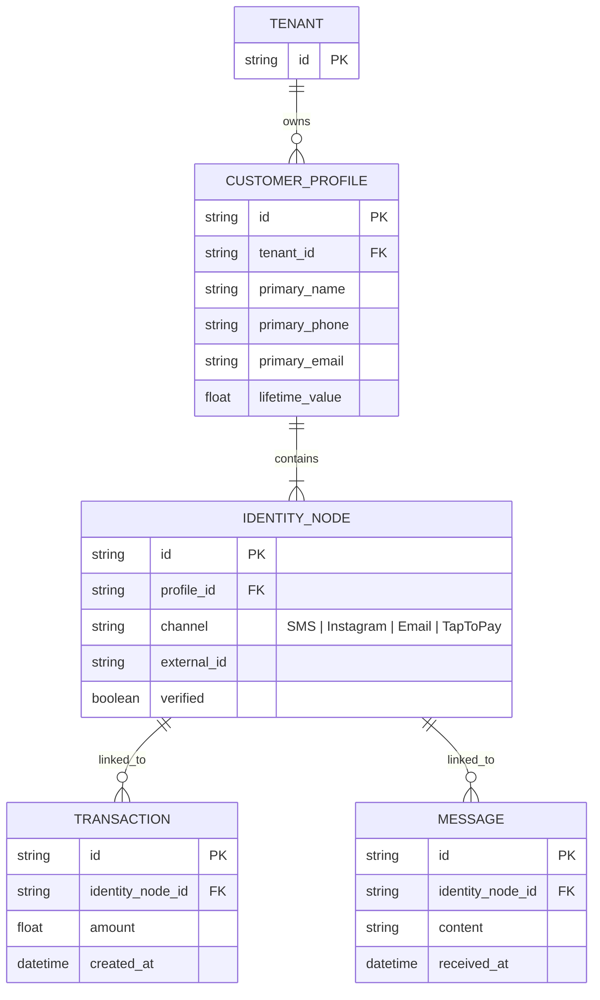
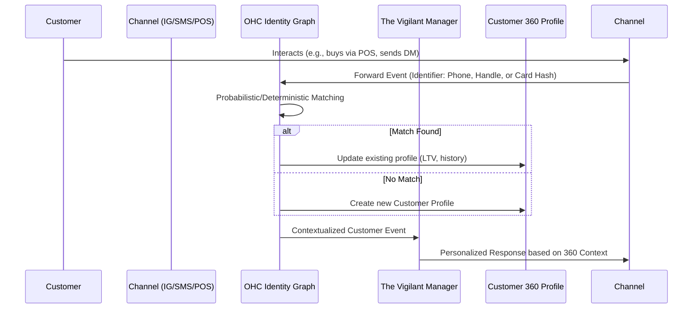

# Title: Omnichannel Customer 360 & Identity Graph

## Problem Statement
Small business owners (like Maya the baker and Priya the boutique owner) interact with the same customer across multiple fragmented channels: Instagram DMs, SMS, in-person tap-to-pay, and the online storefront. Currently, there is no unified view. If a customer asks a question on Instagram and later buys in-store, the business owner has no way to connect these interactions. They need a unified "Customer 360" profile that seamlessly tracks order history, communication, and preferences across every touchpoint, powered by a robust Identity Graph.

## Research Report
*   **Current Capabilities:** OHC has separate architectures for Tap-to-Pay, AI Inbox, and Storefront, but lacks a centralized Identity Graph to merge customer identities.
*   **Competitor Analysis:**
    *   *Shopify:* Has unified customer profiles, but primarily focuses on e-commerce, struggling with true omnichannel messaging (like Instagram DMs).
    *   *Square:* Strong in in-person and online customer directories, but lacks integrated AI-driven social media identity resolution.
    *   *HubSpot/Salesforce:* Too complex, expensive, and manual for small business owners.
*   **Gap Identified:** A mobile-first, zero-configuration Identity Graph that uses AI to deterministically and probabilistically merge customer identities (e.g., matching a phone number from an SMS with a Tap-to-Pay transaction and an Instagram handle).
*   **Strategic Advantage:** By unifying the customer identity, OHC's AI agents can provide highly personalized service, recover abandoned carts via SMS, and offer loyalty perks across all channels, invisibly.

## Design Doc

### Architecture Diagram

### Mobile UX Flow (375px First)
1.  **Incoming Interaction:** Maya receives an Instagram DM. The AI Inbox displays the message.
2.  **Contextual Profile Card:** Above the message thread, a minimal "Glass Material" card appears, showing the customer's `primary_name`, "Lifetime Value: $450", and "Last Order: 2 days ago (In-Store)".
3.  **Customer 360 Deep Dive:** Tapping the card opens a full-screen view. The view contains:
    *   **Header:** Customer name and consolidated contact info.
    *   **Activity Feed:** A unified timeline of all interactions: Tap-to-pay receipts, past DMs, abandoned carts, and shipped online orders.
    *   **Quick Actions:** 1-tap buttons to "Send Custom Invoice", "Issue Store Credit", or "Merge Profile" (if an AI suggests a duplicate).

### AI Agent Integration Points
*   **The Identity Resolution Agent (Background):** Continuously scans incoming identity nodes (phone numbers, emails, partial names, social handles) and merges profiles probabilistically, asking for human confirmation only when confidence is low.
*   **The Vigilant Manager (Operations/Sales):** Uses the 360 profile to generate contextual replies. If a customer asks "Where is my order?", the agent immediately knows which order they mean, regardless of the channel.
*   **The Silent Ambassador (Marketing/Loyalty):** Triggers automated loyalty rewards when the aggregated Lifetime Value across all channels crosses a threshold.

### Performance & Security Integrity
*   **Zero-Trust Isolation:** Customer Profiles and Identity Nodes are strictly multi-tenant isolated by `tenant_id`. No cross-tenant data leakage is permitted.
*   **Real-time Event Ingestion:** The Identity Graph must handle high-throughput event streams from Tap-to-Pay and messaging channels with sub-100ms latency for initial ingestion.
*   **PII Encryption:** All personally identifiable information (PII) within Identity Nodes must be encrypted at rest and in transit.

## Implementation Prompt
Implement the Omnichannel Customer 360 Identity Graph.
Create the backend services to ingest identity events from various channels (POS, SMS, Social), resolve and merge identities into unified `CUSTOMER_PROFILE` entities, and maintain real-time aggregated metrics (like Lifetime Value).
Develop the mobile-first frontend components (Customer 360 Card and Activity Feed) that consume this unified profile. Ensure the UI adheres to the macOS-style Translucent Glass aesthetic.
Acceptance criteria include: successful creation of a unified profile from disparate events, accurate real-time updates to LTV, and displaying the unified activity feed in the mobile Inbox context. Do not prescribe specific database schemas or graph DB choices.

## Priority
P0

## Estimated Scope
Large
