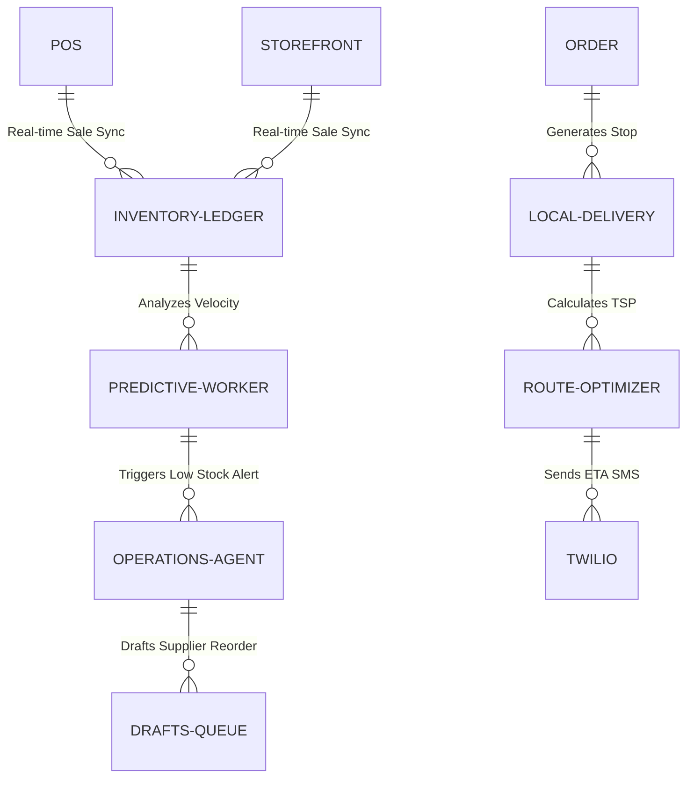

# Title: The Invisible Local Delivery & Inventory Mesh

## Problem Statement
Maya (the home baker) and Priya (the boutique owner) suffer from the "Omnichannel Sync Nightmare." Physical inventory and digital storefronts desynchronize easily, causing overselling. When stock runs low, they find out reactively. Managing local ad-hoc deliveries (like dropping off 5 custom cakes) is chaotic, done via scattered texts and Google Maps. Existing platforms (like Shopify) require manual stock taking and paid 3rd party apps to handle dynamic routing or predictive reordering.

They need an invisible system that anticipates stockouts, automatically prepares supplier reorders, and optimizes local delivery routes without any manual data entry.

## Research Report
- **Competitor Gap:** Shopify and Wix provide static ledgers that merely report numbers ("You have 2 items left"). They require paid 3rd party apps (like Stocky or Routific) to handle predictive reordering or delivery route optimization.
- **OHC Solution:** By leveraging the `Operations (The Manager)` AI department, OHC can build an "Invisible Local Delivery & Inventory Mesh." This proactively monitors sales velocity across online and in-person (POS).
- **Actionable Outcomes:** When stock drops below dynamic thresholds, the Operations Agent automatically drafts a reorder to the supplier and presents it for 1-tap approval in the mobile dashboard. For local deliveries, it automatically optimizes drop-off routes and texts customers ETAs via Twilio integration.

## Design Doc

### Architecture Diagram

### UI Wireframes / Screen Flow (375px)
1. **Push Notification:** "You have 5 cake orders for tomorrow but only 2lbs of flour left."
2. **Drafts for Review Card:** User taps notification, opens OHC app. A glassmorphism card displays: "Drafted email to Costco Business Delivery for 50lbs of Flour. Total: $45."
3. **Approval:** A single large button: "Approve & Send".
4. **Delivery Mode UI:** A "Start Deliveries" floating action button on the dashboard. Tapping it opens a distraction-free driving mode. Large text shows the next stop. A 1-tap button says "Notify customer I'm 10 mins away."

### Mobile UX Flow
- Complete 375px parity. No horizontal scrolling. High-contrast buttons for driving mode.
- Offline-capable view for the delivery route, syncing completion status when cellular connection returns.

### AI Agent Integration Points
- **Operations (The Manager):** Handles the background cron parsing of the `pgvector` store and sales velocity metrics to calculate dynamic reorder points. Executes the TSP (Traveling Salesperson) calculation for local delivery routes.
- **Customer Success (The Ambassador):** Drafts the personalized ETA notifications and supplier reorder emails.

### Key Design Decisions
- **Dynamic Thresholds:** We do not ask the user "What is your low stock threshold?". The AI calculates it based on `(Daily Sales Velocity * Supplier Lead Time)`.
- **Zero-Touch Routing:** The user does not input addresses into a map. The system pulls all `local_delivery` orders for the day and automatically generates the sequence.
- **Asynchronous Handoff:** Complex supplier orders are surfaced via the "Drafts for Review" queue, ensuring the business owner retains final financial control (1-tap approval) without doing the drafting work.

## Implementation Prompt
Implement the `PredictiveInventorySync` worker. It must read sales velocity from the unified ledger, calculate dynamic reorder thresholds, and push drafted reorder emails (via `Resend` or `SendGrid` integration) to the mobile "Drafts for Review" queue.

Secondly, build the `LocalDeliveryRouter` that aggregates daily orders tagged for local delivery, optimizes the route via TSP, and provides a mobile-first UI with 1-tap ETA Twilio SMS triggers.

Ensure strict multi-tenant isolation via the `tenant_id` column. Create necessary unit tests verifying dynamic threshold calculation and route optimization.

## Priority
P0

## Estimated Scope
Large
