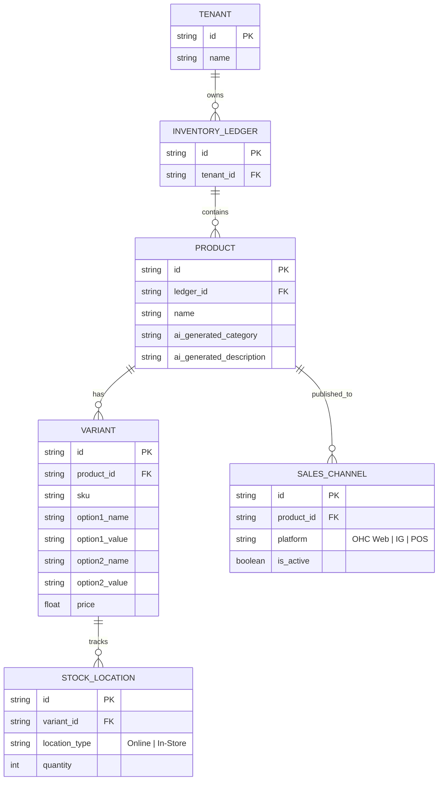
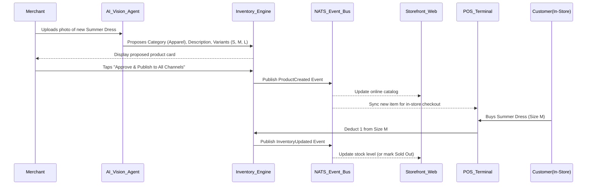

# Title: Omnichannel Inventory Sync & Auto-Categorization Engine

## Problem Statement
Small business owners like Priya (boutique owner) sell physical goods across multiple channels: in-store (POS), online storefront, and Instagram/TikTok. Currently, tracking inventory across these channels is manual and error-prone. When a physical item sells out in-store, they have to manually update their online store to prevent overselling. Furthermore, categorizing new stock and adding variants (size, color) is tedious. They need a system that automatically synchronizes inventory across all sales channels in real-time and uses AI to automatically categorize and structure new product variants from a simple photo upload.

## Research Report
*   **Current Capabilities:** OHC supports basic storefront catalogs but lacks a robust, centralized inventory ledger capable of real-time multi-channel sync and AI-assisted variant generation.
*   **Competitor Analysis:**
    *   *Shopify:* Strong omnichannel inventory sync, but setting up variants and categories can be complex for non-technical users. Requires paid apps for advanced auto-categorization.
    *   *Square Retail:* Good POS integration, but less focused on seamless social media selling and AI-driven catalog creation.
    *   *Wix:* Supports multi-channel, but the UI for managing complex inventory matrices (size/color) is clunky on mobile.
*   **Gap Identified:** A mobile-first, zero-configuration inventory engine that acts as the single source of truth across POS, Web, and Social. It must use AI vision to automatically detect product categories, extract variants (e.g., seeing a stack of t-shirts and proposing size/color options), and instantly sync stock levels globally to prevent overselling.
*   **Strategic Advantage:** By turning inventory management from a tedious data-entry task into a magical, 1-tap AI experience ("snap a photo and it's online everywhere"), OHC significantly lowers the barrier to entry for retail merchants.

## Design Doc

### Architecture Diagram

### UI Wireframes
*   **Add Product Screen:** Full-screen camera view with a prominent "Snap" button.
*   **AI Review Screen:** A clean card overlaying the photo. Shows proposed Title, Category, and a simple list of detected Variants (e.g., "Sizes: S, M, L detected"). A large "Publish Everywhere" button at the bottom.
*   **Inventory Dashboard:** A simple list of products with a clear badge indicating stock levels across channels. Uses large touch targets and Translucent Glass materials.

### Mobile UX Flow (375px First)
1.  **AI Product Ingestion:** Priya taps "Add Product" on her mobile dashboard. The camera opens. She snaps a photo of a new scarf.
2.  **Magic Extraction:** A loading skeleton appears for 2 seconds. The AI Vision Agent returns a fully filled product card: Title ("Silk Floral Scarf"), Description, suggested Category ("Accessories"), and proposes adding variants if it detects multiple colors in the photo.
3.  **1-Tap Approval:** Priya reviews the clean, Translucent Glass styled card, sets the total stock quantity, and taps "Publish Everywhere".
4.  **Unified Stock View:** The Inventory dashboard shows a list of products. Tapping a product reveals a simple matrix of variants and their current stock levels across channels.
5.  **Low Stock Alert:** When an item reaches a threshold, the Operations Agent sends a mobile push notification: "Silk Scarf (Red) is down to 2 left. Reorder soon?"

### AI Agent Integration Points
*   **The Visionary (Operations/Catalog):** Analyzes uploaded images to auto-generate SEO-optimized descriptions, tags, categories, and potential variant structures.
*   **The Vigilant Manager (Operations):** Monitors stock velocity across all channels and alerts the merchant *before* they run out of high-performing items.
*   **The Marketer:** Can automatically draft an Instagram post for newly added inventory: "Just added: Silk Floral Scarves! Grab one before they're gone."

### Key Design Decisions
*   **Zero-Trust Isolation:** Inventory ledgers and stock locations must be strictly tenant-isolated.
*   **Event-Driven Sync:** Use a distributed event mesh (e.g., NATS) to ensure that a POS sale instantly broadcasts an inventory decrement event, updating the web storefront edge-cache in sub-100ms.
*   **Optimistic UI:** When a merchant approves a new product, the mobile UI updates instantly while the heavy lifting (image optimization, vector embedding for search, channel syndication) happens in background queues.

## Implementation Prompt
Implement the Omnichannel Inventory Sync & Auto-Categorization Engine.
The system must allow merchants to upload a product image and automatically receive AI-generated titles, descriptions, categories, and variant suggestions. It must maintain a unified inventory ledger that acts as the single source of truth across all sales channels (Web, POS, Social).
When an item is purchased via any channel, the system must trigger a real-time event to decrement stock globally and update all connected client interfaces immediately.
Ensure the UI components are mobile-first, utilizing Translucent Glass materials and simple 1-tap approval flows, hiding all complex data matrix management from the user. Acceptance criteria include: successful AI extraction of product details from an image, publishing to multiple simulated channels, and real-time stock decrement synchronization across those channels upon a simulated sale.

## Priority
P0

## Estimated Scope
Large
