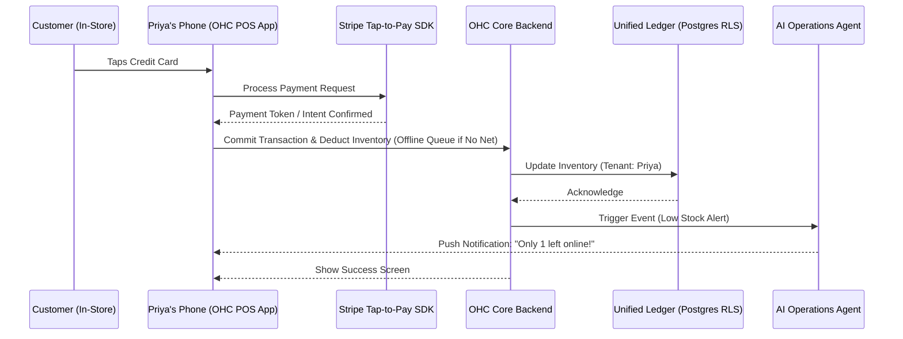

### Title
[Architecture] Omnichannel POS & Mobile Tap-to-Pay Integration

## Problem Statement
Small business owners selling physical goods in person (e.g., Priya the Boutique Owner, Fatima the Food Cart Operator) struggle with disjointed systems. They often maintain a separate physical Point-of-Sale (POS) terminal, and a separate online storefront, leading to double data entry, out-of-sync inventory, and disjointed analytics. Furthermore, investing in expensive POS hardware creates a high barrier to entry. They need a unified, zero-hardware solution: the ability to accept in-person payments securely via their mobile device (Tap-to-Pay) while automatically syncing inventory, customer data, and sales with their online OHC storefront—all operating reliably even with spotty internet connectivity.

## Research Report
### Context and Competitive Landscape
1.  **Shopify POS / Stripe Terminal**: Both offer robust omnichannel POS. Shopify POS is powerful but requires significant setup and often specialized hardware for full functionality. Stripe's Tap-to-Pay SDK enables turning an ordinary iPhone/Android into a payment terminal without extra hardware.
2.  **Square**: The industry standard for simple POS, but often creates a walled garden separate from custom online storefronts.
3.  **OHC Gap**: OHC currently handles online orders and deposits (e.g., for Maya or Carlos), but lacks a dedicated architectural path for in-person, high-throughput, low-latency physical transactions (Priya's boutique, Fatima's food cart).

### Personas Impacted
-   **Priya (Boutique Owner)**: Needs to process a customer's credit card in-store via her phone, immediately updating the centralized inventory so her online store doesn't oversell a unique dress.
-   **Fatima (Food Cart Operator)**: Needs a fast, low-friction way to tap-to-pay for walk-up orders, with offline resilience if the cellular connection drops in a crowded area.

## Design Doc

### Key Design Decisions
1.  **Mobile-Device-as-Terminal (Zero Hardware)**: We will integrate Stripe Terminal's Tap-to-Pay SDK (or equivalent) to eliminate the need for external card readers. The user's smartphone *is* the POS.
2.  **Offline-Capable Intent Queue**: For environments with spotty connections, the POS module must queue transaction intents locally (e.g., SQLite/CRDTs) and process them asynchronously when the connection stabilizes, prioritizing speed at checkout.
3.  **Unified Inventory Ledger**: In-store sales and online sales write to the exact same inventory datastore, with strict Row-Level Security (RLS) ensuring multi-tenant isolation.
4.  **AI Operations Agent Integration**: The Operations Agent monitors the unified inventory and proactively notifies the user via plain-language alerts (e.g., "Hey Priya, that blue dress just sold out in-store, so I removed it from the website.").

### Architecture Diagram (Mermaid.js)

### Mobile UX Flow (375px First)
1.  **Cart View**: A clean, high-contrast list of items. Large (+) and (-) buttons for quick quantity adjustments. A massive "Charge $X.XX" floating action button (FAB) at the bottom.
2.  **Payment Mode Overlay**: Tapping the FAB grays out the background and triggers the native OS Tap-to-Pay interface (Apple/Google Wallet style overlay).
3.  **Success & Receipt**: A celebratory green checkmark. Two large buttons: "Email Receipt" or "Done (Next Customer)". No complex menus.

## Implementation Prompt
Implement the Omnichannel POS module within the OHC mobile application and backend.
- Integrate a Tap-to-Pay SDK (e.g., Stripe) to allow processing of contactless payments directly on the mobile device.
- Build a robust, offline-capable local queue to store transaction intents if the network drops, syncing them to the central OHC ledger upon reconnection.
- Ensure that the backend inventory decrements automatically and atomically, triggering the AI Operations Agent for low-stock notifications.
- The UI must be optimized for a 375px viewport, featuring a large, accessible "Charge" button and a streamlined, grandmother-test-passing checkout flow. Do not prescribe specific API route names or internal database schema names.

## Priority
P0

## Estimated Scope
Large